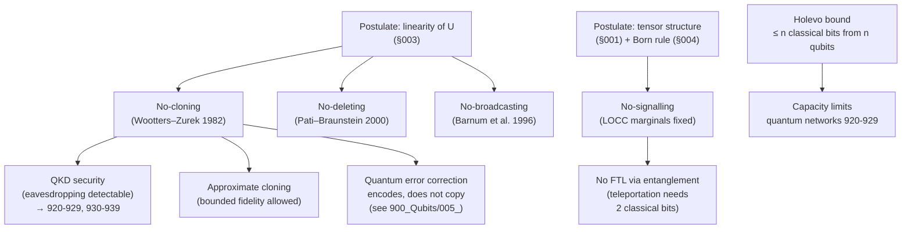

# QCSAA 900-909 · Section 00 · Subsection 904 · Subsubject 005 — No-Cloning, No-Signalling and Information Limits

## 1. Purpose

States the foundational **no-go theorems** that bound information processing in quantum systems and clarifies what they do and do **not** rule out. The theorems are derived from §`003_` (linearity of unitary evolution) and §`004_` (Born/POVM rule) on the state space of §`001_`. They are the discipline that prevents downstream chapters from claiming superluminal communication, perfect copying of unknown states, or unconditional broadcast — and they are the foundational reason why Quantum Key Distribution (`920-929`), Post-Quantum Cryptography (CYB `880-889`) and quantum sensing (`940-949`) make sense as distinct programmes rather than as folklore.

## 2. Scope

- Covers the *No-Cloning, No-Signalling and Information Limits* subsubject (`005`) of subsection `904` *Foundations* within section `00` *Fundamentos de Computación Cuántica*.
- Inherits Q-Division authority and ORB support from the parent row in [`../../README.md` §3](../../README.md#3-architecture-table)[^archtable].
- Concepts in scope:
  - **No-cloning theorem** (Wootters–Zurek, Dieks 1982) — there is no unitary $U$ on $\mathcal{H} \otimes \mathcal{H}$ such that $U(|\psi\rangle \otimes |0\rangle) = |\psi\rangle \otimes |\psi\rangle$ for **every** $|\psi\rangle \in \mathcal{H}$. Proof: linearity of $U$ contradicts non-orthogonal inner-product preservation. Known states *can* be copied; orthogonal sets can be cloned by a fixed unitary.
  - **No-broadcasting theorem** (Barnum et al. 1996) — generalisation of no-cloning to mixed states: a non-commuting set of density operators cannot be broadcast.
  - **No-deleting theorem** (Pati–Braunstein 2000) — the time-reverse statement; an unknown state cannot be deterministically erased into a fixed reference.
  - **No-signalling theorem** — local operations on a bipartite state $\rho_{AB}$ cannot change the marginal $\rho_B = \mathrm{Tr}_A(\rho_{AB})$ of a remote party. Consequence: entanglement does not enable faster-than-light communication despite Bell-correlations.
  - **Holevo bound** — at most $n$ classical bits can be reliably retrieved from $n$ qubits via measurement, regardless of the encoding (resource limits cited by quantum-network capacity arguments).
  - **What is not forbidden** — approximate cloning (with bounded fidelity), quantum teleportation (consumes one ebit + 2 classical bits, no FTL), Quantum Key Distribution (eavesdropping is detectable precisely because no-cloning prevents perfect copying), and one-shot data hiding.
  - **Operational consequences for QCSAA bands** — QKD, device-independent cryptography, error-correction overhead vs classical replication, monogamy of entanglement.
- Out of scope: complexity-theoretic separations (`006_`), and the assurance/interpretation discipline that uses these theorems to refuse overclaim (`007_`).

## 3. Diagram — No-Go Theorems and Their Operational Consequences

## 4. Footprint

| Metric | Value |
|---|---|
| Architecture | `QCSAA` — Quantum Computing & Sentient Agency Architecture |
| Master range | `900–999` |
| Code range | `900-909` |
| Section | `00` — Fundamentos de Computación Cuántica |
| Subject | `00` — General Information |
| Subsection | `904` — Foundations |
| Subsubject | `005` — No-Cloning, No-Signalling and Information Limits |
| Primary Q-Division | Q-HORIZON[^qdiv] |
| Support Q-Divisions | Q-HPC, Q-DATAGOV |
| ORB support | ORB-PMO, ORB-LEG |
| Governance class | `restricted`[^gov] |
| Folder path | `Q+ATLANTIDE/900-999_QCSAA/900-909_Fundamentos-de-Computacion-Cuantica/904_foundations/` |
| Document | `005_No-Cloning-No-Signalling-and-Information-Limits.md` (this file) |
| Parent subsection | [`README.md`](./README.md) · [`000_Overview.md`](./000_Overview.md) |
| Parent architecture | [`../../README.md`](../../README.md) |
| Parent baseline | [`organization/Q+ATLANTIDE.md`](../../../../organization/Q+ATLANTIDE.md) |

## 5. References & Citations

[^baseline]: **Q+ATLANTIDE controlled baseline (v1.0.0)** — [`organization/Q+ATLANTIDE.md`](../../../../organization/Q+ATLANTIDE.md). Defines the controlled `000-999` architecture-band taxonomy and the ATLAS-1000 register subpart.

[^archtable]: **QCSAA §3 Architecture Table** — [`../../README.md` §3](../../README.md#3-architecture-table). Authoritative source for the `900-909` row (Section `00` — Fundamentos de Computación Cuántica, Primary Q-Division Q-HORIZON).

[^qdiv]: **Q-Division authority** — Q-Divisions provide technical authority over an architecture row (Q+ATLANTIDE Note N-002). See [`organization/Q+ATLANTIDE.md` §4](../../../../organization/Q+ATLANTIDE.md#4-notes).

[^gov]: **Governance class** — Bands are classified as `baseline` or `restricted` per Q+ATLANTIDE §4 governance rules.

[^ieeep7130]: **IEEE P7130 — Standard for Quantum Computing Definitions** — Vocabulary baseline for the quantum computing scope of QCSAA `900-999`.

[^nistir8413]: **NIST IR 8413 — Status Report on the Third Round of the NIST Post-Quantum Cryptography Standardization Process** — Post-quantum cryptography reference for QCSAA security-bridging items.

[^etsiqsc001]: **ETSI GR QSC 001 — Quantum-Safe Cryptography (QSC); Quantum-safe algorithmic framework** — ETSI quantum-safe cryptography framework applied across QCSAA.

[^s1000d]: **S1000D Issue 6.0 — International specification for technical publications** — Common Source DataBase (CSDB) and Data Module Code (DMC) specification used for all Q+ATLANTIDE artefacts.

[^as9100d]: **AS9100D — Quality Management Systems — Aviation, Space and Defense Organizations** — Quality-management baseline for all Q+ATLANTIDE deliverables.

### Applicable industry standards

The following standards apply to this subsubject in addition to the cross-cutting Q+ATLANTIDE governance:

- IEEE P7130 — Standard for Quantum Computing Definitions[^ieeep7130]
- NIST IR 8413 — Post-Quantum Cryptography Standardization, Round 3 Status Report[^nistir8413]
- ETSI GR QSC 001 — Quantum-Safe Cryptography algorithmic framework[^etsiqsc001]
- S1000D Issue 6.0 — International specification for technical publications[^s1000d]
- AS9100D — Quality Management Systems — Aviation, Space and Defense Organizations[^as9100d]
