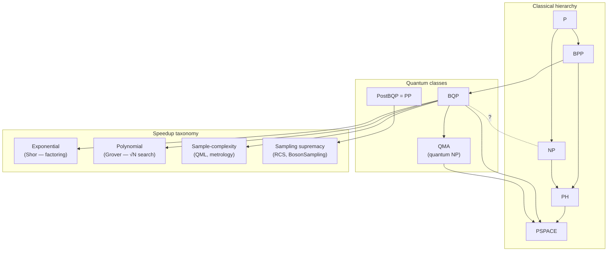

# QCSAA 900-909 · Section 00 · Subsection 904 · Subsubject 006 — Complexity Classes and Quantum Advantage

## 1. Purpose

States the **complexity-theoretic framing** that lets the QCSAA register make precise, falsifiable statements about the computational power of quantum systems. Defines the relevant classes (P, NP, BPP, BQP, QMA, PostBQP, …), positions them under the currently believed inclusions, and identifies the operational contracts behind the terms *quantum supremacy*, *quantum advantage* and *exponential speedup*. This subsubject is the mandatory citation point for any downstream chapter that asserts a speedup; together with §`007_` (assurance discipline) it is the foundational guard against unsupported performance claims.

## 2. Scope

- Covers the *Complexity Classes and Quantum Advantage* subsubject (`006`) of subsection `904` *Foundations* within section `00` *Fundamentos de Computación Cuántica*.
- Inherits Q-Division authority and ORB support from the parent row in [`../../README.md` §3](../../README.md#3-architecture-table)[^archtable].
- Concepts in scope:
  - **Classical baseline classes** — P (deterministic polynomial time), NP (non-deterministic polynomial time, polynomial-checkable certificates), coNP, BPP (bounded-error probabilistic polynomial time), PSPACE.
  - **Quantum classes** — BQP (bounded-error quantum polynomial time), QMA (quantum analogue of NP), PostBQP, QSZK; relationship $\mathrm{BPP} \subseteq \mathrm{BQP} \subseteq \mathrm{PSPACE}$ (proven), $\mathrm{NP}$ vs $\mathrm{BQP}$ (unknown — neither containment is proven).
  - **Oracle separations** — Bernstein–Vazirani, Simon, Shor (factoring/discrete log) as evidence of $\mathrm{BQP}$-power; sampling-task separations (BosonSampling, IQP, Random Circuit Sampling) under standard complexity-theoretic assumptions (non-collapse of the polynomial hierarchy).
  - **Speedup taxonomy** — *exponential* (Shor-type, structured), *polynomial* (Grover-type $\sqrt{N}$, generic search), *sample-complexity* (in QML / metrology), and *constant-factor* (none of these qualify as quantum advantage in the technical sense).
  - **Operational definitions** — *quantum supremacy* (a sampling task no classical computer can match in feasible time), *quantum advantage* (a useful task solved better/faster/cheaper by a quantum device under a stated cost model), *quantum utility* (advantage on a problem of practical value beyond benchmarks).
  - **Cost-model honesty** — wall-clock vs query complexity, gate-count vs T-count vs physical-qubit-count, hidden classical pre-/post-processing, calibration overhead, and the role of error correction (cf. [`../900_Qubits/005_Logical-Qubits-Encoding-and-Error-Correction.md`](../900_Qubits/005_Logical-Qubits-Encoding-and-Error-Correction.md)).
- Out of scope: the mechanics of specific algorithms (`../040_quantum-algorithms/`); the assurance discipline that turns these classifications into reviewable claims (`007_`).

## 3. Diagram — Believed Inclusions and Speedup Contracts

## 4. Footprint

| Metric | Value |
|---|---|
| Architecture | `QCSAA` — Quantum Computing & Sentient Agency Architecture |
| Master range | `900–999` |
| Code range | `900-909` |
| Section | `00` — Fundamentos de Computación Cuántica |
| Subject | `00` — General Information |
| Subsection | `904` — Foundations |
| Subsubject | `006` — Complexity Classes and Quantum Advantage |
| Primary Q-Division | Q-HORIZON[^qdiv] |
| Support Q-Divisions | Q-HPC, Q-DATAGOV |
| ORB support | ORB-PMO, ORB-LEG |
| Governance class | `restricted`[^gov] |
| Folder path | `Q+ATLANTIDE/900-999_QCSAA/900-909_Fundamentos-de-Computacion-Cuantica/904_foundations/` |
| Document | `006_Complexity-Classes-and-Quantum-Advantage.md` (this file) |
| Parent subsection | [`README.md`](./README.md) · [`000_Overview.md`](./000_Overview.md) |
| Parent architecture | [`../../README.md`](../../README.md) |
| Parent baseline | [`organization/Q+ATLANTIDE.md`](../../../../organization/Q+ATLANTIDE.md) |

## 5. References & Citations

[^baseline]: **Q+ATLANTIDE controlled baseline (v1.0.0)** — [`organization/Q+ATLANTIDE.md`](../../../../organization/Q+ATLANTIDE.md). Defines the controlled `000-999` architecture-band taxonomy and the ATLAS-1000 register subpart.

[^archtable]: **QCSAA §3 Architecture Table** — [`../../README.md` §3](../../README.md#3-architecture-table). Authoritative source for the `900-909` row (Section `00` — Fundamentos de Computación Cuántica, Primary Q-Division Q-HORIZON).

[^qdiv]: **Q-Division authority** — Q-Divisions provide technical authority over an architecture row (Q+ATLANTIDE Note N-002). See [`organization/Q+ATLANTIDE.md` §4](../../../../organization/Q+ATLANTIDE.md#4-notes).

[^gov]: **Governance class** — Bands are classified as `baseline` or `restricted` per Q+ATLANTIDE §4 governance rules.

[^ieeep7130]: **IEEE P7130 — Standard for Quantum Computing Definitions** — Vocabulary baseline for the quantum computing scope of QCSAA `900-999`.

[^nistir8413]: **NIST IR 8413 — Status Report on the Third Round of the NIST Post-Quantum Cryptography Standardization Process** — Post-quantum cryptography reference for QCSAA security-bridging items.

[^s1000d]: **S1000D Issue 6.0 — International specification for technical publications** — Common Source DataBase (CSDB) and Data Module Code (DMC) specification used for all Q+ATLANTIDE artefacts.

[^as9100d]: **AS9100D — Quality Management Systems — Aviation, Space and Defense Organizations** — Quality-management baseline for all Q+ATLANTIDE deliverables.

### Applicable industry standards

The following standards apply to this subsubject in addition to the cross-cutting Q+ATLANTIDE governance:

- IEEE P7130 — Standard for Quantum Computing Definitions[^ieeep7130]
- NIST IR 8413 — Post-Quantum Cryptography Standardization, Round 3 Status Report[^nistir8413]
- S1000D Issue 6.0 — International specification for technical publications[^s1000d]
- AS9100D — Quality Management Systems — Aviation, Space and Defense Organizations[^as9100d]
