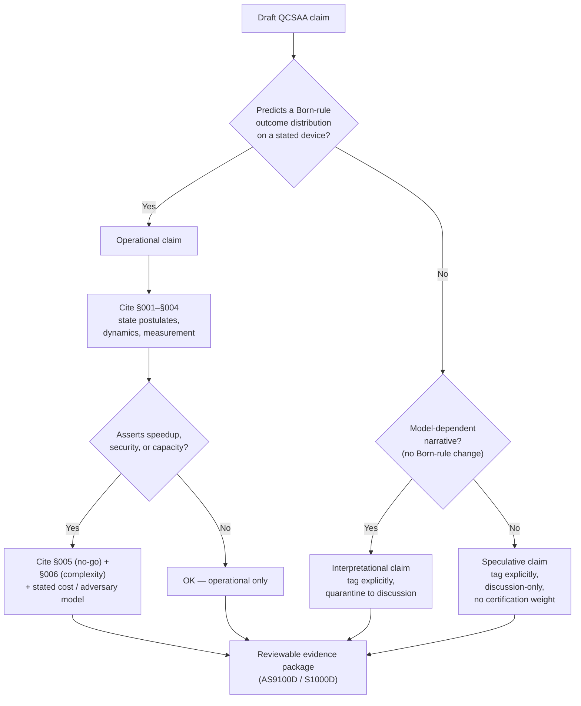

# QCSAA 900-909 · Section 00 · Subsection 904 · Subsubject 007 — Assurance Boundaries and Interpretation Discipline

## 1. Purpose

Closes the foundational range with the **assurance discipline** that translates the previous six subsubjects into reviewable, falsifiable claims fit for AS9100D[^as9100d] and S1000D[^s1000d] artefacts. Distinguishes between *operational* statements (predictions verifiable by §`004_` Born-rule statistics on a calibrated device), *interpretational* statements (model-dependent narratives about what is "really" happening), and *speculative* statements (no operational consequences in the current model). Establishes the rule that downstream chapters of QCSAA, and any cross-band ATLAS/CYB/MECH item that depends on quantum claims, must keep these three registers separate in their evidence packages.

## 2. Scope

- Covers the *Assurance Boundaries and Interpretation Discipline* subsubject (`007`) of subsection `904` *Foundations* within section `00` *Fundamentos de Computación Cuántica*.
- Inherits Q-Division authority and ORB support from the parent row in [`../../README.md` §3](../../README.md#3-architecture-table)[^archtable].
- Concepts in scope:
  - **Three-register discipline** — every claim made by a QCSAA artefact shall be tagged as one of:
    1. **Operational** — predicts an outcome distribution under §`004_`; falsifiable by repeated measurement on a specified device.
    2. **Interpretational** — model-dependent (Copenhagen, many-worlds, Bohmian, relational, QBism, …); does not change Born statistics but changes the narrative; must be marked as such, never asserted as fact.
    3. **Speculative** — no current operational consequences (e.g. consciousness-collapse hypotheses, untestable many-worlds branchings); permitted only in clearly demarcated discussion sections.
  - **Decoherence as the operational anchor** — the practical resolution of "why we observe definite outcomes" lives in §`003_` (CPTP) and [`../900_Qubits/004_Decoherence-Noise-and-Fidelity.md`](../900_Qubits/004_Decoherence-Noise-and-Fidelity.md), not in any specific interpretation.
  - **No-overclaim rules** for downstream QCSAA bands:
    - Speedup claims shall cite §`006_` and a **stated cost model** (gates, qubits, runtime, classical pre/post-processing).
    - Security claims shall cite §`005_` and an **adversary model** (and where relevant NIST IR 8413[^nistir8413] / ETSI GR QSC 001[^etsiqsc001]).
    - Sensing/QML "advantage" claims shall name the resource (entanglement, squeezing, sample-complexity) and the classical baseline they outperform.
    - Sentient-agency claims (`970-979`) shall not invoke quantum effects as an explanatory mechanism for cognition without an operational link back to §`004_`.
  - **Evidence-package contract** — every QCSAA data module that asserts a quantum effect shall include: (a) the postulate(s) cited (§`001`–`004`), (b) the no-go theorems checked (§`005`), (c) the complexity-class context (§`006`), and (d) a triviality/operational-falsifiability statement under this subsubject (§`007`).
  - **Integration into Q+ATLANTIDE governance** — `restricted` governance class[^gov] requires that downstream artefacts inherit this discipline; ATLAS bands consuming QCSAA outputs cite this subsubject when integrating quantum-derived evidence into airworthiness, certification or compliance dossiers.
- Out of scope: the underlying physics and mathematics (covered by §`001`–`006`); specific organisational review workflows (covered by ORB-PMO / ORB-LEG governance documents).

## 3. Diagram — Claim-Triage Workflow for QCSAA Artefacts

## 4. Footprint

| Metric | Value |
|---|---|
| Architecture | `QCSAA` — Quantum Computing & Sentient Agency Architecture |
| Master range | `900–999` |
| Code range | `900-909` |
| Section | `00` — Fundamentos de Computación Cuántica |
| Subject | `00` — General Information |
| Subsection | `904` — Foundations |
| Subsubject | `007` — Assurance Boundaries and Interpretation Discipline |
| Primary Q-Division | Q-HORIZON[^qdiv] |
| Support Q-Divisions | Q-HPC, Q-DATAGOV |
| ORB support | ORB-PMO, ORB-LEG |
| Governance class | `restricted`[^gov] |
| Folder path | `Q+ATLANTIDE/900-999_QCSAA/900-909_Fundamentos-de-Computacion-Cuantica/904_foundations/` |
| Document | `007_Assurance-Boundaries-and-Interpretation-Discipline.md` (this file) |
| Parent subsection | [`README.md`](./README.md) · [`000_Overview.md`](./000_Overview.md) |
| Parent architecture | [`../../README.md`](../../README.md) |
| Parent baseline | [`organization/Q+ATLANTIDE.md`](../../../../organization/Q+ATLANTIDE.md) |

## 5. References & Citations

[^baseline]: **Q+ATLANTIDE controlled baseline (v1.0.0)** — [`organization/Q+ATLANTIDE.md`](../../../../organization/Q+ATLANTIDE.md). Defines the controlled `000-999` architecture-band taxonomy and the ATLAS-1000 register subpart.

[^archtable]: **QCSAA §3 Architecture Table** — [`../../README.md` §3](../../README.md#3-architecture-table). Authoritative source for the `900-909` row (Section `00` — Fundamentos de Computación Cuántica, Primary Q-Division Q-HORIZON).

[^qdiv]: **Q-Division authority** — Q-Divisions provide technical authority over an architecture row (Q+ATLANTIDE Note N-002). See [`organization/Q+ATLANTIDE.md` §4](../../../../organization/Q+ATLANTIDE.md#4-notes).

[^gov]: **Governance class** — Bands are classified as `baseline` or `restricted` per Q+ATLANTIDE §4 governance rules.

[^ieeep7130]: **IEEE P7130 — Standard for Quantum Computing Definitions** — Vocabulary baseline for the quantum computing scope of QCSAA `900-999`.

[^nistir8413]: **NIST IR 8413 — Status Report on the Third Round of the NIST Post-Quantum Cryptography Standardization Process** — Post-quantum cryptography reference for QCSAA security-bridging items.

[^etsiqsc001]: **ETSI GR QSC 001 — Quantum-Safe Cryptography (QSC); Quantum-safe algorithmic framework** — ETSI quantum-safe cryptography framework applied across QCSAA.

[^s1000d]: **S1000D Issue 6.0 — International specification for technical publications** — Common Source DataBase (CSDB) and Data Module Code (DMC) specification used for all Q+ATLANTIDE artefacts.

[^as9100d]: **AS9100D — Quality Management Systems — Aviation, Space and Defense Organizations** — Quality-management baseline for all Q+ATLANTIDE deliverables.

### Applicable industry standards

The following standards apply to this subsubject in addition to the cross-cutting Q+ATLANTIDE governance:

- IEEE P7130 — Standard for Quantum Computing Definitions[^ieeep7130]
- NIST IR 8413 — Post-Quantum Cryptography Standardization, Round 3 Status Report[^nistir8413]
- ETSI GR QSC 001 — Quantum-Safe Cryptography algorithmic framework[^etsiqsc001]
- S1000D Issue 6.0 — International specification for technical publications[^s1000d]
- AS9100D — Quality Management Systems — Aviation, Space and Defense Organizations[^as9100d]
