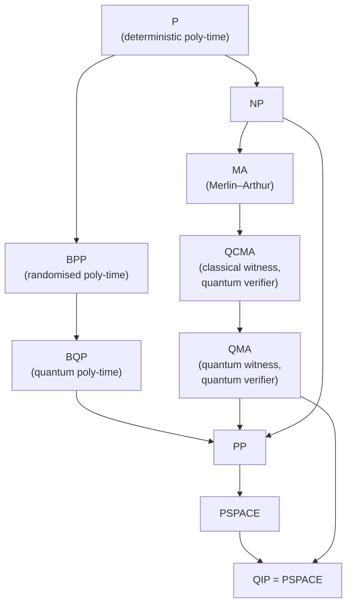

# QCSAA 900–909 · Section 00 · Subsection 905 · Subsubject 001 — Quantum Complexity Classes BQP, QMA, QCMA

## 1. Purpose

Defines the primary quantum computational complexity classes — **BQP** (Bounded-error Quantum Polynomial time), **QMA** (Quantum Merlin–Arthur), and **QCMA** (Quantum Classical Merlin–Arthur) — and characterises their relationships to classical complexity classes P, BPP, MA, and NP. Establishes the class hierarchy that underpins every complexity claim made across QCSAA subsections, conforming to the treatments in Watrous[^watrous] and Arora & Barak[^arorababarak].

## 2. Scope

- Covers the *Quantum Complexity Classes BQP, QMA, QCMA* subsubject (`001`) of subsection `905` *Quantum Complexity and Resource Theory* within section `00` *Fundamentos de Computación Cuántica*.
- Inherits Q-Division authority and ORB support from the parent row in [`README.md`](./README.md)[^archtable].
- Concepts in scope:
  - **BQP** — the class of decision problems decidable in polynomial time by a uniform quantum circuit family with error probability at most 1/3 on every input; equivalent to the class of problems efficiently solvable on a fault-tolerant quantum computer; contained in P^#P and PSPACE; contains BPP; relationship to NP unknown.
  - **QMA** — the quantum analogue of NP/MA: a verifier uses a polynomial-size quantum circuit to check a quantum witness (proof) state provided by an all-powerful prover; error is at most 1/3 for YES instances and at most 1/3 for NO instances (completeness/soundness gap 1/3 each); amplifiable by repetition; k-LOCAL HAMILTONIAN is QMA-complete (Kitaev's theorem).
  - **QCMA** — variant of QMA where the witness is a classical bit string but the verifier is quantum; QCMA ⊆ QMA; whether QCMA = QMA is open; relevant to deciding whether quantum proofs provide extra power over classical proofs.
  - **Class relationships** — P ⊆ BPP ⊆ BQP ⊆ PP ⊆ PSPACE; MA ⊆ QCMA ⊆ QMA ⊆ PP; BQP and NP are incomparable relative to oracles; QMA-hardness as the quantum analogue of NP-hardness.
  - **QMA-complete problems** — k-LOCAL HAMILTONIAN (ground-state energy estimation), QUANTUM SAT, CONSISTENCY OF LOCAL DENSITY MATRICES; these problems encode the computational hardness of many-body quantum physics.
  - **Error reduction and amplification** — sequential repetition amplifies completeness and soundness gaps for both BQP and QMA; for QMA the verifier must unitarily decouple copies of the witness to avoid entanglement between copies.
  - **Quantum interactive proofs (QIP)** — QIP = PSPACE (Jain et al. 2010); QIP(2) ⊆ PSPACE; QMA ⊆ QIP(1) = QMA; brief overview of the class tower QMA ⊆ QIP(2) ⊆ QIP = PSPACE.
- Out of scope: query complexity models (`002_`), circuit-level lower bounds (`003_`), resource theories (`004_`–`006_`), and experimental quantum advantage (`007_`).

## 3. Diagram — Quantum Complexity Class Hierarchy

*Arrows denote containment (A → B means A ⊆ B). Dotted relationships between BQP and NP are omitted as their inclusion direction is unknown.*

## 4. Footprint

| Metric | Value |
|---|---|
| Architecture | `QCSAA` — Quantum Computing & Sentient Agency Architecture |
| Master range | `900–999` |
| Code range | `900-909` |
| Section | `00` — Fundamentos de Computación Cuántica |
| Subsection | `905` — Quantum Complexity and Resource Theory |
| Subsubject | `001` — Quantum Complexity Classes BQP, QMA, QCMA |
| Primary Q-Division | Q-HORIZON[^qdiv] |
| Support Q-Divisions | Q-HPC, Q-DATAGOV |
| ORB support | ORB-PMO, ORB-LEG |
| Governance class | `restricted`[^gov] |
| Folder path | `Q+ATLANTIDE/900-999_QCSAA/900-909_Fundamentos-de-Computacion-Cuantica/905_Quantum-Complexity-and-Resource-Theory/` |
| Document | `001_Quantum-Complexity-Classes-BQP-QMA-QCMA.md` (this file) |
| Parent subsection | [`README.md`](./README.md) · [`000_Overview.md`](./000_Overview.md) |
| Parent architecture | [`../../README.md`](../../README.md) |
| Parent baseline | [`organization/Q+ATLANTIDE.md`](../../../../organization/Q+ATLANTIDE.md) |

## 5. References & Citations

[^baseline]: **Q+ATLANTIDE controlled baseline (v1.0.0)** — [`organization/Q+ATLANTIDE.md`](../../../../organization/Q+ATLANTIDE.md). Defines the controlled `000-999` architecture-band taxonomy and the ATLAS-1000 register subpart.

[^archtable]: **§3 — Subsubject Index (parent README)** — [`README.md` §3](./README.md#3-subsubject-index). Authoritative source for the `905` subsection row (Primary Q-Division Q-HORIZON).

[^qdiv]: **Q-Division authority** — Q-Divisions provide technical authority over an architecture row (Q+ATLANTIDE Note N-002). See [`organization/Q+ATLANTIDE.md` §4](../../../../organization/Q+ATLANTIDE.md#4-notes).

[^gov]: **Governance class** — `restricted` denotes documents requiring additional governance, evidence packages and access controls (rule N-006[^n006]).

[^n006]: **Note N-006 (Restricted bands)** — Quantum-related (`900-999` QCSAA) bands require additional governance, evidence packages and access controls. See [`organization/Q+ATLANTIDE.md` §5.3](../../../../organization/Q+ATLANTIDE.md#53-restricted-band-templates-n-006).

[^watrous]: **Watrous, J. (2009)** — "Quantum Computational Complexity." In *Encyclopedia of Complexity and Systems Science*. Springer. Comprehensive survey defining BQP, QMA, QCMA, QIP, and their containment relationships.

[^arorababarak]: **Arora, S. & Barak, B. (2009)** — *Computational Complexity: A Modern Approach*. Cambridge University Press. Chapters 10–11 cover probabilistic complexity (BPP, MA) providing the classical foundation for quantum class definitions.

[^kitaev]: **Kitaev, A., Shen, A. & Vyalyi, M. (2002)** — *Classical and Quantum Computation*. American Mathematical Society. Chapter 14 proves QMA-completeness of k-LOCAL HAMILTONIAN, establishing the quantum analogue of Cook-Levin.

[^isoiec4879]: **ISO/IEC 4879:2023** — *Quantum computing — Vocabulary*. Defines quantum advantage (§3.18) and related terms used to characterise BQP-based speedups.

### Applicable standards

The following standards apply to this subsubject in addition to the cross-cutting Q+ATLANTIDE governance:

- Watrous (2009) — "Quantum Computational Complexity"[^watrous]
- Arora & Barak (2009) — *Computational Complexity: A Modern Approach*[^arorababarak]
- Kitaev, Shen & Vyalyi (2002) — *Classical and Quantum Computation*[^kitaev]
- ISO/IEC 4879:2023 — *Quantum computing — Vocabulary*[^isoiec4879]
