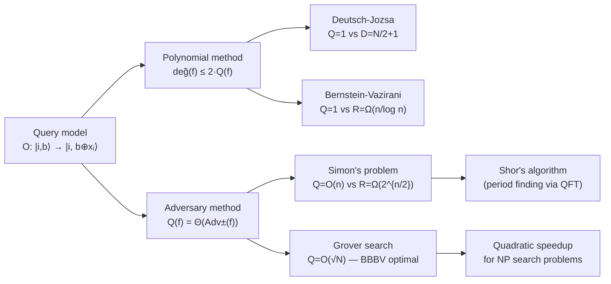

# QCSAA 900–909 · Section 00 · Subsection 905 · Subsubject 002 — Query Complexity and Oracle Separations

## 1. Purpose

Establishes the **quantum query complexity** model as the primary tool for proving unconditional quantum speedups and oracle separations. Defines the quantum decision-tree model, the polynomial and adversary lower-bound methods, and the key separation results — Deutsch-Jozsa, Bernstein-Vazirani, Simon's problem, and Grover search — that formally demonstrate BQP ⊄ BPP and NP ⊄ BQP relative to oracles. Canonical treatments follow Buhrman & de Wolf[^buhrman] and the original complexity-theoretic framework of Bernstein & Vazirani[^bernstein].

## 2. Scope

- Covers the *Query Complexity and Oracle Separations* subsubject (`002`) of subsection `905` *Quantum Complexity and Resource Theory* within section `00` *Fundamentos de Computación Cuántica*.
- Inherits Q-Division authority and ORB support from the parent row in [`README.md`](./README.md)[^archtable].
- Concepts in scope:
  - **Query model** — the computation accesses an input x ∈ {0,1}^N only via quantum queries O: |i⟩|b⟩ ↦ |i⟩|b ⊕ xᵢ⟩; cost is the number of queries; the model enables unconditional lower bounds independent of circuit-model assumptions.
  - **Decision-tree complexity** — deterministic (D), randomised (R), and quantum (Q) query complexities; relations D ≤ R² (Nisan-Szegedy), Q ≤ D^0.5 (Grover, special cases), and the general gap Q² ≤ R ≤ D (up to poly factors).
  - **Polynomial method** — any T-query quantum algorithm computing f must be representable by a multilinear polynomial of degree ≤ 2T in the input variables (Beals et al.); lower bounds on Q(f) follow from lower bounds on the approximate polynomial degree deg̃(f).
  - **Quantum adversary method** — the spectral adversary lower bound Adv(f): Q(f) = Ω(Adv(f)); tight characterisation Q(f) = Θ(Adv±(f)) via the general (negative-weight) adversary (Reichardt 2011); applicable to all total Boolean functions.
  - **Key separations** — Deutsch-Jozsa (D = 1 vs deterministic D = N/2+1 for balanced/constant); Bernstein-Vazirani (Q = 1 vs R = Ω(n/log n) for hidden linear function); Simon's problem (Q = O(n) vs R = Ω(2^(n/2)) — exponential separation, basis for Shor); Grover's search (Q = O(√N) vs deterministic D = Ω(N) — quadratic separation, optimal by BBBV lower bound).
  - **BBBV lower bound** — any quantum algorithm must make Ω(√N) queries to find a marked element in an unstructured database of N items; proves Grover's algorithm is query-optimal.
  - **Oracle separations in complexity theory** — relative to a random oracle: BQP ⊄ PH (Raz & Tal 2019); relative to a specific oracle: BQP ⊄ BPP (Simon/Bernstein-Vazirani); these results constrain non-relativising proof techniques needed to resolve BQP vs P.
- Out of scope: circuit-model lower bounds without the query model (`003_`), complexity class definitions (`001_`), and resource theories (`004_`–`006_`).

## 3. Diagram — Query Complexity Landscape

## 4. Footprint

| Metric | Value |
|---|---|
| Architecture | `QCSAA` — Quantum Computing & Sentient Agency Architecture |
| Master range | `900–999` |
| Code range | `900-909` |
| Section | `00` — Fundamentos de Computación Cuántica |
| Subsection | `905` — Quantum Complexity and Resource Theory |
| Subsubject | `002` — Query Complexity and Oracle Separations |
| Primary Q-Division | Q-HORIZON[^qdiv] |
| Support Q-Divisions | Q-HPC, Q-DATAGOV |
| ORB support | ORB-PMO, ORB-LEG |
| Governance class | `restricted`[^gov] |
| Folder path | `Q+ATLANTIDE/900-999_QCSAA/900-909_Fundamentos-de-Computacion-Cuantica/905_Quantum-Complexity-and-Resource-Theory/` |
| Document | `002_Query-Complexity-and-Oracle-Separations.md` (this file) |
| Parent subsection | [`README.md`](./README.md) · [`000_Overview.md`](./000_Overview.md) |
| Parent architecture | [`../../README.md`](../../README.md) |
| Parent baseline | [`organization/Q+ATLANTIDE.md`](../../../../organization/Q+ATLANTIDE.md) |

## 5. References & Citations

[^baseline]: **Q+ATLANTIDE controlled baseline (v1.0.0)** — [`organization/Q+ATLANTIDE.md`](../../../../organization/Q+ATLANTIDE.md). Defines the controlled `000-999` architecture-band taxonomy and the ATLAS-1000 register subpart.

[^archtable]: **§3 — Subsubject Index (parent README)** — [`README.md` §3](./README.md#3-subsubject-index). Authoritative source for the `905` subsection row (Primary Q-Division Q-HORIZON).

[^qdiv]: **Q-Division authority** — Q-Divisions provide technical authority over an architecture row (Q+ATLANTIDE Note N-002). See [`organization/Q+ATLANTIDE.md` §4](../../../../organization/Q+ATLANTIDE.md#4-notes).

[^gov]: **Governance class** — `restricted` denotes documents requiring additional governance, evidence packages and access controls (rule N-006[^n006]).

[^n006]: **Note N-006 (Restricted bands)** — Quantum-related (`900-999` QCSAA) bands require additional governance, evidence packages and access controls. See [`organization/Q+ATLANTIDE.md` §5.3](../../../../organization/Q+ATLANTIDE.md#53-restricted-band-templates-n-006).

[^buhrman]: **Buhrman, H. & de Wolf, R. (2002)** — "Complexity Measures and Decision Tree Complexity: A Survey." *Theoretical Computer Science*, 288(1), 21–43. Canonical survey of the relationships between deterministic, randomised, and quantum decision-tree complexity.

[^bernstein]: **Bernstein, E. & Vazirani, U. (1997)** — "Quantum Complexity Theory." *SIAM Journal on Computing*, 26(5), 1411–1473. Defines BQP formally and proves the oracle separation BQP ⊄ BPP via the recursive Bernstein-Vazirani problem.

[^bbbv]: **Bennett, C., Bernstein, E., Brassard, G. & Vazirani, U. (1997)** — "Strengths and Weaknesses of Quantum Computing." *SIAM Journal on Computing*, 26(5), 1510–1523. Proves the Ω(√N) BBBV lower bound on quantum search, establishing Grover's algorithm as query-optimal.

[^isoiec4879]: **ISO/IEC 4879:2023** — *Quantum computing — Vocabulary*. Defines quantum advantage (§3.18) and quantum speedup in the context of algorithm complexity.

### Applicable standards

The following standards apply to this subsubject in addition to the cross-cutting Q+ATLANTIDE governance:

- Buhrman & de Wolf (2002) — "Complexity Measures and Decision Tree Complexity"[^buhrman]
- Bernstein & Vazirani (1997) — "Quantum Complexity Theory"[^bernstein]
- Bennett et al. (1997) — "Strengths and Weaknesses of Quantum Computing"[^bbbv]
- ISO/IEC 4879:2023 — *Quantum computing — Vocabulary*[^isoiec4879]
