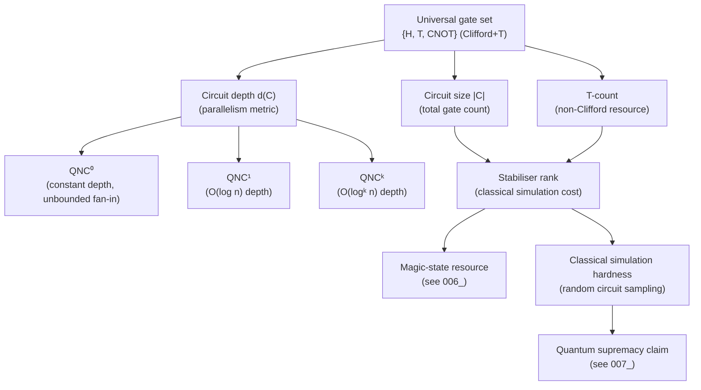

# QCSAA 900–909 · Section 00 · Subsection 905 · Subsubject 003 — Circuit Complexity and Lower Bounds

## 1. Purpose

Defines **quantum circuit complexity** — the minimum number of elementary gates (size) and parallel depth required to implement a unitary transformation — and surveys the principal lower-bound techniques that establish when classical simulation of quantum circuits is computationally hard. Introduces the QNC hierarchy, commutation-based depth lower bounds, rank and communication-complexity arguments, and their implications for the classical hardness of shallow quantum circuits. Follows the treatments in Nielsen & Chuang[^nielchung] and Aaronson & Chen[^aaronson].

## 2. Scope

- Covers the *Circuit Complexity and Lower Bounds* subsubject (`003`) of subsection `905` *Quantum Complexity and Resource Theory* within section `00` *Fundamentos de Computación Cuántica*.
- Inherits Q-Division authority and ORB support from the parent row in [`README.md`](./README.md)[^archtable].
- Concepts in scope:
  - **Quantum circuit complexity** — a quantum circuit on n qubits with gates from a universal gate set G; the size |C| is the total gate count; the depth d(C) is the longest path in the gate DAG (parallelism depth); the T-count is the number of non-Clifford T gates, the dominant resource in fault-tolerant compilation.
  - **Universal gate sets** — {H, T, CNOT} (Clifford+T), {H, CNOT, Toffoli}, and continuous gate sets (SU(2) × CNOT); Solovay-Kitaev theorem: any single-qubit gate can be approximated to precision ε by a Clifford+T sequence of length O(log^c(1/ε)).
  - **QNC hierarchy** — QNC^0 (constant-depth quantum circuits with unbounded fan-in), QNC^1, QNC^k for depth O(log^k n); QNC^0 can compute functions (e.g. the quantum Fourier transform on small registers) that are believed hard for NC^0.
  - **Depth-size trade-offs** — depth reduction by parallelism at a cost of ancilla qubits; pebbling arguments for space-time trade-offs in reversible computation; the Håstad-Goldmann theorem adapted to quantum settings.
  - **Rank-based lower bounds** — the communication matrix rank of the computed function provides lower bounds on quantum circuit size; algebraic geometry arguments (Raz et al.) for multi-party communication that bound circuit depth.
  - **Stabiliser rank** — the minimum number of stabiliser states required to express a quantum state as a superposition; related to the complexity of classically simulating Clifford+few-T circuits; stabiliser rank growth with T-gate count underpins magic-state resource theory (`006_`).
  - **Classical simulation and hardness** — a depth-d quantum circuit with local gates on a 2D grid can be classically simulated in time exponential in min(d, n); random circuit sampling on n ≥ 50 qubits at depth ~20 is believed classically hard (see `007_` for supremacy experiments).
  - **Lower bounds without oracles** — limitations of current techniques: no super-linear circuit-size lower bounds are known for explicit functions in P^{#P}; progress via monotone circuit lower bounds (Razborov-Smolensky) does not directly transfer to the quantum gate-set setting.
- Out of scope: query-model lower bounds (`002_`), complexity class definitions (`001_`), and the resource-theoretic formalism of magic (`006_`).

## 3. Diagram — Circuit Complexity Hierarchy

## 4. Footprint

| Metric | Value |
|---|---|
| Architecture | `QCSAA` — Quantum Computing & Sentient Agency Architecture |
| Master range | `900–999` |
| Code range | `900-909` |
| Section | `00` — Fundamentos de Computación Cuántica |
| Subsection | `905` — Quantum Complexity and Resource Theory |
| Subsubject | `003` — Circuit Complexity and Lower Bounds |
| Primary Q-Division | Q-HORIZON[^qdiv] |
| Support Q-Divisions | Q-HPC, Q-DATAGOV |
| ORB support | ORB-PMO, ORB-LEG |
| Governance class | `restricted`[^gov] |
| Folder path | `Q+ATLANTIDE/900-999_QCSAA/900-909_Fundamentos-de-Computacion-Cuantica/905_Quantum-Complexity-and-Resource-Theory/` |
| Document | `003_Circuit-Complexity-and-Lower-Bounds.md` (this file) |
| Parent subsection | [`README.md`](./README.md) · [`000_Overview.md`](./000_Overview.md) |
| Parent architecture | [`../../README.md`](../../README.md) |
| Parent baseline | [`organization/Q+ATLANTIDE.md`](../../../../organization/Q+ATLANTIDE.md) |

## 5. References & Citations

[^baseline]: **Q+ATLANTIDE controlled baseline (v1.0.0)** — [`organization/Q+ATLANTIDE.md`](../../../../organization/Q+ATLANTIDE.md). Defines the controlled `000-999` architecture-band taxonomy and the ATLAS-1000 register subpart.

[^archtable]: **§3 — Subsubject Index (parent README)** — [`README.md` §3](./README.md#3-subsubject-index). Authoritative source for the `905` subsection row (Primary Q-Division Q-HORIZON).

[^qdiv]: **Q-Division authority** — Q-Divisions provide technical authority over an architecture row (Q+ATLANTIDE Note N-002). See [`organization/Q+ATLANTIDE.md` §4](../../../../organization/Q+ATLANTIDE.md#4-notes).

[^gov]: **Governance class** — `restricted` denotes documents requiring additional governance, evidence packages and access controls (rule N-006[^n006]).

[^n006]: **Note N-006 (Restricted bands)** — Quantum-related (`900-999` QCSAA) bands require additional governance, evidence packages and access controls. See [`organization/Q+ATLANTIDE.md` §5.3](../../../../organization/Q+ATLANTIDE.md#53-restricted-band-templates-n-006).

[^nielchung]: **Nielsen, M. A. & Chuang, I. L. (2010)** — *Quantum Computation and Quantum Information* (10th Anniversary Edition). Cambridge University Press. Chapters 4–5 define quantum circuits, universality, and the Solovay-Kitaev theorem.

[^aaronson]: **Aaronson, S. & Chen, L. (2017)** — "Complexity-Theoretic Foundations of Quantum Supremacy Experiments." In *Proceedings of CCC 2017*. Surveys circuit-complexity hardness arguments for random circuit sampling and connects them to the polynomial hierarchy.

[^arorababarak]: **Arora, S. & Barak, B. (2009)** — *Computational Complexity: A Modern Approach*. Cambridge University Press. Chapters 6–14 cover circuit complexity, NC hierarchies, and lower-bound techniques applicable to the quantum setting.

[^isoiec4879]: **ISO/IEC 4879:2023** — *Quantum computing — Vocabulary*. Defines quantum circuit (§3.8) and circuit depth in the context of quantum computation vocabulary.

### Applicable standards

The following standards apply to this subsubject in addition to the cross-cutting Q+ATLANTIDE governance:

- Nielsen & Chuang (2010) — *Quantum Computation and Quantum Information*[^nielchung]
- Aaronson & Chen (2017) — "Complexity-Theoretic Foundations of Quantum Supremacy Experiments"[^aaronson]
- Arora & Barak (2009) — *Computational Complexity: A Modern Approach*[^arorababarak]
- ISO/IEC 4879:2023 — *Quantum computing — Vocabulary*[^isoiec4879]
