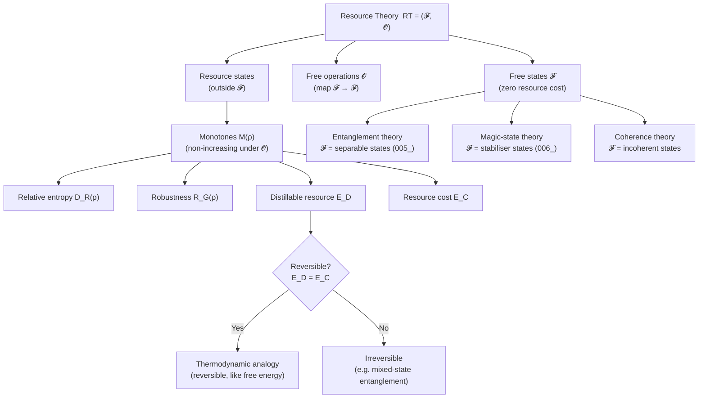

# QCSAA 900–909 · Section 00 · Subsection 905 · Subsubject 004 — Resource Theory Foundations

## 1. Purpose

Establishes the **axiomatic framework of quantum resource theories** — the general mathematical structure that formalises the notion of a quantum resource, its quantification, and the conditions under which resources can be converted or distilled. Introduces free states, free operations, resource monotones, and interconversion rates as the universal tools applied concretely to entanglement (`005_`), magic (`006_`), coherence, and thermodynamics. Follows the framework of Chitambar & Gour[^chitambar] and Winter[^winter].

## 2. Scope

- Covers the *Resource Theory Foundations* subsubject (`004`) of subsection `905` *Quantum Complexity and Resource Theory* within section `00` *Fundamentos de Computación Cuántica*.
- Inherits Q-Division authority and ORB support from the parent row in [`README.md`](./README.md)[^archtable].
- Concepts in scope:
  - **Resource theory structure** — a resource theory RT = (F, O) is defined by a set of free states F ⊆ D(H) (density operators obtainable without resource cost) and a set of free operations O (quantum channels that map F to F); any state outside F has nonzero resource.
  - **Free operations taxonomy** — LOCC (local operations and classical communication) for entanglement; stabiliser operations (Clifford unitaries, Pauli measurements, stabiliser-state preparation) for magic; incoherent operations (IOs), strictly incoherent operations (SIOs), and dephasing-covariant operations for coherence.
  - **Resource monotones** — a functional M: D(H) → ℝ≥0 is a resource monotone if M(ρ) = 0 for all ρ ∈ F and M does not increase under free operations: M(Λ(ρ)) ≤ M(ρ) for all Λ ∈ O; examples: relative entropy of resource D(ρ‖σ) = Tr[ρ(log ρ − log σ)] minimised over σ ∈ F; robustness of resource.
  - **Relative entropy of a resource** — D_R(ρ) = min_{σ∈F} D(ρ‖σ); operationally, it equals the optimal rate for single-shot resource dilution under a given free-operation class; provides an upper bound on distillable resource.
  - **Robustness** — the generalised robustness R_G(ρ) = min{s ≥ 0 : (ρ + s·τ)/(1+s) ∈ F for some density matrix τ}; multiplicatively related to channel discrimination tasks and witnessing advantages in channel discrimination.
  - **Resource distillation and formation rates** — the distillable resource E_D is the asymptotic rate at which maximally resourceful states ("gold standard") can be extracted from n copies of ρ under free operations; the resource cost E_C is the asymptotic rate of the reverse process; E_D ≤ E_C with equality only for reversible resource theories.
  - **Reversibility and thermodynamic analogy** — analogous to the second law of thermodynamics; a resource theory is reversible if E_D = E_C for all states; entanglement theory is irreversible for mixed states; coherence theory is reversible under strictly incoherent operations.
  - **Single-shot resource theory** — one-shot distillable resource E_D^ε (ε-error) and cost E_C^ε; smooth min- and max-entropy provide tight bounds; connection to hypothesis testing and one-shot information theory (Datta[^datta]).
  - **Channel resource theories** — extension of state resource theories to quantum channels; free channels, channel monotones, and resource interconversion rates for channels; relevant to quantifying resources in quantum communication protocols.
- Out of scope: specific application to entanglement (`005_`), magic states (`006_`), complexity class definitions (`001_`–`003_`).

## 3. Diagram — Resource Theory Framework

## 4. Footprint

| Metric | Value |
|---|---|
| Architecture | `QCSAA` — Quantum Computing & Sentient Agency Architecture |
| Master range | `900–999` |
| Code range | `900-909` |
| Section | `00` — Fundamentos de Computación Cuántica |
| Subsection | `905` — Quantum Complexity and Resource Theory |
| Subsubject | `004` — Resource Theory Foundations |
| Primary Q-Division | Q-HORIZON[^qdiv] |
| Support Q-Divisions | Q-HPC, Q-DATAGOV |
| ORB support | ORB-PMO, ORB-LEG |
| Governance class | `restricted`[^gov] |
| Folder path | `Q+ATLANTIDE/900-999_QCSAA/900-909_Fundamentos-de-Computacion-Cuantica/905_Quantum-Complexity-and-Resource-Theory/` |
| Document | `004_Resource-Theory-Foundations.md` (this file) |
| Parent subsection | [`README.md`](./README.md) · [`000_Overview.md`](./000_Overview.md) |
| Parent architecture | [`../../README.md`](../../README.md) |
| Parent baseline | [`organization/Q+ATLANTIDE.md`](../../../../organization/Q+ATLANTIDE.md) |

## 5. References & Citations

[^baseline]: **Q+ATLANTIDE controlled baseline (v1.0.0)** — [`organization/Q+ATLANTIDE.md`](../../../../organization/Q+ATLANTIDE.md). Defines the controlled `000-999` architecture-band taxonomy and the ATLAS-1000 register subpart.

[^archtable]: **§3 — Subsubject Index (parent README)** — [`README.md` §3](./README.md#3-subsubject-index). Authoritative source for the `905` subsection row (Primary Q-Division Q-HORIZON).

[^qdiv]: **Q-Division authority** — Q-Divisions provide technical authority over an architecture row (Q+ATLANTIDE Note N-002). See [`organization/Q+ATLANTIDE.md` §4](../../../../organization/Q+ATLANTIDE.md#4-notes).

[^gov]: **Governance class** — `restricted` denotes documents requiring additional governance, evidence packages and access controls (rule N-006[^n006]).

[^n006]: **Note N-006 (Restricted bands)** — Quantum-related (`900-999` QCSAA) bands require additional governance, evidence packages and access controls. See [`organization/Q+ATLANTIDE.md` §5.3](../../../../organization/Q+ATLANTIDE.md#53-restricted-band-templates-n-006).

[^chitambar]: **Chitambar, E. & Gour, G. (2019)** — "Quantum Resource Theories." *Reviews of Modern Physics*, 91(2), 025001. Comprehensive review of the axiomatic structure, examples, and interconversion results for quantum resource theories.

[^winter]: **Winter, A. & Streltsov, A. (2016)** — "Operational Resource Theory of Coherence." *Physical Review Letters*, 116, 120404. Establishes coherence as a formally manipulable resource with distillation and cost rates under strictly incoherent operations.

[^datta]: **Datta, N. (2009)** — "Min- and Max-Relative Entropies and a New Entanglement Monotone." *IEEE Transactions on Information Theory*, 55(6), 2816–2826. Introduces smooth min/max entropy bounds for one-shot resource distillation and formation.

[^isoiec4879]: **ISO/IEC 4879:2023** — *Quantum computing — Vocabulary*. Defines quantum entanglement (§3.6) and related resource-relevant concepts.

### Applicable standards

The following standards apply to this subsubject in addition to the cross-cutting Q+ATLANTIDE governance:

- Chitambar & Gour (2019) — "Quantum Resource Theories"[^chitambar]
- Winter & Streltsov (2016) — "Operational Resource Theory of Coherence"[^winter]
- Datta (2009) — "Min- and Max-Relative Entropies"[^datta]
- ISO/IEC 4879:2023 — *Quantum computing — Vocabulary*[^isoiec4879]
