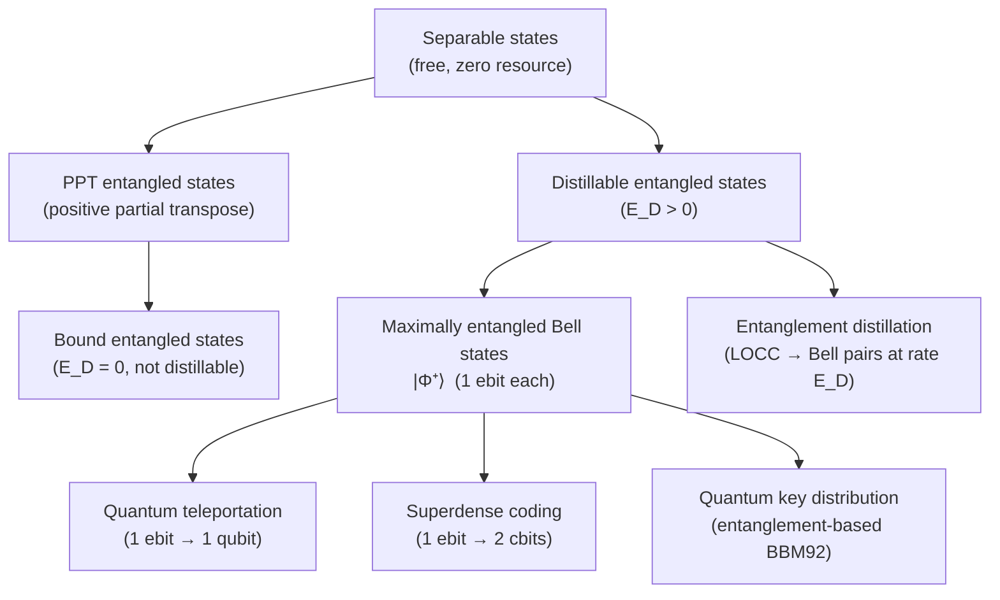

# QCSAA 900–909 · Section 00 · Subsection 905 · Subsubject 005 — Entanglement as Resource

## 1. Purpose

Applies the resource-theory framework (`004_`) to **quantum entanglement**, characterising it as the operationally meaningful resource underlying quantum teleportation, superdense coding, quantum key distribution, and multi-party quantum computing protocols. Defines LOCC-free convertibility, Schmidt rank, entanglement measures (entropy of entanglement, entanglement of formation, distillable entanglement, entanglement cost), and the asymptotic reversibility structure for pure and mixed states. Follows the canonical treatments in Nielsen & Chuang[^nielchung] and Horodecki et al.[^horodecki].

## 2. Scope

- Covers the *Entanglement as Resource* subsubject (`005`) of subsection `905` *Quantum Complexity and Resource Theory* within section `00` *Fundamentos de Computación Cuántica*.
- Inherits Q-Division authority and ORB support from the parent row in [`README.md`](./README.md)[^archtable].
- Concepts in scope:
  - **Entanglement resource theory** — free states: separable states ρ_AB = Σᵢ pᵢ σᵢ^A ⊗ τᵢ^B; free operations: LOCC (local operations and classical communication); any state that cannot be written as a separable state is entangled and carries nonzero resource.
  - **Schmidt decomposition** — every pure bipartite state |ψ⟩_{AB} = Σᵢ λᵢ |iᴬ⟩|iᴮ⟩ with λᵢ > 0 and Σᵢ λᵢ² = 1; Schmidt rank r is the number of nonzero Schmidt coefficients; r = 1 iff the state is separable; r ≥ 2 iff it is entangled.
  - **Entropy of entanglement** — E(|ψ⟩) = S(ρ_A) = −Σᵢ λᵢ² log λᵢ² (von Neumann entropy of either marginal); the unique entanglement measure for pure states under LOCC; the maximally entangled (Bell) state |Φ⁺⟩ has E = 1 ebit.
  - **Distillable entanglement and entanglement cost** — E_D(ρ): asymptotic rate of extracting Bell pairs from n copies of ρ under LOCC; E_C(ρ): asymptotic rate of forming ρ from Bell pairs under LOCC; E_D(ρ) ≤ E_C(ρ) with equality for pure states (E = S(ρ_A)); inequality for mixed states demonstrates irreversibility.
  - **Entanglement of formation** — E_F(ρ) = min_{pᵢ,|ψᵢ⟩} Σᵢ pᵢ E(|ψᵢ⟩) over all pure-state decompositions of ρ; E_F(ρ) ≥ E_D(ρ); its regularised version equals E_C under LOCC.
  - **Negativity and PPT criterion** — ρ_AB has a positive partial transpose (PPT) iff (Id_A ⊗ T_B)(ρ) ≥ 0 (Peres criterion); all separable states are PPT; the negativity N(ρ) = (‖ρ^{T_B}‖₁ − 1)/2 is an entanglement monotone; PPT states may be entangled (bound entanglement).
  - **Bound entanglement** — entangled states with E_D = 0; cannot be distilled into Bell pairs but may still enable certain quantum protocols (e.g. secret-key agreement); paradigmatic examples: Horodecki 3×3 bound entangled state.
  - **Operational protocols** — quantum teleportation consumes 1 ebit + 2 classical bits to transmit 1 qubit; superdense coding uses 1 ebit to transmit 2 classical bits; both protocols are optimal (Holevo bound / teleportation capacity theorem).
  - **Multipartite entanglement** — GHZ states, W states, graph states; LOCC classification beyond bipartite is vastly more complex; entanglement measures generalise to multipartite settings with distinct inequivalent entanglement classes.
- Out of scope: abstract resource-theory axioms (`004_`), magic (non-stabiliser) resource (`006_`), qubit mathematical formalism (`900_`).

## 3. Diagram — Entanglement Resource Ladder

## 4. Footprint

| Metric | Value |
|---|---|
| Architecture | `QCSAA` — Quantum Computing & Sentient Agency Architecture |
| Master range | `900–999` |
| Code range | `900-909` |
| Section | `00` — Fundamentos de Computación Cuántica |
| Subsection | `905` — Quantum Complexity and Resource Theory |
| Subsubject | `005` — Entanglement as Resource |
| Primary Q-Division | Q-HORIZON[^qdiv] |
| Support Q-Divisions | Q-HPC, Q-DATAGOV |
| ORB support | ORB-PMO, ORB-LEG |
| Governance class | `restricted`[^gov] |
| Folder path | `Q+ATLANTIDE/900-999_QCSAA/900-909_Fundamentos-de-Computacion-Cuantica/905_Quantum-Complexity-and-Resource-Theory/` |
| Document | `005_Entanglement-as-Resource.md` (this file) |
| Parent subsection | [`README.md`](./README.md) · [`000_Overview.md`](./000_Overview.md) |
| Parent architecture | [`../../README.md`](../../README.md) |
| Parent baseline | [`organization/Q+ATLANTIDE.md`](../../../../organization/Q+ATLANTIDE.md) |

## 5. References & Citations

[^baseline]: **Q+ATLANTIDE controlled baseline (v1.0.0)** — [`organization/Q+ATLANTIDE.md`](../../../../organization/Q+ATLANTIDE.md). Defines the controlled `000-999` architecture-band taxonomy and the ATLAS-1000 register subpart.

[^archtable]: **§3 — Subsubject Index (parent README)** — [`README.md` §3](./README.md#3-subsubject-index). Authoritative source for the `905` subsection row (Primary Q-Division Q-HORIZON).

[^qdiv]: **Q-Division authority** — Q-Divisions provide technical authority over an architecture row (Q+ATLANTIDE Note N-002). See [`organization/Q+ATLANTIDE.md` §4](../../../../organization/Q+ATLANTIDE.md#4-notes).

[^gov]: **Governance class** — `restricted` denotes documents requiring additional governance, evidence packages and access controls (rule N-006[^n006]).

[^n006]: **Note N-006 (Restricted bands)** — Quantum-related (`900-999` QCSAA) bands require additional governance, evidence packages and access controls. See [`organization/Q+ATLANTIDE.md` §5.3](../../../../organization/Q+ATLANTIDE.md#53-restricted-band-templates-n-006).

[^nielchung]: **Nielsen, M. A. & Chuang, I. L. (2010)** — *Quantum Computation and Quantum Information* (10th Anniversary Edition). Cambridge University Press. Chapters 12–13 cover entanglement measures, distillation, Schmidt decomposition, and LOCC operations.

[^horodecki]: **Horodecki, R., Horodecki, P., Horodecki, M. & Horodecki, K. (2009)** — "Quantum Entanglement." *Reviews of Modern Physics*, 81(2), 865. Comprehensive review of entanglement theory: separability criteria, measures, distillation, and multipartite entanglement.

[^isoiec4879]: **ISO/IEC 4879:2023** — *Quantum computing — Vocabulary*. Defines quantum entanglement (§3.6), Bell state (§3.7), and related terms for the operational vocabulary of entanglement as a resource.

### Applicable standards

The following standards apply to this subsubject in addition to the cross-cutting Q+ATLANTIDE governance:

- Nielsen & Chuang (2010) — *Quantum Computation and Quantum Information*[^nielchung]
- Horodecki et al. (2009) — "Quantum Entanglement"[^horodecki]
- ISO/IEC 4879:2023 — *Quantum computing — Vocabulary*[^isoiec4879]
