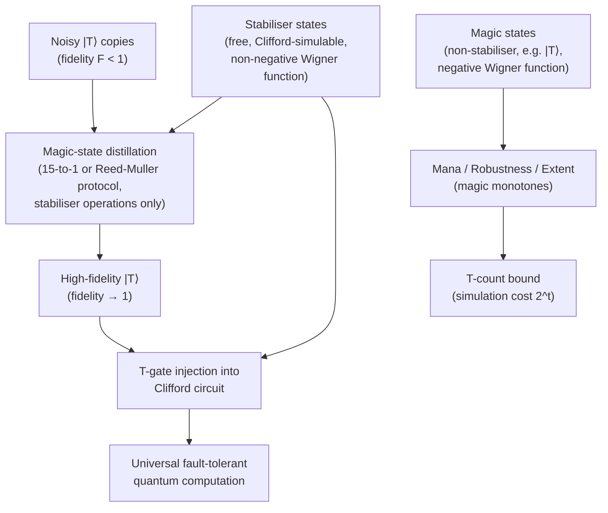

# QCSAA 900–909 · Section 00 · Subsection 905 · Subsubject 006 — Magic States and Non-Stabilizer Resources

## 1. Purpose

Establishes the **resource theory of magic (non-stabiliser resources)** — the formal treatment of the computational power that lies beyond the Clifford/stabiliser free set. Defines the stabiliser formalism as the free-resource baseline, characterises magic states and their role in universal fault-tolerant quantum computation, introduces magic measures (robustness, mana, stabiliser extent), and quantifies the overhead of magic-state distillation. This subsubject connects `900_Qubits/005_` (logical-qubit encoding and magic-state injection) with `003_` (T-count as a complexity metric), and grounds the resource-theoretic framework of `004_` in a computationally critical application. Follows Bravyi & Kitaev[^bravyi] and Veitch et al.[^veitch].

## 2. Scope

- Covers the *Magic States and Non-Stabilizer Resources* subsubject (`006`) of subsection `905` *Quantum Complexity and Resource Theory* within section `00` *Fundamentos de Computación Cuántica*.
- Inherits Q-Division authority and ORB support from the parent row in [`README.md`](./README.md)[^archtable].
- Concepts in scope:
  - **Stabiliser formalism recap** — the Clifford group is generated by {H, S, CNOT}; Clifford circuits map Pauli operators to Pauli operators under conjugation; the Gottesman-Knill theorem proves that stabiliser circuits (Clifford + Pauli-basis measurements + stabiliser-state preparation) are efficiently classically simulable in O(n²) time, establishing the "free" baseline.
  - **Magic states** — states that lie outside the convex hull of stabiliser states; the canonical example is the T-state |T⟩ = T|+⟩ = (|0⟩ + e^{iπ/4}|1⟩)/√2; injecting |T⟩ into a Clifford circuit enables universal quantum computation (Bravyi-Kitaev theorem[^bravyi]).
  - **Resource theory of magic** — free states: stabiliser states (pure and mixed convex hull); free operations: stabiliser (Clifford) operations; resource states: any state with nonzero non-stabiliserness; magic is necessary and sufficient for quantum computational universality beyond BPP.
  - **Magic measures**:
    - *Mana* M(ρ) = log Σ_{p∈𝒫} |W_ρ(p)| where W_ρ is the discrete Wigner function; mana is a strong monotone under stabiliser operations for odd-dimensional systems (Veitch et al.[^veitch]).
    - *Stabiliser extent* ξ(ψ) = min{Σᵢ |cᵢ|² : |ψ⟩ = Σᵢ cᵢ|φᵢ⟩, |φᵢ⟩ stabiliser}; ξ(ψ)^{1/2} bounds the classical simulation cost of sampling from a Clifford+|ψ⟩ circuit.
    - *Robustness of magic* R_M(ρ): minimum s such that (ρ + s·τ)/(1+s) is a stabiliser state for some density matrix τ; related to the cost of channel discrimination using ρ.
  - **Magic-state distillation** — a stabiliser protocol that consumes m noisy copies of a magic state at fidelity F and outputs one higher-fidelity copy at rate r(F, m); the 15-to-1 protocol (Bravyi-Kitaev[^bravyi]) distills |T⟩ using 15 input copies to produce 1 output copy; resource overhead: dominant cost in fault-tolerant resource estimates.
  - **T-count and simulation complexity** — a Clifford+T circuit with T-count t can be classically simulated in time O(poly(n)·2^t) (Bravyi et al. 2016); thus the T-count is the primary resource metric for both quantum advantage and simulation hardness, connecting to `003_` (T-count as circuit complexity) and `900/005_` (magic-state injection in fault-tolerant computation).
  - **Quasiprobability representations** — the discrete Wigner function on qudit systems provides a unified framework for stabiliser states (non-negative Wigner function) vs magic states (negative Wigner function); negativity in the Wigner function is both necessary and sufficient for computational advantage in certain measurement-based models.
- Out of scope: abstract resource-theory axioms (`004_`), entanglement resource (`005_`), complexity class definitions (`001_`).

## 3. Diagram — Magic-State Distillation Pipeline

## 4. Footprint

| Metric | Value |
|---|---|
| Architecture | `QCSAA` — Quantum Computing & Sentient Agency Architecture |
| Master range | `900–999` |
| Code range | `900-909` |
| Section | `00` — Fundamentos de Computación Cuántica |
| Subsection | `905` — Quantum Complexity and Resource Theory |
| Subsubject | `006` — Magic States and Non-Stabilizer Resources |
| Primary Q-Division | Q-HORIZON[^qdiv] |
| Support Q-Divisions | Q-HPC, Q-DATAGOV |
| ORB support | ORB-PMO, ORB-LEG |
| Governance class | `restricted`[^gov] |
| Folder path | `Q+ATLANTIDE/900-999_QCSAA/900-909_Fundamentos-de-Computacion-Cuantica/905_Quantum-Complexity-and-Resource-Theory/` |
| Document | `006_Magic-States-and-Non-Stabilizer-Resources.md` (this file) |
| Parent subsection | [`README.md`](./README.md) · [`000_Overview.md`](./000_Overview.md) |
| Parent architecture | [`../../README.md`](../../README.md) |
| Parent baseline | [`organization/Q+ATLANTIDE.md`](../../../../organization/Q+ATLANTIDE.md) |

## 5. References & Citations

[^baseline]: **Q+ATLANTIDE controlled baseline (v1.0.0)** — [`organization/Q+ATLANTIDE.md`](../../../../organization/Q+ATLANTIDE.md). Defines the controlled `000-999` architecture-band taxonomy and the ATLAS-1000 register subpart.

[^archtable]: **§3 — Subsubject Index (parent README)** — [`README.md` §3](./README.md#3-subsubject-index). Authoritative source for the `905` subsection row (Primary Q-Division Q-HORIZON).

[^qdiv]: **Q-Division authority** — Q-Divisions provide technical authority over an architecture row (Q+ATLANTIDE Note N-002). See [`organization/Q+ATLANTIDE.md` §4](../../../../organization/Q+ATLANTIDE.md#4-notes).

[^gov]: **Governance class** — `restricted` denotes documents requiring additional governance, evidence packages and access controls (rule N-006[^n006]).

[^n006]: **Note N-006 (Restricted bands)** — Quantum-related (`900-999` QCSAA) bands require additional governance, evidence packages and access controls. See [`organization/Q+ATLANTIDE.md` §5.3](../../../../organization/Q+ATLANTIDE.md#53-restricted-band-templates-n-006).

[^bravyi]: **Bravyi, S. & Kitaev, A. (2005)** — "Universal Quantum Computation with Ideal Clifford Gates and Noisy Ancillas." *Physical Review A*, 71(2), 022316. Introduces magic-state distillation and proves that Clifford+T-state injection suffices for universal quantum computation.

[^veitch]: **Veitch, V., Mousavian, S. A. H., Gottesman, D. & Emerson, J. (2014)** — "The Resource Theory of Stabiliser Computation." *New Journal of Physics*, 16(1), 013009. Formalises the resource theory of magic, introduces the mana monotone via the discrete Wigner function, and proves operational significance.

[^isoiec4879]: **ISO/IEC 4879:2023** — *Quantum computing — Vocabulary*. Defines fault-tolerant quantum computation (§3.17) and universal quantum gate set (§3.9) in the context of magic-state-based universality.

### Applicable standards

The following standards apply to this subsubject in addition to the cross-cutting Q+ATLANTIDE governance:

- Bravyi & Kitaev (2005) — "Universal Quantum Computation with Ideal Clifford Gates and Noisy Ancillas"[^bravyi]
- Veitch et al. (2014) — "The Resource Theory of Stabiliser Computation"[^veitch]
- ISO/IEC 4879:2023 — *Quantum computing — Vocabulary*[^isoiec4879]
