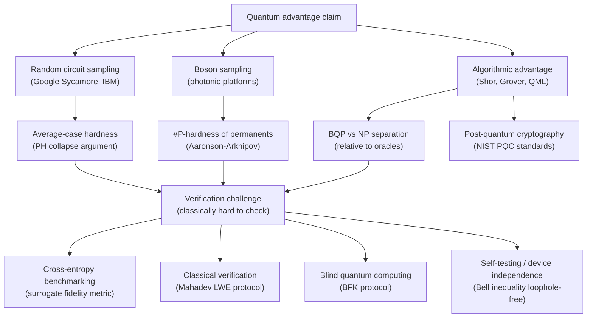

# QCSAA 900–909 · Section 00 · Subsection 905 · Subsubject 007 — Quantum Advantage, Classical Hardness and Verification

## 1. Purpose

Defines the complexity-theoretic foundations of **quantum advantage** and **quantum supremacy** claims, characterises the classical hardness assumptions that underpin them, and surveys protocols for **verifying quantum computations** either classically or through interactive proof systems. Connects the complexity-class separations of `001_`, the oracle lower bounds of `002_`, and the circuit complexity results of `003_` to the experimental and cryptographic literature on demonstrating and certifying quantum computational power. Canonical references include Aaronson & Chen[^aaronson], Arkhipov & Aaronson[^arkhipov], and the verification framework of Mahadev[^mahadev].

## 2. Scope

- Covers the *Quantum Advantage, Classical Hardness and Verification* subsubject (`007`) of subsection `905` *Quantum Complexity and Resource Theory* within section `00` *Fundamentos de Computación Cuántica*.
- Inherits Q-Division authority and ORB support from the parent row in [`README.md`](./README.md)[^archtable].
- Concepts in scope:
  - **Quantum supremacy and advantage definitions** — *quantum supremacy* (Preskill 2012): a quantum device solves a specific computational task in a time that no classical computer can match in practice; *quantum advantage*: a provable or conjectured complexity separation between quantum and classical for a task of practical relevance; ISO/IEC 4879[^isoiec4879] distinguishes these terms.
  - **Random circuit sampling (RCS)** — a quantum computer applies a random depth-d circuit of 2-qubit gates to n qubits and samples the output distribution; Google Sycamore (2019): 53 qubits at depth ~20 claimed to require 10,000 years on classical supercomputers; hardness argument: anti-concentration + polynomial-hierarchy (PH) collapse argument (Aaronson & Chen[^aaronson]) implies that classically spoofing the heavy-output set probability requires collapsing PH to the third level.
  - **Boson sampling** — linear-optical network on m modes with n ≤ m photons; sampling the output distribution is #P-hard to classically simulate exactly; approximate classical hardness is conjectured under the permanent-of-Gaussians conjecture (Aaronson & Arkhipov[^arkhipov]); BosonSampling with n ~ 50–100 photons is an early quantum advantage target.
  - **Average-case hardness** — worst-case hardness (NP or #P) does not directly imply quantum advantage in practice; the key is *average-case* hardness relative to Haar-random circuits; worst-to-average case reduction via the polynomial method implies PH collapse if classical simulation is efficient in the average case.
  - **Classical simulation algorithms** — tensor-network contraction (MPS, PEPS), stabiliser simulation (Clifford+few-T), Clifford+T sparse simulation (2^t scaling), and direct amplitude estimation; each sets a regime boundary distinguishing classically tractable from classically hard circuits.
  - **Verification of quantum computations** — the central challenge: a classical verifier cannot directly check quantum outputs; approaches:
    - *Classical verification via cryptography* — Mahadev[^mahadev] constructs a classical-verifier interactive protocol for BQP based on trapdoor claw-free functions (LWE assumption); the prover (quantum device) proves correct computation to a classical polynomial-time verifier.
    - *Blind quantum computing* — Broadbent-Fitzsimons-Kashefi protocol: a classical (or limited quantum) client delegates computation to a quantum server while keeping inputs and computation hidden; used as a verification subroutine.
    - *Cross-entropy benchmarking (XEB)* — classical estimate of the linear cross-entropy fidelity F_XEB = 2^n ⟨P_θ(x)⟩ − 1; surrogate metric for verifying RCS experiments; susceptible to spoofing by approximate classical algorithms in certain regimes.
    - *Self-testing and device independence* — Bell inequality violations certify entanglement and, with loophole-free tests, verify quantum device behaviour without trusting the device; connection to device-independent quantum key distribution and randomness certification.
  - **Post-quantum cryptographic implications** — quantum advantage for factoring (Shor) and search (Grover) directly threatens RSA/ECC and symmetric-key security margins; NIST PQC standardisation timeline and the resource estimates (qubit count, T-gate count from `003_`) required to break specific key sizes.
- Out of scope: complexity class definitions without experimental context (`001_`), query lower bounds (`002_`), and magic-state distillation overhead (`006_`).

## 3. Diagram — Quantum Advantage Landscape

## 4. Footprint

| Metric | Value |
|---|---|
| Architecture | `QCSAA` — Quantum Computing & Sentient Agency Architecture |
| Master range | `900–999` |
| Code range | `900-909` |
| Section | `00` — Fundamentos de Computación Cuántica |
| Subsection | `905` — Quantum Complexity and Resource Theory |
| Subsubject | `007` — Quantum Advantage, Classical Hardness and Verification |
| Primary Q-Division | Q-HORIZON[^qdiv] |
| Support Q-Divisions | Q-HPC, Q-DATAGOV |
| ORB support | ORB-PMO, ORB-LEG |
| Governance class | `restricted`[^gov] |
| Folder path | `Q+ATLANTIDE/900-999_QCSAA/900-909_Fundamentos-de-Computacion-Cuantica/905_Quantum-Complexity-and-Resource-Theory/` |
| Document | `007_Quantum-Advantage-Classical-Hardness-and-Verification.md` (this file) |
| Parent subsection | [`README.md`](./README.md) · [`000_Overview.md`](./000_Overview.md) |
| Parent architecture | [`../../README.md`](../../README.md) |
| Parent baseline | [`organization/Q+ATLANTIDE.md`](../../../../organization/Q+ATLANTIDE.md) |

## 5. References & Citations

[^baseline]: **Q+ATLANTIDE controlled baseline (v1.0.0)** — [`organization/Q+ATLANTIDE.md`](../../../../organization/Q+ATLANTIDE.md). Defines the controlled `000-999` architecture-band taxonomy and the ATLAS-1000 register subpart.

[^archtable]: **§3 — Subsubject Index (parent README)** — [`README.md` §3](./README.md#3-subsubject-index). Authoritative source for the `905` subsection row (Primary Q-Division Q-HORIZON).

[^qdiv]: **Q-Division authority** — Q-Divisions provide technical authority over an architecture row (Q+ATLANTIDE Note N-002). See [`organization/Q+ATLANTIDE.md` §4](../../../../organization/Q+ATLANTIDE.md#4-notes).

[^gov]: **Governance class** — `restricted` denotes documents requiring additional governance, evidence packages and access controls (rule N-006[^n006]).

[^n006]: **Note N-006 (Restricted bands)** — Quantum-related (`900-999` QCSAA) bands require additional governance, evidence packages and access controls. See [`organization/Q+ATLANTIDE.md` §5.3](../../../../organization/Q+ATLANTIDE.md#53-restricted-band-templates-n-006).

[^aaronson]: **Aaronson, S. & Chen, L. (2017)** — "Complexity-Theoretic Foundations of Quantum Supremacy Experiments." In *Proceedings of CCC 2017*. Formal hardness argument for random circuit sampling based on anti-concentration and polynomial-hierarchy collapse.

[^arkhipov]: **Aaronson, S. & Arkhipov, A. (2011)** — "The Computational Complexity of Linear Optics." In *Proceedings of STOC 2011*. Introduces boson sampling, proves #P-hardness of exact classical simulation, and conjectures average-case hardness.

[^mahadev]: **Mahadev, U. (2018)** — "Classical Verification of Quantum Computations." In *Proceedings of FOCS 2018*. Constructs the first classical-verifier interactive proof system for BQP under the learning-with-errors (LWE) hardness assumption.

[^isoiec4879]: **ISO/IEC 4879:2023** — *Quantum computing — Vocabulary*. Defines quantum advantage (§3.18) and quantum supremacy (§3.19), distinguishing conjectured advantage from demonstrated computational superiority.

### Applicable standards

The following standards apply to this subsubject in addition to the cross-cutting Q+ATLANTIDE governance:

- Aaronson & Chen (2017) — "Complexity-Theoretic Foundations of Quantum Supremacy Experiments"[^aaronson]
- Aaronson & Arkhipov (2011) — "The Computational Complexity of Linear Optics"[^arkhipov]
- Mahadev (2018) — "Classical Verification of Quantum Computations"[^mahadev]
- ISO/IEC 4879:2023 — *Quantum computing — Vocabulary*[^isoiec4879]
