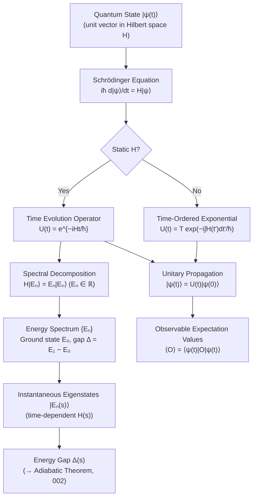

# QCSAA 900-909 · Section 00 · Subsection 906 · Subsubject 001 — Hamiltonian Formalism and Time Evolution

## 1. Purpose

Establishes the **mathematical foundation of Hamiltonian quantum mechanics** as applied to quantum computation: the Schrödinger equation iħ d|ψ⟩/dt = H|ψ⟩, the time evolution operator U(t) = e^{−iHt/ħ} for static Hamiltonians, Hermitian observables with real eigenvalues, the energy spectrum constituted by eigenstates of H, and the distinction between static and time-dependent Hamiltonians. These concepts underpin the entire subsection `906` *Hamiltonian Methods and Adiabatic Computation*, providing the operator-algebraic framework upon which the adiabatic theorem, AQC model, quantum annealing, and circuit equivalence are built[^nielsen_chuang][^sakurai][^farhi2000].

## 2. Scope

- Covers the *Hamiltonian Formalism and Time Evolution* subsubject (`001`) of subsection `906` within section `00` *Fundamentos de Computación Cuántica*.
- Inherits Q-Division authority and ORB support from the parent row in [`../../README.md` §3](../../README.md#3-architecture-table)[^archtable].
- Concepts in scope:
  - **Schrödinger equation** — the time-dependent Schrödinger equation iħ d|ψ⟩/dt = H|ψ⟩ as the equation of motion for a closed quantum system; H as a Hermitian operator on the system's Hilbert space.
  - **Time evolution operator** — for a static (time-independent) Hamiltonian H, the propagator U(t) = e^{−iHt/ħ}; unitarity U†U = I; the relationship U(t) = Σₙ e^{−iEₙt/ħ} |Eₙ⟩⟨Eₙ| via spectral decomposition.
  - **Hermitian observables and energy spectrum** — the eigenvalue equation H|Eₙ⟩ = Eₙ|Eₙ⟩; real eigenvalues {Eₙ} as the energy spectrum; orthonormal eigenstates {|Eₙ⟩} forming a complete basis; ground-state energy E₀ and ground state |E₀⟩.
  - **Static vs. time-dependent Hamiltonians** — the time-independent case and its exact closed-form exponential; the time-dependent case and the Dyson series / time-ordered exponential U(t) = T exp(−i∫₀ᵗ H(t′) dt′/ħ).
  - **Instantaneous eigenstates and energy gaps** — for a parametrically varying H(s), the instantaneous eigenstates |Eₙ(s)⟩ and instantaneous energy gaps Δ(s) = E₁(s) − E₀(s); relevance to the adiabatic regime (→ `002`).
- Out of scope: the adiabatic theorem and gap conditions (`002`), the AQC model (`003`), quantum annealing hardware (`004`), and circuit-level Hamiltonian simulation (`005`).

## 3. Diagram — Hamiltonian Formalism and Time Evolution

## 4. Footprint

| Metric | Value |
|---|---|
| Architecture | `QCSAA` — Quantum Computing & Sentient Agency Architecture |
| Master range | `900–999` |
| Code range | `900-909` |
| Section | `00` — Fundamentos de Computación Cuántica |
| Subsection | `906` — Hamiltonian Methods and Adiabatic Computation |
| Subsubject | `001` — Hamiltonian Formalism and Time Evolution |
| Primary Q-Division | Q-HORIZON[^qdiv] |
| Support Q-Divisions | Q-HPC, Q-DATAGOV |
| ORB support | ORB-PMO, ORB-LEG |
| Governance class | `restricted`[^gov] |
| Folder path | `Q+ATLANTIDE/900-999_QCSAA/900-909_Fundamentos-de-Computacion-Cuantica/906_Hamiltonian-Methods-and-Adiabatic-Computation/` |
| Document | `001_Hamiltonian-Formalism-and-Time-Evolution.md` (this file) |
| Parent subsection | [`README.md`](./README.md) · [`000_Overview.md`](./000_Overview.md) |
| Parent architecture | [`../../README.md`](../../README.md) |
| Parent baseline | [`organization/Q+ATLANTIDE.md`](../../../../organization/Q+ATLANTIDE.md) |

## 5. References & Citations

[^baseline]: **Q+ATLANTIDE controlled baseline (v1.0.0)** — [`organization/Q+ATLANTIDE.md`](../../../../organization/Q+ATLANTIDE.md). Defines the controlled `000-999` architecture-band taxonomy and the ATLAS-1000 register subpart.

[^archtable]: **QCSAA §3 Architecture Table** — [`../../README.md` §3](../../README.md#3-architecture-table). Authoritative source for the `900-909` row (Section `00` — Fundamentos de Computación Cuántica, Primary Q-Division Q-HORIZON).

[^qdiv]: **Q-Division authority** — Q-Divisions provide technical authority over an architecture row (Q+ATLANTIDE Note N-002). See [`organization/Q+ATLANTIDE.md` §4](../../../../organization/Q+ATLANTIDE.md#4-notes).

[^gov]: **Governance class** — `restricted` denotes documents requiring additional governance, evidence packages and access controls (rule N-006[^n006]).

[^n006]: **Note N-006 (Restricted bands)** — Quantum-related (`900-999` QCSAA) bands require additional governance, evidence packages and access controls. See [`organization/Q+ATLANTIDE.md` §5.3](../../../../organization/Q+ATLANTIDE.md#53-restricted-band-templates-n-006).

[^nielsen_chuang]: **Nielsen, M. A. & Chuang, I. L. — *Quantum Computation and Quantum Information* (10th anniversary ed., Cambridge University Press, 2010), Ch. 2** — Primary reference for Hamiltonian formalism, the Schrödinger equation, and the time evolution operator in quantum computation. ISBN 978-1-107-00217-3.

[^sakurai]: **Sakurai, J. J. & Napolitano, J. — *Modern Quantum Mechanics* (2nd ed., Addison-Wesley, 2010)** — Standard graduate reference for Hermitian observables, spectral decomposition, and time evolution in quantum mechanics. ISBN 978-0-805-38291-4.

[^farhi2000]: **Farhi, E., Goldstone, J., Gutmann, S., Lapan, J., Lundgren, A. & Preda, D. — *A Quantum Adiabatic Evolution Algorithm Applied to Random Instances of an NP-Complete Problem* (2000)** — Introduces the AQC model and its reliance on Hamiltonian time evolution and energy gap analysis. [arXiv:quant-ph/0001106](https://arxiv.org/abs/quant-ph/0001106).

### Applicable standards

- Nielsen & Chuang — *Quantum Computation and Quantum Information*, Ch. 2 (Cambridge, 2010)[^nielsen_chuang]
- Sakurai & Napolitano — *Modern Quantum Mechanics* (2nd ed., Addison-Wesley, 2010)[^sakurai]
- Farhi et al. — *A Quantum Adiabatic Evolution Algorithm* (arXiv:quant-ph/0001106, 2000)[^farhi2000]
