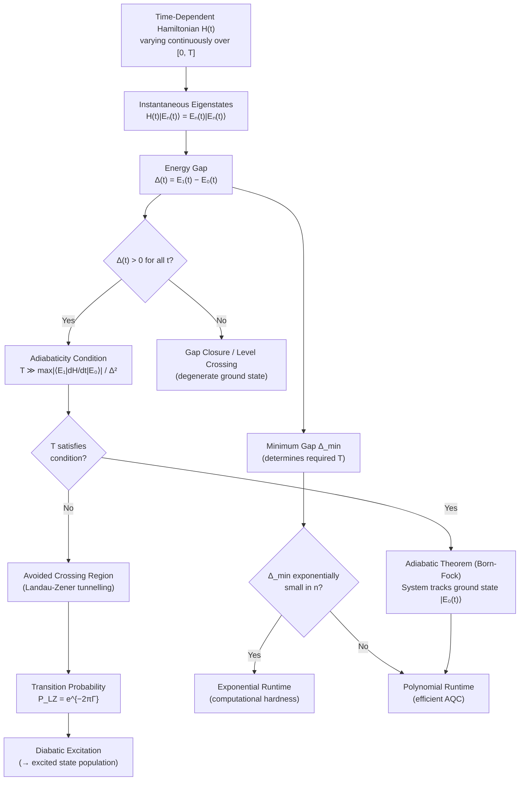

# QCSAA 900-909 · Section 00 · Subsection 906 · Subsubject 002 — Adiabatic Theorem and Gap Conditions

## 1. Purpose

States and analyses the **Born-Fock adiabatic theorem** (1928) as the central theoretical guarantee underpinning adiabatic quantum computation: a quantum system initially in the ground state of a slowly-varying Hamiltonian H(t) remains in the instantaneous ground state throughout the evolution, provided the evolution time T is sufficiently large relative to the inverse square of the minimum spectral gap. This subsubject formalises the energy gap Δ(t) = E₁(t) − E₀(t) between the ground and first excited states, the quantitative adiabaticity condition, Landau-Zener tunnelling at avoided crossings, and the computational consequences of exponentially small spectral gaps for the efficiency of the AQC model[^born_fock][^albash_lidar][^landau_zener].

## 2. Scope

- Covers the *Adiabatic Theorem and Gap Conditions* subsubject (`002`) of subsection `906` within section `00` *Fundamentos de Computación Cuántica*.
- Inherits Q-Division authority and ORB support from the parent row in [`../../README.md` §3](../../README.md#3-architecture-table)[^archtable].
- Concepts in scope:
  - **Born-Fock adiabatic theorem (1928)** — formal statement: if H(t) varies continuously, the spectral gap Δ(t) > 0 for all t ∈ [0, T], and T is large enough, then a system starting in the k-th eigenstate of H(0) remains in the k-th instantaneous eigenstate of H(t) up to a phase; original proof by Born and Fock (1928).
  - **Energy gap Δ(t) = E₁(t) − E₀(t)** — the spectral gap between the ground state energy E₀(t) and the first excited state energy E₁(t) as a function of the interpolation parameter; the minimum gap Δ_min = min_{t∈[0,T]} Δ(t) as the critical resource governing the adiabatic runtime.
  - **Adiabaticity condition** — the quantitative condition T ≫ max_{t} (|⟨E₁(t)|dH/dt|E₀(t)⟩| / Δ(t)²); derivation from first-order perturbation theory in the adiabatic frame; implications for scheduling s(t) near gap minima.
  - **Landau-Zener tunnelling at avoided crossings** — the Landau-Zener formula for the transition probability P_{LZ} = e^{−2πΓ} at an avoided crossing, where Γ = |⟨E₁|∂H/∂s|E₀⟩|² / (2|dΔ/ds|); physical mechanism of diabatic transitions.
  - **Minimum spectral gap problem** — instances of NP-hard problems for which Δ_min is exponentially small in n, implying exponentially large runtime T for the adiabatic algorithm; open question of the gap for random 3-SAT.
- Out of scope: the AQC model construction (`003`), Ising encoding (`004`), and error mitigation strategies (`006`).

## 3. Diagram — Adiabatic Theorem and Gap Conditions

## 4. Footprint

| Metric | Value |
|---|---|
| Architecture | `QCSAA` — Quantum Computing & Sentient Agency Architecture |
| Master range | `900–999` |
| Code range | `900-909` |
| Section | `00` — Fundamentos de Computación Cuántica |
| Subsection | `906` — Hamiltonian Methods and Adiabatic Computation |
| Subsubject | `002` — Adiabatic Theorem and Gap Conditions |
| Primary Q-Division | Q-HORIZON[^qdiv] |
| Support Q-Divisions | Q-HPC, Q-DATAGOV |
| ORB support | ORB-PMO, ORB-LEG |
| Governance class | `restricted`[^gov] |
| Folder path | `Q+ATLANTIDE/900-999_QCSAA/900-909_Fundamentos-de-Computacion-Cuantica/906_Hamiltonian-Methods-and-Adiabatic-Computation/` |
| Document | `002_Adiabatic-Theorem-and-Gap-Conditions.md` (this file) |
| Parent subsection | [`README.md`](./README.md) · [`000_Overview.md`](./000_Overview.md) |
| Parent architecture | [`../../README.md`](../../README.md) |
| Parent baseline | [`organization/Q+ATLANTIDE.md`](../../../../organization/Q+ATLANTIDE.md) |

## 5. References & Citations

[^baseline]: **Q+ATLANTIDE controlled baseline (v1.0.0)** — [`organization/Q+ATLANTIDE.md`](../../../../organization/Q+ATLANTIDE.md). Defines the controlled `000-999` architecture-band taxonomy and the ATLAS-1000 register subpart.

[^archtable]: **QCSAA §3 Architecture Table** — [`../../README.md` §3](../../README.md#3-architecture-table). Authoritative source for the `900-909` row (Section `00` — Fundamentos de Computación Cuántica, Primary Q-Division Q-HORIZON).

[^qdiv]: **Q-Division authority** — Q-Divisions provide technical authority over an architecture row (Q+ATLANTIDE Note N-002). See [`organization/Q+ATLANTIDE.md` §4](../../../../organization/Q+ATLANTIDE.md#4-notes).

[^gov]: **Governance class** — `restricted` denotes documents requiring additional governance, evidence packages and access controls (rule N-006[^n006]).

[^n006]: **Note N-006 (Restricted bands)** — Quantum-related (`900-999` QCSAA) bands require additional governance, evidence packages and access controls. See [`organization/Q+ATLANTIDE.md` §5.3](../../../../organization/Q+ATLANTIDE.md#53-restricted-band-templates-n-006).

[^born_fock]: **Born, M. & Fock, V. — *Beweis des Adiabatensatzes* — Zeitschrift für Physik 51, 165–180 (1928)** — Original proof of the quantum adiabatic theorem establishing the conditions under which a system tracks its instantaneous eigenstate. [DOI:10.1007/BF01343193](https://doi.org/10.1007/BF01343193).

[^albash_lidar]: **Albash, T. & Lidar, D. A. — *Adiabatic Quantum Computation* — Rev. Mod. Phys. 90, 015002 (2018)** — Comprehensive review covering the adiabatic theorem, gap conditions, Landau-Zener transitions, and their implications for quantum computation. [DOI:10.1103/RevModPhys.90.015002](https://doi.org/10.1103/RevModPhys.90.015002).

[^landau_zener]: **Landau, L. D. — Phys. Z. Sowjetunion 2, 46 (1932); Zener, C. — Proc. R. Soc. Lond. A 137, 696–702 (1932)** — Independent derivations of the two-level transition probability at an avoided crossing, foundational for understanding diabatic tunnelling in adiabatic quantum computation.

### Applicable standards

- Born & Fock — *Beweis des Adiabatensatzes*, Zeitschrift für Physik 51 (1928)[^born_fock]
- Albash & Lidar — *Adiabatic Quantum Computation*, Rev. Mod. Phys. 90, 015002 (2018)[^albash_lidar]
- Landau (1932) / Zener (1932) — Landau-Zener tunnelling formula[^landau_zener]
