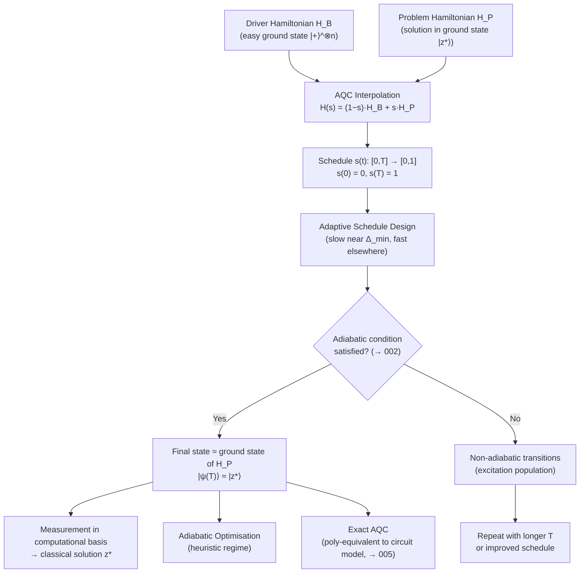

# QCSAA 900-909 · Section 00 · Subsection 906 · Subsubject 003 — Adiabatic Quantum Computation Model

## 1. Purpose

Defines and analyses the **Adiabatic Quantum Computation (AQC) model** as introduced by Farhi et al. (2000): the time-dependent Hamiltonian H(t) = (1−s(t))H_B + s(t)H_P interpolating between an initial driver Hamiltonian H_B (with a simple, easily prepared ground state) and a problem Hamiltonian H_P (whose ground state encodes the solution to a computational problem). This subsubject specifies the structural roles of H_B and H_P, the design space for interpolation schedules s(t), and the distinction between adiabatic optimisation (approximate) and adiabatic exact computation (polynomial equivalence with the circuit model)[^farhi2000][^albash_lidar][^aharonov2007].

## 2. Scope

- Covers the *Adiabatic Quantum Computation Model* subsubject (`003`) of subsection `906` within section `00` *Fundamentos de Computación Cuántica*.
- Inherits Q-Division authority and ORB support from the parent row in [`../../README.md` §3](../../README.md#3-architecture-table)[^archtable].
- Concepts in scope:
  - **AQC Hamiltonian structure** — the interpolation form H(t) = (1−s(t))H_B + s(t)H_P, where s(t) is a dimensionless schedule parameter satisfying s(0) = 0 and s(T) = 1; normalization conventions and locality constraints on H_B and H_P.
  - **Driver (initial) Hamiltonian H_B** — standard choice H_B = −Σᵢ σᵢˣ, whose unique ground state is the equal superposition |+⟩^{⊗n} = (|0⟩+|1⟩)^{⊗n}/√(2ⁿ); the requirement that the ground state of H_B is efficiently preparable.
  - **Problem Hamiltonian H_P** — a diagonal-in-the-computational-basis Hamiltonian encoding the objective function; the ground state of H_P corresponds to the optimal assignment; construction from classical cost functions and constraints.
  - **Interpolation schedule s(t): [0,T] → [0,1]** — linear, non-linear (adaptive), and Roland-Cerf local adiabatic schedules; slowing down near the minimum gap to satisfy the adiabaticity condition (→ `002`); optimal schedule design as a variational problem.
  - **Adiabatic optimisation vs. exact computation** — the distinction between using AQC as a heuristic optimiser (returning the approximate ground-state configuration) and the theoretical model of exact AQC (which is computationally equivalent to the gate model per Aharonov et al. 2007, → `005`).
- Out of scope: physical Ising Hamiltonian encodings and D-Wave hardware (`004`), circuit-model equivalence proofs (`005`), and Hamiltonian engineering details (`006`).

## 3. Diagram — Adiabatic Quantum Computation Model

## 4. Footprint

| Metric | Value |
|---|---|
| Architecture | `QCSAA` — Quantum Computing & Sentient Agency Architecture |
| Master range | `900–999` |
| Code range | `900-909` |
| Section | `00` — Fundamentos de Computación Cuántica |
| Subsection | `906` — Hamiltonian Methods and Adiabatic Computation |
| Subsubject | `003` — Adiabatic Quantum Computation Model |
| Primary Q-Division | Q-HORIZON[^qdiv] |
| Support Q-Divisions | Q-HPC, Q-DATAGOV |
| ORB support | ORB-PMO, ORB-LEG |
| Governance class | `restricted`[^gov] |
| Folder path | `Q+ATLANTIDE/900-999_QCSAA/900-909_Fundamentos-de-Computacion-Cuantica/906_Hamiltonian-Methods-and-Adiabatic-Computation/` |
| Document | `003_Adiabatic-Quantum-Computation-Model.md` (this file) |
| Parent subsection | [`README.md`](./README.md) · [`000_Overview.md`](./000_Overview.md) |
| Parent architecture | [`../../README.md`](../../README.md) |
| Parent baseline | [`organization/Q+ATLANTIDE.md`](../../../../organization/Q+ATLANTIDE.md) |

## 5. References & Citations

[^baseline]: **Q+ATLANTIDE controlled baseline (v1.0.0)** — [`organization/Q+ATLANTIDE.md`](../../../../organization/Q+ATLANTIDE.md). Defines the controlled `000-999` architecture-band taxonomy and the ATLAS-1000 register subpart.

[^archtable]: **QCSAA §3 Architecture Table** — [`../../README.md` §3](../../README.md#3-architecture-table). Authoritative source for the `900-909` row (Section `00` — Fundamentos de Computación Cuántica, Primary Q-Division Q-HORIZON).

[^qdiv]: **Q-Division authority** — Q-Divisions provide technical authority over an architecture row (Q+ATLANTIDE Note N-002). See [`organization/Q+ATLANTIDE.md` §4](../../../../organization/Q+ATLANTIDE.md#4-notes).

[^gov]: **Governance class** — `restricted` denotes documents requiring additional governance, evidence packages and access controls (rule N-006[^n006]).

[^n006]: **Note N-006 (Restricted bands)** — Quantum-related (`900-999` QCSAA) bands require additional governance, evidence packages and access controls. See [`organization/Q+ATLANTIDE.md` §5.3](../../../../organization/Q+ATLANTIDE.md#53-restricted-band-templates-n-006).

[^farhi2000]: **Farhi, E., Goldstone, J., Gutmann, S., Lapan, J., Lundgren, A. & Preda, D. — *A Quantum Adiabatic Evolution Algorithm Applied to Random Instances of an NP-Complete Problem* (2000)** — Original paper defining the AQC model H(t) = (1−s)H_B + s·H_P and demonstrating its application to 3-SAT. [arXiv:quant-ph/0001106](https://arxiv.org/abs/quant-ph/0001106).

[^albash_lidar]: **Albash, T. & Lidar, D. A. — *Adiabatic Quantum Computation* — Rev. Mod. Phys. 90, 015002 (2018)** — Comprehensive treatment of the AQC model, driver and problem Hamiltonians, schedule design, and performance analysis. [DOI:10.1103/RevModPhys.90.015002](https://doi.org/10.1103/RevModPhys.90.015002).

[^aharonov2007]: **Aharonov, D., van Dam, W., Kempe, J., Landau, Z., Lloyd, S. & Regev, O. — *Adiabatic Quantum Computation Is Equivalent to Standard Quantum Computation* — SIAM J. Comput. 37(1), 166–194 (2007)** — Proves polynomial equivalence between AQC and the gate circuit model. [DOI:10.1137/S0097539705447323](https://doi.org/10.1137/S0097539705447323).

### Applicable standards

- Farhi et al. — *A Quantum Adiabatic Evolution Algorithm* (arXiv:quant-ph/0001106, 2000)[^farhi2000]
- Albash & Lidar — *Adiabatic Quantum Computation*, Rev. Mod. Phys. 90, 015002 (2018)[^albash_lidar]
- Aharonov et al. — *Adiabatic Quantum Computation Is Equivalent to Standard Quantum Computation*, SIAM J. Comput. 37(1) (2007)[^aharonov2007]
