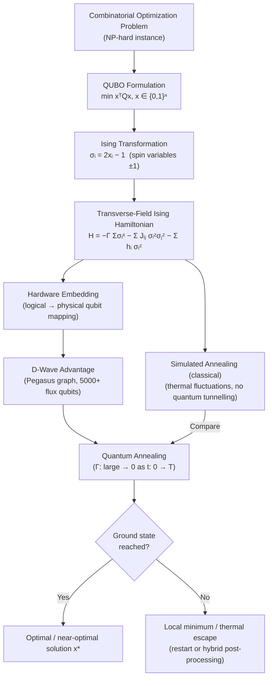

# QCSAA 900-909 · Section 00 · Subsection 906 · Subsubject 004 — Quantum Annealing and Ising Problem Encoding

## 1. Purpose

Specifies the **quantum annealing computational paradigm** and the Ising/QUBO encoding formalism used to map combinatorial optimization problems onto quantum hardware. This subsubject defines the transverse-field Ising Hamiltonian H = −Γ Σᵢ σᵢˣ − Σᵢⱼ Jᵢⱼ σᵢᶻ σⱼᶻ − Σᵢ hᵢ σᵢᶻ, the QUBO (Quadratic Unconstrained Binary Optimization) formulation and its Ising equivalence, the systematic mapping of NP optimization problems to Ising form, the D-Wave superconducting flux-qubit hardware architecture as the primary near-term platform, and the comparative performance characteristics of quantum annealing versus simulated annealing[^kadowaki][^lucas][^iso4879].

## 2. Scope

- Covers the *Quantum Annealing and Ising Problem Encoding* subsubject (`004`) of subsection `906` within section `00` *Fundamentos de Computación Cuántica*.
- Inherits Q-Division authority and ORB support from the parent row in [`../../README.md` §3](../../README.md#3-architecture-table)[^archtable].
- Concepts in scope:
  - **Transverse-field Ising Hamiltonian** — H = −Γ(t) Σᵢ σᵢˣ − Σᵢ<ⱼ Jᵢⱼ σᵢᶻ σⱼᶻ − Σᵢ hᵢ σᵢᶻ; the transverse field Γ(t) as the driver (quantum tunnelling term) annealed to zero; local fields hᵢ and two-body couplings Jᵢⱼ as the problem encoding.
  - **QUBO encoding** — Quadratic Unconstrained Binary Optimization: min_{x∈{0,1}ⁿ} xᵀQx; the bijection σᵢ = 2xᵢ − 1 between binary variables and ±1 Ising spins; equivalence between QUBO and Ising objective functions.
  - **Mapping NP optimization problems to Ising/QUBO form** — compendium of reductions: Max-Cut, graph colouring, TSP, integer factorization, portfolio optimization; penalty-term encoding of equality and inequality constraints; Lucas (2014) as the canonical reference for problem mappings.
  - **D-Wave superconducting flux-qubit annealer architecture** — flux qubits as superconducting two-level systems; the Chimera and Pegasus connectivity graphs; embedding logical problem graphs onto the hardware topology; current D-Wave Advantage (5000+ qubits, Pegasus graph).
  - **Quantum annealing vs. simulated annealing** — simulated annealing as a classical stochastic heuristic using thermal fluctuations; quantum annealing's use of quantum tunnelling to traverse energy barriers; theoretical and empirical evidence for quantum speedup on specific instances.
- Out of scope: the formal AQC model (`003`), circuit-model equivalence (`005`), and pulse-level hardware control (`006`).

## 3. Diagram — Quantum Annealing and Ising Problem Encoding

## 4. Footprint

| Metric | Value |
|---|---|
| Architecture | `QCSAA` — Quantum Computing & Sentient Agency Architecture |
| Master range | `900–999` |
| Code range | `900-909` |
| Section | `00` — Fundamentos de Computación Cuántica |
| Subsection | `906` — Hamiltonian Methods and Adiabatic Computation |
| Subsubject | `004` — Quantum Annealing and Ising Problem Encoding |
| Primary Q-Division | Q-HORIZON[^qdiv] |
| Support Q-Divisions | Q-HPC, Q-DATAGOV |
| ORB support | ORB-PMO, ORB-LEG |
| Governance class | `restricted`[^gov] |
| Folder path | `Q+ATLANTIDE/900-999_QCSAA/900-909_Fundamentos-de-Computacion-Cuantica/906_Hamiltonian-Methods-and-Adiabatic-Computation/` |
| Document | `004_Quantum-Annealing-and-Ising-Problem-Encoding.md` (this file) |
| Parent subsection | [`README.md`](./README.md) · [`000_Overview.md`](./000_Overview.md) |
| Parent architecture | [`../../README.md`](../../README.md) |
| Parent baseline | [`organization/Q+ATLANTIDE.md`](../../../../organization/Q+ATLANTIDE.md) |

## 5. References & Citations

[^baseline]: **Q+ATLANTIDE controlled baseline (v1.0.0)** — [`organization/Q+ATLANTIDE.md`](../../../../organization/Q+ATLANTIDE.md). Defines the controlled `000-999` architecture-band taxonomy and the ATLAS-1000 register subpart.

[^archtable]: **QCSAA §3 Architecture Table** — [`../../README.md` §3](../../README.md#3-architecture-table). Authoritative source for the `900-909` row (Section `00` — Fundamentos de Computación Cuántica, Primary Q-Division Q-HORIZON).

[^qdiv]: **Q-Division authority** — Q-Divisions provide technical authority over an architecture row (Q+ATLANTIDE Note N-002). See [`organization/Q+ATLANTIDE.md` §4](../../../../organization/Q+ATLANTIDE.md#4-notes).

[^gov]: **Governance class** — `restricted` denotes documents requiring additional governance, evidence packages and access controls (rule N-006[^n006]).

[^n006]: **Note N-006 (Restricted bands)** — Quantum-related (`900-999` QCSAA) bands require additional governance, evidence packages and access controls. See [`organization/Q+ATLANTIDE.md` §5.3](../../../../organization/Q+ATLANTIDE.md#53-restricted-band-templates-n-006).

[^kadowaki]: **Kadowaki, T. & Nishimori, H. — *Quantum Annealing in the Transverse Ising Model* — Phys. Rev. E 58, 5355 (1998)** — Original paper proposing quantum annealing as a metaheuristic using quantum tunnelling to search energy landscapes. [DOI:10.1103/PhysRevE.58.5355](https://doi.org/10.1103/PhysRevE.58.5355).

[^lucas]: **Lucas, A. — *Ising Formulations of Many NP Problems* — Front. Phys. 2, 5 (2014)** — Comprehensive compendium of reductions from NP optimization problems (TSP, Max-Cut, graph colouring, etc.) to the Ising and QUBO formalisms. [DOI:10.3389/fphy.2014.00005](https://doi.org/10.3389/fphy.2014.00005).

[^iso4879]: **ISO/IEC 4879:2023 — Information technology — Quantum computing — Vocabulary** — International standard vocabulary for quantum annealing, Ising model, QUBO, and related quantum optimization terms.

### Applicable standards

- Kadowaki & Nishimori — *Quantum Annealing in the Transverse Ising Model*, Phys. Rev. E 58, 5355 (1998)[^kadowaki]
- Lucas — *Ising Formulations of Many NP Problems*, Front. Phys. 2, 5 (2014)[^lucas]
- ISO/IEC 4879:2023 — Quantum computing — Vocabulary[^iso4879]
