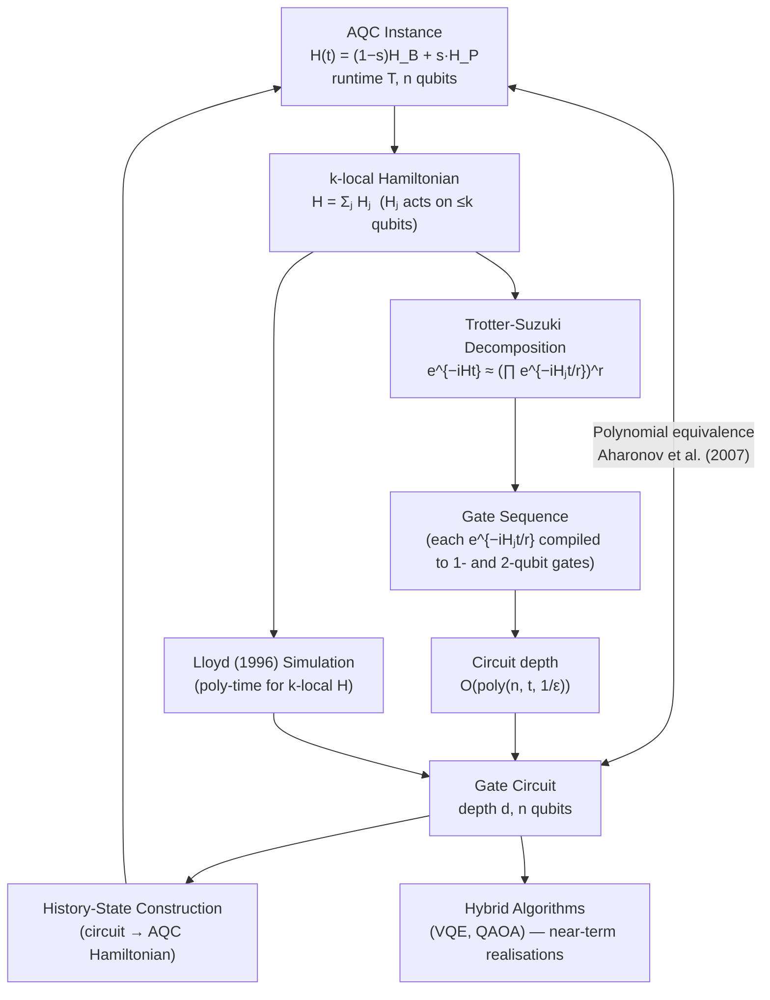

# QCSAA 900-909 · Section 00 · Subsection 906 · Subsubject 005 — Equivalence with Circuit Model

## 1. Purpose

Establishes the **polynomial equivalence between Adiabatic Quantum Computation and the gate circuit model**, as proved by Aharonov et al. (2007): any quantum circuit can be encoded as an AQC instance and vice versa, with only polynomial overhead in both directions. This subsubject covers the Trotterization (Suzuki-Trotter) decomposition that converts the continuous time evolution e^{−iHt} into a product of elementary gate operations, Lloyd's (1996) efficient Hamiltonian simulation result, and the circuit-depth cost analysis for simulating k-local Hamiltonians[^aharonov2007][^lloyd1996][^nielsen_chuang].

## 2. Scope

- Covers the *Equivalence with Circuit Model* subsubject (`005`) of subsection `906` within section `00` *Fundamentos de Computación Cuántica*.
- Inherits Q-Division authority and ORB support from the parent row in [`../../README.md` §3](../../README.md#3-architecture-table)[^archtable].
- Concepts in scope:
  - **Aharonov et al. (2007) equivalence theorem** — formal statement of polynomial equivalence: any AQC instance running in time T with n qubits can be simulated by a quantum circuit of size poly(n, T), and any quantum circuit of depth d can be translated into an AQC instance with O(poly(n, d)) parameters; the proof strategy via history-state Hamiltonian construction.
  - **Trotterization / Suzuki-Trotter decomposition** — first-order Trotter: e^{−i(A+B)t} ≈ (e^{−iAt/r} e^{−iBt/r})^r with error O(t²/r); higher-order Suzuki formulas; the Trotter error bound and its gate count implications; practical compilation of Hamiltonian simulation circuits.
  - **Hamiltonian simulation via circuit model (Lloyd 1996)** — Lloyd's result that a k-local Hamiltonian H = Σⱼ Hⱼ (sum of polynomially many local terms) can be simulated on a quantum computer to precision ε in time O(poly(n, t, 1/ε)); the gate circuit as the natural language for quantum Hamiltonian simulation.
  - **Circuit depth cost of simulating k-local Hamiltonians** — Trotter step count r = O(Λ²t²/ε) for first-order decomposition, where Λ is the spectral norm; sparse Hamiltonian simulation and qubitization approaches; LCU (linear combination of unitaries) method.
  - **Practical implications** — hybrid quantum-classical algorithms (VQE, QAOA) as approximate near-term realisations of Hamiltonian evolution within the circuit model; the role of this equivalence in validating both AQC hardware and gate-based approaches for the same problem classes.
- Out of scope: the AQC model construction (`003`), Ising hardware encodings (`004`), and pulse-level control for analogue processors (`006`).

## 3. Diagram — AQC–Circuit Model Equivalence

## 4. Footprint

| Metric | Value |
|---|---|
| Architecture | `QCSAA` — Quantum Computing & Sentient Agency Architecture |
| Master range | `900–999` |
| Code range | `900-909` |
| Section | `00` — Fundamentos de Computación Cuántica |
| Subsection | `906` — Hamiltonian Methods and Adiabatic Computation |
| Subsubject | `005` — Equivalence with Circuit Model |
| Primary Q-Division | Q-HORIZON[^qdiv] |
| Support Q-Divisions | Q-HPC, Q-DATAGOV |
| ORB support | ORB-PMO, ORB-LEG |
| Governance class | `restricted`[^gov] |
| Folder path | `Q+ATLANTIDE/900-999_QCSAA/900-909_Fundamentos-de-Computacion-Cuantica/906_Hamiltonian-Methods-and-Adiabatic-Computation/` |
| Document | `005_Equivalence-with-Circuit-Model.md` (this file) |
| Parent subsection | [`README.md`](./README.md) · [`000_Overview.md`](./000_Overview.md) |
| Parent architecture | [`../../README.md`](../../README.md) |
| Parent baseline | [`organization/Q+ATLANTIDE.md`](../../../../organization/Q+ATLANTIDE.md) |

## 5. References & Citations

[^baseline]: **Q+ATLANTIDE controlled baseline (v1.0.0)** — [`organization/Q+ATLANTIDE.md`](../../../../organization/Q+ATLANTIDE.md). Defines the controlled `000-999` architecture-band taxonomy and the ATLAS-1000 register subpart.

[^archtable]: **QCSAA §3 Architecture Table** — [`../../README.md` §3](../../README.md#3-architecture-table). Authoritative source for the `900-909` row (Section `00` — Fundamentos de Computación Cuántica, Primary Q-Division Q-HORIZON).

[^qdiv]: **Q-Division authority** — Q-Divisions provide technical authority over an architecture row (Q+ATLANTIDE Note N-002). See [`organization/Q+ATLANTIDE.md` §4](../../../../organization/Q+ATLANTIDE.md#4-notes).

[^gov]: **Governance class** — `restricted` denotes documents requiring additional governance, evidence packages and access controls (rule N-006[^n006]).

[^n006]: **Note N-006 (Restricted bands)** — Quantum-related (`900-999` QCSAA) bands require additional governance, evidence packages and access controls. See [`organization/Q+ATLANTIDE.md` §5.3](../../../../organization/Q+ATLANTIDE.md#53-restricted-band-templates-n-006).

[^aharonov2007]: **Aharonov, D., van Dam, W., Kempe, J., Landau, Z., Lloyd, S. & Regev, O. — *Adiabatic Quantum Computation Is Equivalent to Standard Quantum Computation* — SIAM J. Comput. 37(1), 166–194 (2007)** — Proves the polynomial equivalence between AQC and the gate circuit model via history-state Hamiltonian construction. [DOI:10.1137/S0097539705447323](https://doi.org/10.1137/S0097539705447323).

[^lloyd1996]: **Lloyd, S. — *Universal Quantum Simulators* — Science 273, 1073–1078 (1996)** — Establishes that quantum computers can simulate the time evolution of any local Hamiltonian efficiently using a product-formula decomposition. [DOI:10.1126/science.273.5278.1073](https://doi.org/10.1126/science.273.5278.1073).

[^nielsen_chuang]: **Nielsen, M. A. & Chuang, I. L. — *Quantum Computation and Quantum Information* (10th anniversary ed., Cambridge University Press, 2010), Ch. 4** — Standard reference for quantum circuit model, gate decompositions, and Hamiltonian simulation via Trotter-Suzuki methods. ISBN 978-1-107-00217-3.

### Applicable standards

- Aharonov et al. — *Adiabatic Quantum Computation Is Equivalent to Standard Quantum Computation*, SIAM J. Comput. 37(1) (2007)[^aharonov2007]
- Lloyd — *Universal Quantum Simulators*, Science 273, 1073 (1996)[^lloyd1996]
- Nielsen & Chuang — *Quantum Computation and Quantum Information*, Ch. 4 (Cambridge, 2010)[^nielsen_chuang]
