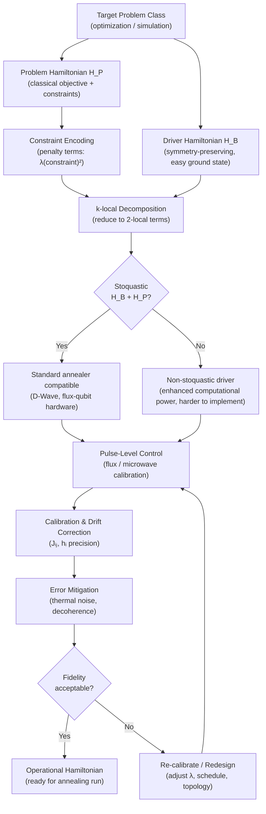

# QCSAA 900-909 · Section 00 · Subsection 906 · Subsubject 006 — Hamiltonian Engineering and Control

## 1. Purpose

Addresses the **practical design and physical implementation of Hamiltonians** for analogue quantum processors: the engineering of driver Hamiltonians H_B and problem Hamiltonians H_P for specific problem classes, k-local Hamiltonian decompositions (including 2-local and stoquastic constraints), pulse-level control and calibration for analogue devices, error mitigation strategies applicable to adiabatic and annealing hardware, and the encoding of constraints via penalty terms in the problem Hamiltonian. These engineering considerations bridge the theoretical AQC model (`003`) and the hardware realizations (`007`)[^krantz][^albash_lidar][^ieee_p7131].

## 2. Scope

- Covers the *Hamiltonian Engineering and Control* subsubject (`006`) of subsection `906` within section `00` *Fundamentos de Computación Cuántica*.
- Inherits Q-Division authority and ORB support from the parent row in [`../../README.md` §3](../../README.md#3-architecture-table)[^archtable].
- Concepts in scope:
  - **Designing H_B and H_P for specific problem classes** — choice of driver beyond the standard transverse-field H_B = −Σσᵢˣ (e.g., driver terms preserving symmetry subspaces, non-stoquastic drivers); construction of H_P from the classical objective function and hardware connectivity constraints; co-design of software encoding and hardware topology.
  - **k-local Hamiltonian decompositions** — decomposition of many-body Hamiltonians into sums of k-body interaction terms; 2-local Hamiltonians as the standard accessible class on current hardware; stoquastic Hamiltonians (no sign problem in the computational basis) vs. non-stoquastic; the computational power implications of restricting to 2-local stoquastic forms.
  - **Pulse-level control and calibration for analogue quantum processors** — microwave and flux pulse sequences for superconducting qubit annealers; calibration of coupling strengths Jᵢⱼ and local fields hᵢ; drift correction and crosstalk mitigation; freeze-out schedules and mid-anneal pauses for analogue control.
  - **Error mitigation in adiabatic/annealing hardware** — thermal noise and decoherence in the annealing regime; error suppression via quantum error-correcting codes adapted for AQC (e.g., the D-Wave noise-aware embedding); energy-based post-selection; redundancy encoding and majority-vote decoding.
  - **Penalty terms and constraint encoding** — encoding equality constraints Σᵢ xᵢ = k as quadratic penalty terms λ(Σᵢ xᵢ − k)²; inequality constraints via slack variables; penalty strength selection to ensure ground-state feasibility; automated QUBO compilation pipelines.
- Out of scope: formal AQC model (`003`), Ising/QUBO encodings for specific NP problems (`004`), and aerospace-application mappings (`007`).

## 3. Diagram — Hamiltonian Engineering and Control

## 4. Footprint

| Metric | Value |
|---|---|
| Architecture | `QCSAA` — Quantum Computing & Sentient Agency Architecture |
| Master range | `900–999` |
| Code range | `900-909` |
| Section | `00` — Fundamentos de Computación Cuántica |
| Subsection | `906` — Hamiltonian Methods and Adiabatic Computation |
| Subsubject | `006` — Hamiltonian Engineering and Control |
| Primary Q-Division | Q-HORIZON[^qdiv] |
| Support Q-Divisions | Q-HPC, Q-DATAGOV |
| ORB support | ORB-PMO, ORB-LEG |
| Governance class | `restricted`[^gov] |
| Folder path | `Q+ATLANTIDE/900-999_QCSAA/900-909_Fundamentos-de-Computacion-Cuantica/906_Hamiltonian-Methods-and-Adiabatic-Computation/` |
| Document | `006_Hamiltonian-Engineering-and-Control.md` (this file) |
| Parent subsection | [`README.md`](./README.md) · [`000_Overview.md`](./000_Overview.md) |
| Parent architecture | [`../../README.md`](../../README.md) |
| Parent baseline | [`organization/Q+ATLANTIDE.md`](../../../../organization/Q+ATLANTIDE.md) |

## 5. References & Citations

[^baseline]: **Q+ATLANTIDE controlled baseline (v1.0.0)** — [`organization/Q+ATLANTIDE.md`](../../../../organization/Q+ATLANTIDE.md). Defines the controlled `000-999` architecture-band taxonomy and the ATLAS-1000 register subpart.

[^archtable]: **QCSAA §3 Architecture Table** — [`../../README.md` §3](../../README.md#3-architecture-table). Authoritative source for the `900-909` row (Section `00` — Fundamentos de Computación Cuántica, Primary Q-Division Q-HORIZON).

[^qdiv]: **Q-Division authority** — Q-Divisions provide technical authority over an architecture row (Q+ATLANTIDE Note N-002). See [`organization/Q+ATLANTIDE.md` §4](../../../../organization/Q+ATLANTIDE.md#4-notes).

[^gov]: **Governance class** — `restricted` denotes documents requiring additional governance, evidence packages and access controls (rule N-006[^n006]).

[^n006]: **Note N-006 (Restricted bands)** — Quantum-related (`900-999` QCSAA) bands require additional governance, evidence packages and access controls. See [`organization/Q+ATLANTIDE.md` §5.3](../../../../organization/Q+ATLANTIDE.md#53-restricted-band-templates-n-006).

[^krantz]: **Krantz, P., Kjaergaard, M., Yan, F., Orlando, T. P., Gustavsson, S. & Oliver, W. D. — *A Quantum Engineer's Guide to Superconducting Qubits* — Appl. Phys. Rev. 6, 021318 (2019)** — Comprehensive engineering reference for superconducting qubit systems including pulse-level control, calibration, and error characterization for Hamiltonian-based processors. [DOI:10.1063/1.5089550](https://doi.org/10.1063/1.5089550).

[^albash_lidar]: **Albash, T. & Lidar, D. A. — *Adiabatic Quantum Computation* — Rev. Mod. Phys. 90, 015002 (2018)** — Reviews Hamiltonian engineering strategies, k-local decompositions, stoquastic constraints, and error mitigation in the adiabatic framework. [DOI:10.1103/RevModPhys.90.015002](https://doi.org/10.1103/RevModPhys.90.015002).

[^ieee_p7131]: **IEEE P7131 — Standard for Quantum Computing Performance Metrics and Benchmarking** — Defines performance metrics, calibration protocols, and benchmarking standards applicable to analogue and gate-based quantum processors, including Hamiltonian-engineered systems.

### Applicable standards

- Krantz et al. — *A Quantum Engineer's Guide to Superconducting Qubits*, Appl. Phys. Rev. 6, 021318 (2019)[^krantz]
- Albash & Lidar — *Adiabatic Quantum Computation*, Rev. Mod. Phys. 90, 015002 (2018)[^albash_lidar]
- IEEE P7131 — Standard for Quantum Computing Performance Metrics and Benchmarking[^ieee_p7131]
