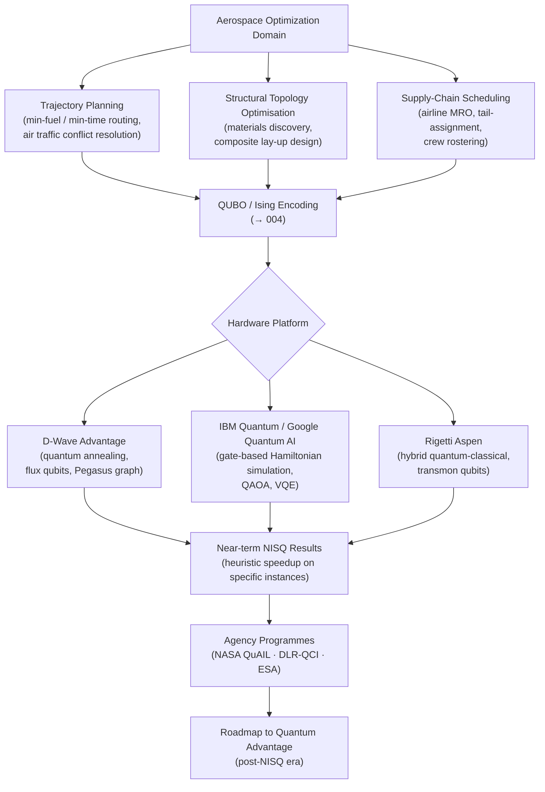

# QCSAA 900-909 · Section 00 · Subsection 906 · Subsubject 007 — Aerospace Applicability and Hardware Realizations

## 1. Purpose

Maps the **aerospace-domain applicability** of Hamiltonian methods and adiabatic quantum computation onto concrete use cases and current hardware platforms: trajectory planning and route optimisation, structural topology optimisation and materials discovery, airline and MRO supply-chain scheduling as QUBO/Ising optimization instances; and hardware platforms including the D-Wave Advantage quantum annealer (flux qubits), IBM Quantum, Google Quantum AI, and Rigetti for gate-based Hamiltonian simulation. This subsubject also surveys NASA, DLR, and ESA quantum computing initiatives that are actively exploring Hamiltonian-based methods for aerospace applications[^perdomo][^farhi2014][^preskill2018].

## 2. Scope

- Covers the *Aerospace Applicability and Hardware Realizations* subsubject (`007`) of subsection `906` within section `00` *Fundamentos de Computación Cuántica*.
- Inherits Q-Division authority and ORB support from the parent row in [`../../README.md` §3](../../README.md#3-architecture-table)[^archtable].
- Concepts in scope:
  - **Aerospace trajectory planning and route optimisation** — formulation of flight-path optimization (minimum fuel, minimum time, conflict-free routing) as QUBO problems; encoding of airspace constraints as penalty terms; D-Wave and gate-model QAOA approaches demonstrated for air traffic management and satellite orbit scheduling.
  - **Structural topology optimisation and materials discovery** — aerospace-grade materials design (lightweight alloys, composite lay-up optimisation) as combinatorial search problems; quantum annealing and variational Hamiltonian methods for molecular simulation relevant to advanced materials and propellant chemistry.
  - **Supply-chain scheduling (airline/MRO)** — aircraft maintenance, repair, and overhaul (MRO) scheduling; tail-assignment and crew-rostering problems encoded as Ising Hamiltonians; gate-model Hamiltonian simulation for logistics network optimisation.
  - **Hardware platforms** — D-Wave Advantage (5000+ superconducting flux qubits, Pegasus graph) for quantum annealing; IBM Quantum (superconducting gate-based, Falcon/Eagle/Heron processors) and Google Quantum AI (Sycamore) for variational Hamiltonian simulation and QAOA; Rigetti Computing (superconducting transmon, Aspen series) for hybrid quantum-classical workflows.
  - **NASA/DLR/ESA quantum computing initiatives** — NASA Ames Quantum AI Laboratory (QuAIL); DLR Quantum Computing Initiative (DLR-QCI); ESA Basic Activities quantum computing research; joint industry-agency programmes on quantum advantage for aerospace optimization.
- Out of scope: Hamiltonian engineering implementation details (`006`), theoretical complexity bounds (`002`–`005`), and non-aerospace QUBO applications.

## 3. Diagram — Aerospace Applicability and Hardware Realizations

## 4. Footprint

| Metric | Value |
|---|---|
| Architecture | `QCSAA` — Quantum Computing & Sentient Agency Architecture |
| Master range | `900–999` |
| Code range | `900-909` |
| Section | `00` — Fundamentos de Computación Cuántica |
| Subsection | `906` — Hamiltonian Methods and Adiabatic Computation |
| Subsubject | `007` — Aerospace Applicability and Hardware Realizations |
| Primary Q-Division | Q-HORIZON[^qdiv] |
| Support Q-Divisions | Q-HPC, Q-DATAGOV |
| ORB support | ORB-PMO, ORB-LEG |
| Governance class | `restricted`[^gov] |
| Folder path | `Q+ATLANTIDE/900-999_QCSAA/900-909_Fundamentos-de-Computacion-Cuantica/906_Hamiltonian-Methods-and-Adiabatic-Computation/` |
| Document | `007_Aerospace-Applicability-and-Hardware-Realizations.md` (this file) |
| Parent subsection | [`README.md`](./README.md) · [`000_Overview.md`](./000_Overview.md) |
| Parent architecture | [`../../README.md`](../../README.md) |
| Parent baseline | [`organization/Q+ATLANTIDE.md`](../../../../organization/Q+ATLANTIDE.md) |

## 5. References & Citations

[^baseline]: **Q+ATLANTIDE controlled baseline (v1.0.0)** — [`organization/Q+ATLANTIDE.md`](../../../../organization/Q+ATLANTIDE.md). Defines the controlled `000-999` architecture-band taxonomy and the ATLAS-1000 register subpart.

[^archtable]: **QCSAA §3 Architecture Table** — [`../../README.md` §3](../../README.md#3-architecture-table). Authoritative source for the `900-909` row (Section `00` — Fundamentos de Computación Cuántica, Primary Q-Division Q-HORIZON).

[^qdiv]: **Q-Division authority** — Q-Divisions provide technical authority over an architecture row (Q+ATLANTIDE Note N-002). See [`organization/Q+ATLANTIDE.md` §4](../../../../organization/Q+ATLANTIDE.md#4-notes).

[^gov]: **Governance class** — `restricted` denotes documents requiring additional governance, evidence packages and access controls (rule N-006[^n006]).

[^n006]: **Note N-006 (Restricted bands)** — Quantum-related (`900-999` QCSAA) bands require additional governance, evidence packages and access controls. See [`organization/Q+ATLANTIDE.md` §5.3](../../../../organization/Q+ATLANTIDE.md#53-restricted-band-templates-n-006).

[^perdomo]: **Perdomo-Ortiz, A., Dickson, N., Drew-Brook, M., Rose, G. & Aspuru-Guzik, A. — *Finding Low-Energy Conformations of Lattice Protein Models by Quantum Annealing* — Sci. Rep. 2, 571 (2012)** — Demonstrates quantum annealing for protein folding as a proxy for aerospace-relevant molecular design optimization. [DOI:10.1038/srep00571](https://doi.org/10.1038/srep00571).

[^farhi2014]: **Farhi, E., Goldstone, J. & Gutmann, S. — *A Quantum Approximate Optimization Algorithm* (2014)** — Introduces QAOA as a gate-circuit analogue of adiabatic evolution for combinatorial optimization, directly applicable to aerospace scheduling and routing problems. [arXiv:1411.4028](https://arxiv.org/abs/1411.4028).

[^preskill2018]: **Preskill, J. — *Quantum Computing in the NISQ Era and Beyond* — Quantum 2, 79 (2018)** — Surveys the near-term (NISQ) hardware landscape including D-Wave, IBM, Google, and Rigetti, and the prospects for practical quantum advantage in optimization. [arXiv:1801.00862](https://arxiv.org/abs/1801.00862).

### Applicable standards

- Perdomo-Ortiz et al. — *Finding Low-Energy Conformations of Lattice Protein Models by Quantum Annealing*, Sci. Rep. 2, 571 (2012)[^perdomo]
- Farhi, Goldstone & Gutmann — *A Quantum Approximate Optimization Algorithm* (arXiv:1411.4028, 2014)[^farhi2014]
- Preskill — *Quantum Computing in the NISQ Era and Beyond*, Quantum 2, 79 (2018)[^preskill2018]
