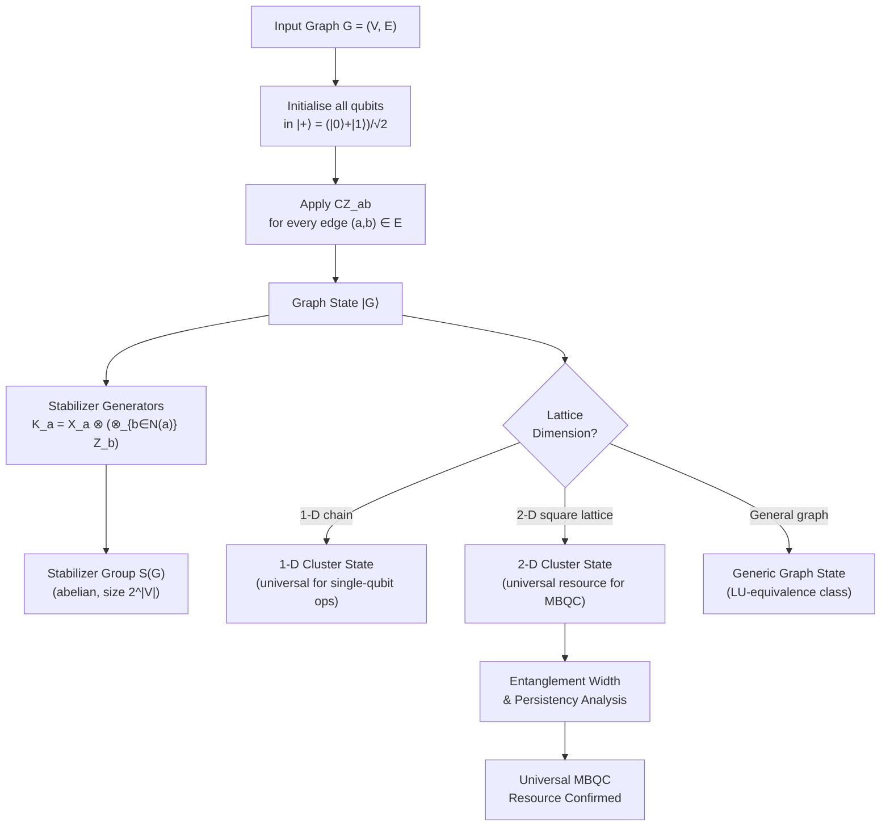

# QCSAA 900-909 · Section 00 · Subsection 907 · Subsubject 001 — Cluster States and Graph States

## 1. Purpose

Establishes the **mathematical definition and physical construction of graph states and cluster states** — the highly entangled multi-qubit resource states that underpin measurement-based quantum computation (MBQC). This document defines the stabilizer formalism for graph states, identifies cluster states as a canonical subfamily, characterises their entanglement structure, and establishes their universality as resource states for one-way quantum computation[^raussendorf_briegel][^hein_graph][^briegel_mbqc].

## 2. Scope

- Covers the *Cluster States and Graph States* subsubject (`001`) of subsection `907` *Measurement-Based and One-Way Computing* within section `00` *Fundamentos de Computación Cuántica*.
- Inherits Q-Division authority and ORB support from the parent row in [`../../README.md` §3](../../README.md#3-architecture-table)[^archtable].
- Concepts in scope:
  - **Graph state definition** — given a simple undirected graph G = (V, E), the graph state |G⟩ is the simultaneous +1 eigenstate of the stabilizer generators K_a = X_a ⊗ (⊗_{b ∈ N(a)} Z_b) for all vertices a ∈ V; construction from |+⟩^⊗|V| by applying CZ gates along all edges.
  - **Stabilizer formalism for graph states** — stabilizer group S(G) ≤ Pauli_n generated by {K_a}; binary symplectic representation; syndrome extraction; local complementation rule and its action on the graph.
  - **Cluster states** — 1-D, 2-D (square-lattice), and higher-dimensional cluster states as the canonical resource for MBQC; construction protocols and adjacency matrix representation; 2-D square-lattice cluster state as the universal resource[^raussendorf_briegel].
  - **Entanglement structure** — Schmidt rank, entanglement width, and persistency of entanglement (minimum number of measurements that destroy all entanglement); comparison with GHZ and W states.
  - **Local unitary (LU) equivalence** — local Clifford (LC) equivalence classes of graph states; graphic rules for LC equivalence (Bouchet algorithm); orbit structure under local complementation.
  - **Universal resource states** — characterisation of which graph states are universal resources for MBQC; non-universal graph states (e.g., 1-D cluster states support only single-qubit operations); AKLT state as an alternative universal resource[^gross_eisert].
  - **Preparation protocols** — sequential CZ-gate preparation; optical fusion networks; lattice surgery constructions; preparation fidelity requirements and noise sensitivity.
- Out of scope: measurement patterns (`003_`); circuit-model equivalence proofs (`004_`); physical photonic implementations (`005_`).

## 3. Diagram — Graph State Construction and Stabilizer Structure

## 4. Footprint

| Metric | Value |
|---|---|
| Architecture | `QCSAA` — Quantum Computing & Sentient Agency Architecture |
| Master range | `900–999` |
| Code range | `900-909` |
| Section | `00` — Fundamentos de Computación Cuántica |
| Subsection | `907` — Measurement-Based and One-Way Computing |
| Subsubject | `001` — Cluster States and Graph States |
| Primary Q-Division | Q-HORIZON[^qdiv] |
| Support Q-Divisions | Q-HPC, Q-DATAGOV |
| ORB support | ORB-PMO, ORB-LEG |
| Governance class | `restricted`[^gov] |
| Folder path | `Q+ATLANTIDE/900-999_QCSAA/900-909_Fundamentos-de-Computacion-Cuantica/907_Measurement-Based-and-One-Way-Computing/` |
| Document | `001_Cluster-States-and-Graph-States.md` (this file) |
| Parent subsection | [`README.md`](./README.md) · [`000_Overview.md`](./000_Overview.md) |
| Parent architecture | [`../../README.md`](../../README.md) |
| Parent baseline | [`organization/Q+ATLANTIDE.md`](../../../../organization/Q+ATLANTIDE.md) |

## 5. References & Citations

[^baseline]: **Q+ATLANTIDE controlled baseline (v1.0.0)** — [`organization/Q+ATLANTIDE.md`](../../../../organization/Q+ATLANTIDE.md). Defines the controlled `000-999` architecture-band taxonomy and the ATLAS-1000 register subpart.

[^archtable]: **QCSAA §3 Architecture Table** — [`../../README.md` §3](../../README.md#3-architecture-table). Authoritative source for the `900-909` row (Section `00` — Fundamentos de Computación Cuántica, Primary Q-Division Q-HORIZON).

[^qdiv]: **Q-Division authority** — Q-Divisions provide technical authority over an architecture row (Q+ATLANTIDE Note N-002). See [`organization/Q+ATLANTIDE.md` §4](../../../../organization/Q+ATLANTIDE.md#4-notes).

[^gov]: **Governance class** — `restricted` denotes documents requiring additional governance, evidence packages and access controls (rule N-006[^n006]).

[^n006]: **Note N-006 (Restricted bands)** — Quantum-related (`900-999` QCSAA) bands require additional governance, evidence packages and access controls. See [`organization/Q+ATLANTIDE.md` §5.3](../../../../organization/Q+ATLANTIDE.md#53-restricted-band-templates-n-006).

[^raussendorf_briegel]: **Raussendorf, R. & Briegel, H. J. — "A One-Way Quantum Computer" (*Physical Review Letters* 86(22), 2001, pp. 5188–5191)** — Original introduction of cluster states and their universal resource property for MBQC. [DOI:10.1103/PhysRevLett.86.5188](https://doi.org/10.1103/PhysRevLett.86.5188).

[^hein_graph]: **Hein, M., Eisert, J. & Briegel, H. J. — "Multiparty entanglement in graph states" (*Physical Review A* 69, 062311, 2004)** — Comprehensive treatment of graph state entanglement, stabilizer structure, LC equivalence, and Schmidt rank. [DOI:10.1103/PhysRevA.69.062311](https://doi.org/10.1103/PhysRevA.69.062311).

[^briegel_mbqc]: **Briegel, H. J., Browne, D. E., Dür, W., Raussendorf, R. & Van den Nest, M. — "Measurement-based quantum computation" (*Nature Physics* 5, 2009, pp. 19–26)** — Review covering resource states, entanglement properties, and their role in MBQC. [DOI:10.1038/nphys1157](https://doi.org/10.1038/nphys1157).

[^gross_eisert]: **Gross, D. & Eisert, J. — "Novel schemes for measurement-based quantum computation" (*Physical Review Letters* 98, 220503, 2007)** — Classification of universal resource states beyond the cluster-state family, including AKLT states. [DOI:10.1103/PhysRevLett.98.220503](https://doi.org/10.1103/PhysRevLett.98.220503).

[^iso4879]: **ISO/IEC 4879:2023 — Information technology — Quantum computing — Vocabulary** — Normative vocabulary for cluster state, graph state, stabilizer, entanglement, and related terms.

### Applicable standards

- Raussendorf & Briegel — *A One-Way Quantum Computer* (PRL, 2001)[^raussendorf_briegel]
- Hein, Eisert & Briegel — *Multiparty entanglement in graph states* (PRA, 2004)[^hein_graph]
- Briegel et al. — *Measurement-based quantum computation* (Nature Physics, 2009)[^briegel_mbqc]
- Gross & Eisert — *Novel schemes for MBQC* (PRL, 2007)[^gross_eisert]
- ISO/IEC 4879:2023 — Quantum computing — Vocabulary[^iso4879]
