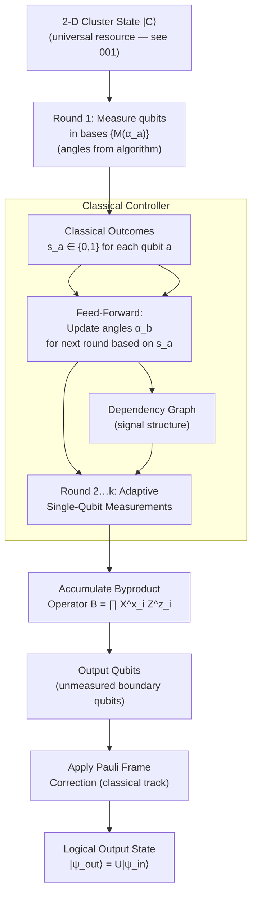

# QCSAA 900-909 · Section 00 · Subsection 907 · Subsubject 002 — One-Way Computation Model

## 1. Purpose

Defines the **operational mechanics of the one-way quantum computer** (1WQC): a model of universal quantum computation driven entirely by adaptive single-qubit measurements on a pre-prepared cluster state, with no coherent multi-qubit operations after resource-state creation. This document specifies the measurement sequence, classical feed-forward mechanism, byproduct operator algebra, and the separation of quantum and classical computational resources that together constitute the Raussendorf-Briegel model[^raussendorf_briegel][^raussendorf_computational][^briegel_mbqc].

## 2. Scope

- Covers the *One-Way Computation Model* subsubject (`002`) of subsection `907` *Measurement-Based and One-Way Computing* within section `00` *Fundamentos de Computación Cuántica*.
- Inherits Q-Division authority and ORB support from the parent row in [`../../README.md` §3](../../README.md#3-architecture-table)[^archtable].
- Concepts in scope:
  - **Resource state preparation** — creation of the 2-D cluster state |C⟩ as the universal quantum resource; this step may use entangling operations and is completed before computation begins (see `001_`).
  - **Adaptive single-qubit measurements** — each qubit in the cluster is measured in a basis M(α) = {cos α |0⟩ ± sin α |1⟩} for a chosen angle α ∈ [0, π); measurement outcomes are classical bits s_a ∈ {0, 1}.
  - **Classical feed-forward** — measurement basis angles for later qubits are updated in real time based on prior outcomes; this adaptivity is essential for deterministic quantum computation and introduces a classical processing layer between measurement rounds.
  - **Byproduct operators** — each measurement result s_a induces a Pauli byproduct X^{s_a} or Z^{s_a} on neighbouring qubits; the product of all byproducts accumulated during a computation constitutes the overall byproduct operator B = ∏ X^{x_i} Z^{z_i} that must be tracked or corrected.
  - **Byproduct correction and Pauli frame** — tracking accumulated byproducts in a classical Pauli frame (the Gottesman-Knill-style update) without physical correction; Pauli frame propagation through the measurement sequence.
  - **Computational depth and parallelism** — the one-way model allows circuits of polynomial depth to be executed with measurement depth proportional to the circuit depth; parallelisation of Clifford operations to constant measurement depth.
  - **Non-destructive and destructive measurements** — the one-way model is inherently destructive (each qubit is consumed by measurement); comparison with teleportation-based gate models.
  - **Signal and dependency structure** — classical dependency graph encoding which measurement angles depend on prior outcomes; acyclicity requirement for deterministic computation (see flow conditions in `003_`).
- Out of scope: graph state construction (`001_`); flow and gflow formalism (`003_`); circuit-model translation (`004_`).

## 3. Diagram — One-Way Computation Execution Model

## 4. Footprint

| Metric | Value |
|---|---|
| Architecture | `QCSAA` — Quantum Computing & Sentient Agency Architecture |
| Master range | `900–999` |
| Code range | `900-909` |
| Section | `00` — Fundamentos de Computación Cuántica |
| Subsection | `907` — Measurement-Based and One-Way Computing |
| Subsubject | `002` — One-Way Computation Model |
| Primary Q-Division | Q-HORIZON[^qdiv] |
| Support Q-Divisions | Q-HPC, Q-DATAGOV |
| ORB support | ORB-PMO, ORB-LEG |
| Governance class | `restricted`[^gov] |
| Folder path | `Q+ATLANTIDE/900-999_QCSAA/900-909_Fundamentos-de-Computacion-Cuantica/907_Measurement-Based-and-One-Way-Computing/` |
| Document | `002_One-Way-Computation-Model.md` (this file) |
| Parent subsection | [`README.md`](./README.md) · [`000_Overview.md`](./000_Overview.md) |
| Parent architecture | [`../../README.md`](../../README.md) |
| Parent baseline | [`organization/Q+ATLANTIDE.md`](../../../../organization/Q+ATLANTIDE.md) |

## 5. References & Citations

[^baseline]: **Q+ATLANTIDE controlled baseline (v1.0.0)** — [`organization/Q+ATLANTIDE.md`](../../../../organization/Q+ATLANTIDE.md). Defines the controlled `000-999` architecture-band taxonomy and the ATLAS-1000 register subpart.

[^archtable]: **QCSAA §3 Architecture Table** — [`../../README.md` §3](../../README.md#3-architecture-table). Authoritative source for the `900-909` row (Section `00` — Fundamentos de Computación Cuántica, Primary Q-Division Q-HORIZON).

[^qdiv]: **Q-Division authority** — Q-Divisions provide technical authority over an architecture row (Q+ATLANTIDE Note N-002). See [`organization/Q+ATLANTIDE.md` §4](../../../../organization/Q+ATLANTIDE.md#4-notes).

[^gov]: **Governance class** — `restricted` denotes documents requiring additional governance, evidence packages and access controls (rule N-006[^n006]).

[^n006]: **Note N-006 (Restricted bands)** — Quantum-related (`900-999` QCSAA) bands require additional governance, evidence packages and access controls. See [`organization/Q+ATLANTIDE.md` §5.3](../../../../organization/Q+ATLANTIDE.md#53-restricted-band-templates-n-006).

[^raussendorf_briegel]: **Raussendorf, R. & Briegel, H. J. — "A One-Way Quantum Computer" (*Physical Review Letters* 86(22), 2001, pp. 5188–5191)** — Original formulation of the one-way QC model: cluster states, adaptive measurements, and byproduct operators. [DOI:10.1103/PhysRevLett.86.5188](https://doi.org/10.1103/PhysRevLett.86.5188).

[^raussendorf_computational]: **Raussendorf, R. & Briegel, H. J. — "Computational model underlying the one-way quantum computer" (*Quantum Information and Computation* 2(6), 2002, pp. 443–486)** — Detailed exposition of the measurement-based model, byproduct algebra, feed-forward, and Pauli frame. [arXiv:quant-ph/0207071](https://arxiv.org/abs/quant-ph/0207071).

[^briegel_mbqc]: **Briegel, H. J., Browne, D. E., Dür, W., Raussendorf, R. & Van den Nest, M. — "Measurement-based quantum computation" (*Nature Physics* 5, 2009, pp. 19–26)** — Comprehensive review of the one-way model, computational depth, and classical control requirements. [DOI:10.1038/nphys1157](https://doi.org/10.1038/nphys1157).

[^iso4879]: **ISO/IEC 4879:2023 — Information technology — Quantum computing — Vocabulary** — Normative vocabulary for measurement, feed-forward, byproduct operator, and related terms.

### Applicable standards

- Raussendorf & Briegel — *A One-Way Quantum Computer* (PRL, 2001)[^raussendorf_briegel]
- Raussendorf & Briegel — *Computational model underlying the one-way QC* (QIC, 2002)[^raussendorf_computational]
- Briegel et al. — *Measurement-based quantum computation* (Nature Physics, 2009)[^briegel_mbqc]
- ISO/IEC 4879:2023 — Quantum computing — Vocabulary[^iso4879]
