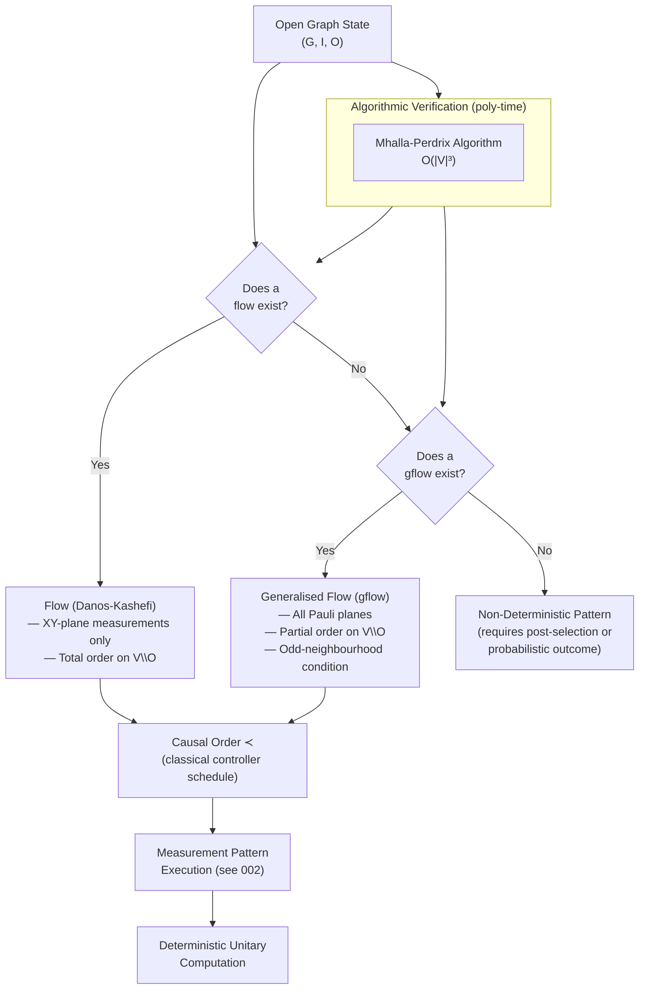

# QCSAA 900-909 · Section 00 · Subsection 907 · Subsubject 003 — Measurement Patterns and Flow Conditions

## 1. Purpose

Develops the **measurement calculus** — the formal language for specifying, composing, and standardising measurement-based quantum programs — and the **flow conditions** that guarantee deterministic, uniformly-computed computation on open graph states. This document defines measurement patterns, signal functions, the dependency structure, and the hierarchy of flow, causal flow, and generalised flow (gflow) conditions that are necessary and sufficient for determinism in the one-way model[^danos_kashefi][^browne_flow][^mhalla_perdrix].

## 2. Scope

- Covers the *Measurement Patterns and Flow Conditions* subsubject (`003`) of subsection `907` *Measurement-Based and One-Way Computing* within section `00` *Fundamentos de Computación Cuántica*.
- Inherits Q-Division authority and ORB support from the parent row in [`../../README.md` §3](../../README.md#3-architecture-table)[^archtable].
- Concepts in scope:
  - **Open graph states** — an open graph (G, I, O) where G = (V, E) is the underlying graph, I ⊆ V is the set of input vertices, and O ⊆ V is the set of output vertices; the non-output vertices V \ O are measured.
  - **Measurement commands** — the atomic commands of the measurement calculus: N (preparation of |+⟩), E_{ab} (entanglement via CZ), M^α_a (measurement of qubit a in the XY-plane at angle α), and byproduct corrections X^s_a and Z^s_a.
  - **Signal functions and dependency** — a signal function s_a : {0,1}^V → {0,1} mapping prior measurement outcomes to the correction applied at qubit a; encoded as a linear function over GF(2) to maintain Pauli-frame update efficiency.
  - **Standardisation and rewriting rules** — rewriting rules of the measurement calculus that allow any pattern to be standardised (preparation → entanglement → measurement → correction) without changing the implemented unitary; proof that any pattern can be brought to standard form.
  - **Flow condition (Danos-Kashefi)** — a function f : O^c → I^c on non-output to non-input vertices that assigns a correction target for each measured qubit; together with a partial order ≺ on V, it must satisfy: (i) a ≁ f(a), (ii) a ~ b only if b ≺ a (or b = f(a)), (iii) correction respects the order. Flow guarantees determinism in the XY-plane measurement basis.
  - **Causal flow** — a refinement of flow that admits a total order (causal order) consistent with all dependencies; enables efficient classical simulation of the correction track and tight depth analysis.
  - **Generalised flow (gflow)** — the strictly weaker condition extending determinism to YZ- and XZ-plane measurements and to graph states that admit no standard flow; a gflow is a pair (g, ≺) where g maps each measured qubit to a set of correction qubits (g : O^c → 2^{I^c}) satisfying the odd-neighbourhood condition in the Z₂ geometry of the graph; gflow is necessary and sufficient for determinism in the one-way model with arbitrary Pauli-plane measurements[^browne_flow].
  - **Algorithmic verification** — polynomial-time algorithms (O(|V|^3)) for deciding the existence of flow/gflow and constructing them when they exist; the Mhalla-Perdrix algorithm for gflow[^mhalla_perdrix].
  - **Depth complexity** — measuring the depth of a pattern as the number of sequential (non-parallelisable) measurement rounds; gflow depth as the length of the longest chain in the partial order ≺; relationship to circuit depth.
- Out of scope: resource state construction (`001_`); one-way model execution mechanics (`002_`); equivalence proofs to circuit model (`004_`).

## 3. Diagram — Flow Condition Hierarchy and Verification

## 4. Footprint

| Metric | Value |
|---|---|
| Architecture | `QCSAA` — Quantum Computing & Sentient Agency Architecture |
| Master range | `900–999` |
| Code range | `900-909` |
| Section | `00` — Fundamentos de Computación Cuántica |
| Subsection | `907` — Measurement-Based and One-Way Computing |
| Subsubject | `003` — Measurement Patterns and Flow Conditions |
| Primary Q-Division | Q-HORIZON[^qdiv] |
| Support Q-Divisions | Q-HPC, Q-DATAGOV |
| ORB support | ORB-PMO, ORB-LEG |
| Governance class | `restricted`[^gov] |
| Folder path | `Q+ATLANTIDE/900-999_QCSAA/900-909_Fundamentos-de-Computacion-Cuantica/907_Measurement-Based-and-One-Way-Computing/` |
| Document | `003_Measurement-Patterns-and-Flow-Conditions.md` (this file) |
| Parent subsection | [`README.md`](./README.md) · [`000_Overview.md`](./000_Overview.md) |
| Parent architecture | [`../../README.md`](../../README.md) |
| Parent baseline | [`organization/Q+ATLANTIDE.md`](../../../../organization/Q+ATLANTIDE.md) |

## 5. References & Citations

[^baseline]: **Q+ATLANTIDE controlled baseline (v1.0.0)** — [`organization/Q+ATLANTIDE.md`](../../../../organization/Q+ATLANTIDE.md). Defines the controlled `000-999` architecture-band taxonomy and the ATLAS-1000 register subpart.

[^archtable]: **QCSAA §3 Architecture Table** — [`../../README.md` §3](../../README.md#3-architecture-table). Authoritative source for the `900-909` row (Section `00` — Fundamentos de Computación Cuántica, Primary Q-Division Q-HORIZON).

[^qdiv]: **Q-Division authority** — Q-Divisions provide technical authority over an architecture row (Q+ATLANTIDE Note N-002). See [`organization/Q+ATLANTIDE.md` §4](../../../../organization/Q+ATLANTIDE.md#4-notes).

[^gov]: **Governance class** — `restricted` denotes documents requiring additional governance, evidence packages and access controls (rule N-006[^n006]).

[^n006]: **Note N-006 (Restricted bands)** — Quantum-related (`900-999` QCSAA) bands require additional governance, evidence packages and access controls. See [`organization/Q+ATLANTIDE.md` §5.3](../../../../organization/Q+ATLANTIDE.md#53-restricted-band-templates-n-006).

[^danos_kashefi]: **Danos, V. & Kashefi, E. — "Determinism in the one-way model" (*Physical Review A* 74, 052310, 2006)** — Introduces the measurement calculus, open graph states, flow condition, and determinism theorem for XY-plane measurements. [DOI:10.1103/PhysRevA.74.052310](https://doi.org/10.1103/PhysRevA.74.052310).

[^browne_flow]: **Browne, D. E., Kashefi, E., Mhalla, M. & Perdrix, S. — "Generalized Flow and Determinism in Measurement-Based Quantum Computation" (*New Journal of Physics* 9, 250, 2007)** — Defines generalised flow (gflow), proves it is necessary and sufficient for determinism, and establishes the depth-complexity relationship. [DOI:10.1088/1367-2630/9/8/250](https://doi.org/10.1088/1367-2630/9/8/250).

[^mhalla_perdrix]: **Mhalla, M. & Perdrix, S. — "Finding Optimal Flows Efficiently" (*Proceedings of ICALP 2008, LNCS 5125*, pp. 857–868)** — Polynomial-time algorithm O(|V|³) for finding gflow and causal flow in open graph states. [DOI:10.1007/978-3-540-70575-8_70](https://doi.org/10.1007/978-3-540-70575-8_70).

[^iso4879]: **ISO/IEC 4879:2023 — Information technology — Quantum computing — Vocabulary** — Normative vocabulary for measurement pattern, determinism, and measurement-based computation terms.

### Applicable standards

- Danos & Kashefi — *Determinism in the one-way model* (PRA, 2006)[^danos_kashefi]
- Browne et al. — *Generalized Flow and Determinism in MBQC* (NJP, 2007)[^browne_flow]
- Mhalla & Perdrix — *Finding Optimal Flows Efficiently* (ICALP, 2008)[^mhalla_perdrix]
- ISO/IEC 4879:2023 — Quantum computing — Vocabulary[^iso4879]
