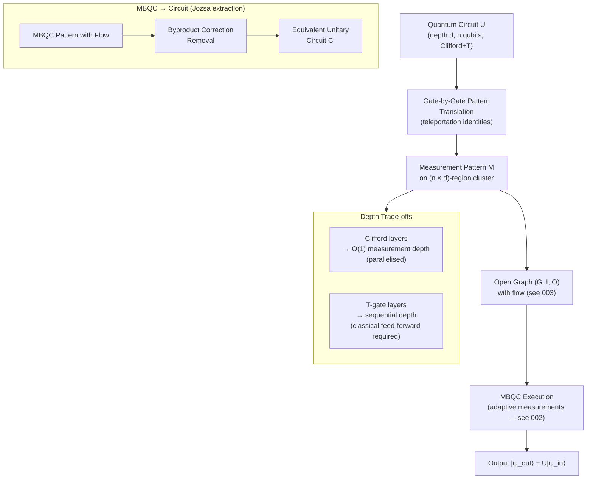

# QCSAA 900-909 · Section 00 · Subsection 907 · Subsubject 004 — Equivalence with Circuit Model

## 1. Purpose

Establishes the **formal equivalence between the one-way quantum computation model and the quantum circuit model**: any unitary quantum circuit can be efficiently translated into an MBQC measurement pattern on a 2-D cluster state, and conversely any MBQC pattern with flow corresponds to a unitary circuit. This document presents the teleportation-based gate construction underpinning this equivalence, the universality theorem for 2-D cluster states, depth-complexity trade-offs, and the bidirectional compilation algorithms used to convert between the two models[^nielsen_cluster][^raussendorf_briegel][^gross_eisert][^jozsa_mbqc].

## 2. Scope

- Covers the *Equivalence with Circuit Model* subsubject (`004`) of subsection `907` *Measurement-Based and One-Way Computing* within section `00` *Fundamentos de Computación Cuántica*.
- Inherits Q-Division authority and ORB support from the parent row in [`../../README.md` §3](../../README.md#3-architecture-table)[^archtable].
- Concepts in scope:
  - **Teleportation-based gate construction** — single-qubit rotations realised by measuring a 2-qubit cluster in a rotated basis; the "rotation by teleportation" identity R_Z(α) ~ M^α on a single wire of the cluster; composition of teleportations to implement arbitrary single-qubit unitaries.
  - **Two-qubit gates via entanglement** — CNOT and CZ gates constructed by measuring a 4-qubit cluster pattern; equivalence between cluster-state wiring and two-qubit gate application; the role of the CZ gate in linking cluster sites.
  - **Circuit-to-MBQC translation** — systematic translation of a depth-d, n-qubit Clifford+T circuit into a measurement pattern on a cluster of O(nd) qubits; gate-by-gate pattern concatenation; wiring patterns for identity propagation.
  - **Universality theorem** — formal proof that the 2-D cluster state is a universal resource: any polynomial-time quantum computation can be performed by adaptive measurements on a polynomially-sized region of the infinite 2-D cluster[^raussendorf_briegel].
  - **MBQC-to-circuit translation** — given an MBQC pattern with flow, construction of an equivalent unitary circuit; the Josza circuit extraction algorithm; complexity overhead of byproduct correction removal.
  - **Depth-complexity trade-offs** — parallelisation of Clifford subcircuits to O(1) measurement depth; T-gate depth lower bounds in the MBQC model; comparison with circuit T-depth; implications for fault-tolerant resource estimation.
  - **Resource overhead analysis** — qubit count and measurement count as functions of circuit gate count and depth; comparison with the circuit model's ancilla costs.
  - **Clifford and non-Clifford separation** — Clifford gates correspond to Pauli-plane measurements and can be parallelised; non-Clifford (T-gate, arbitrary rotation) measurements introduce classical adaptivity and set the depth lower bound.
- Out of scope: measurement pattern formalism (`003_`); physical realization (`005_`); fault-tolerance (`006_`).

## 3. Diagram — Circuit-to-MBQC Translation Pipeline

## 4. Footprint

| Metric | Value |
|---|---|
| Architecture | `QCSAA` — Quantum Computing & Sentient Agency Architecture |
| Master range | `900–999` |
| Code range | `900-909` |
| Section | `00` — Fundamentos de Computación Cuántica |
| Subsection | `907` — Measurement-Based and One-Way Computing |
| Subsubject | `004` — Equivalence with Circuit Model |
| Primary Q-Division | Q-HORIZON[^qdiv] |
| Support Q-Divisions | Q-HPC, Q-DATAGOV |
| ORB support | ORB-PMO, ORB-LEG |
| Governance class | `restricted`[^gov] |
| Folder path | `Q+ATLANTIDE/900-999_QCSAA/900-909_Fundamentos-de-Computacion-Cuantica/907_Measurement-Based-and-One-Way-Computing/` |
| Document | `004_Equivalence-with-Circuit-Model.md` (this file) |
| Parent subsection | [`README.md`](./README.md) · [`000_Overview.md`](./000_Overview.md) |
| Parent architecture | [`../../README.md`](../../README.md) |
| Parent baseline | [`organization/Q+ATLANTIDE.md`](../../../../organization/Q+ATLANTIDE.md) |

## 5. References & Citations

[^baseline]: **Q+ATLANTIDE controlled baseline (v1.0.0)** — [`organization/Q+ATLANTIDE.md`](../../../../organization/Q+ATLANTIDE.md). Defines the controlled `000-999` architecture-band taxonomy and the ATLAS-1000 register subpart.

[^archtable]: **QCSAA §3 Architecture Table** — [`../../README.md` §3](../../README.md#3-architecture-table). Authoritative source for the `900-909` row (Section `00` — Fundamentos de Computación Cuántica, Primary Q-Division Q-HORIZON).

[^qdiv]: **Q-Division authority** — Q-Divisions provide technical authority over an architecture row (Q+ATLANTIDE Note N-002). See [`organization/Q+ATLANTIDE.md` §4](../../../../organization/Q+ATLANTIDE.md#4-notes).

[^gov]: **Governance class** — `restricted` denotes documents requiring additional governance, evidence packages and access controls (rule N-006[^n006]).

[^n006]: **Note N-006 (Restricted bands)** — Quantum-related (`900-999` QCSAA) bands require additional governance, evidence packages and access controls. See [`organization/Q+ATLANTIDE.md` §5.3](../../../../organization/Q+ATLANTIDE.md#53-restricted-band-templates-n-006).

[^raussendorf_briegel]: **Raussendorf, R. & Briegel, H. J. — "A One-Way Quantum Computer" (*Physical Review Letters* 86(22), 2001, pp. 5188–5191)** — Universality theorem for 2-D cluster states; circuit-to-MBQC translation framework. [DOI:10.1103/PhysRevLett.86.5188](https://doi.org/10.1103/PhysRevLett.86.5188).

[^nielsen_cluster]: **Nielsen, M. A. — "Cluster-state quantum computation" (*Reports on Mathematical Physics* 57(1), 2006, pp. 147–161)** — Teleportation-based gate constructions, MBQC-to-circuit extraction (Jozsa algorithm), and depth analysis. [DOI:10.1016/S0034-4877(06)80014-5](https://doi.org/10.1016/S0034-4877(06)80014-5).

[^gross_eisert]: **Gross, D. & Eisert, J. — "Novel schemes for measurement-based quantum computation" (*Physical Review Letters* 98, 220503, 2007)** — Universality conditions beyond cluster states; resource-state classification relative to the circuit model. [DOI:10.1103/PhysRevLett.98.220503](https://doi.org/10.1103/PhysRevLett.98.220503).

[^jozsa_mbqc]: **Jozsa, R. — "An introduction to measurement based quantum computation" (*NATO Science Series, III: Computer and Systems Sciences*, Vol. 199, 2006)** — Accessible treatment of teleportation-based gates and bidirectional circuit–MBQC translation. [arXiv:quant-ph/0508124](https://arxiv.org/abs/quant-ph/0508124).

[^iso4879]: **ISO/IEC 4879:2023 — Information technology — Quantum computing — Vocabulary** — Normative vocabulary for quantum circuit, universality, and measurement-based computation terms.

### Applicable standards

- Raussendorf & Briegel — *A One-Way Quantum Computer* (PRL, 2001)[^raussendorf_briegel]
- Nielsen — *Cluster-state quantum computation* (Reports on Mathematical Physics, 2006)[^nielsen_cluster]
- Gross & Eisert — *Novel schemes for MBQC* (PRL, 2007)[^gross_eisert]
- Jozsa — *An introduction to measurement based quantum computation* (NATO, 2006)[^jozsa_mbqc]
- ISO/IEC 4879:2023 — Quantum computing — Vocabulary[^iso4879]
