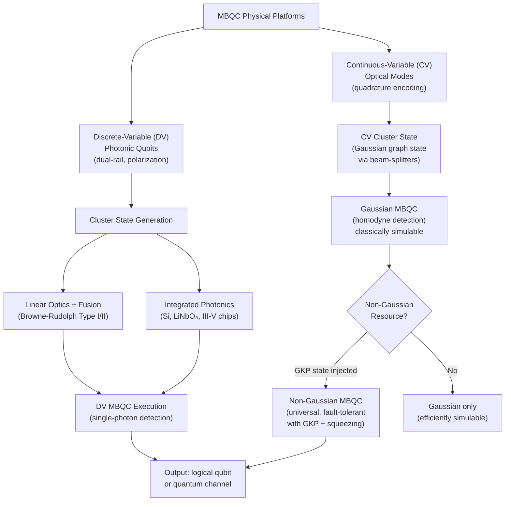

# QCSAA 900-909 · Section 00 · Subsection 907 · Subsubject 005 — Photonic and Continuous-Variable Realizations

## 1. Purpose

Covers the **physical implementation of measurement-based quantum computation in photonic and continuous-variable (CV) platforms** — the two paradigms most naturally suited to the MBQC model due to photon indistinguishability, room-temperature operation, and native compatibility with optical networks and free-space links. This document addresses linear optical cluster-state generation, the Browne-Rudolph fusion scheme, CV cluster states and Gaussian MBQC, the Gottesman-Kitaev-Preskill (GKP) encoding for fault-tolerant non-Gaussian operations, and the performance trade-offs relevant to aerospace and space-borne deployments[^browne_rudolph][^menicucci_cv][^kok_review][^walshe_gkp].

## 2. Scope

- Covers the *Photonic and Continuous-Variable Realizations* subsubject (`005`) of subsection `907` *Measurement-Based and One-Way Computing* within section `00` *Fundamentos de Computación Cuántica*.
- Inherits Q-Division authority and ORB support from the parent row in [`../../README.md` §3](../../README.md#3-architecture-table)[^archtable].
- Concepts in scope:
  - **Dual-rail photonic qubits** — logical |0⟩ and |1⟩ encoded in two spatial or polarization modes of a single photon; Fock state representation; advantages for room-temperature operation and long-distance transmission.
  - **Linear optical cluster-state generation** — beam-splitter networks, phase shifters, and single-photon detectors for probabilistic entangling operations; the KLM (Knill-Laflamme-Milburn) scheme and non-deterministic CNOT gates[^klm].
  - **Browne-Rudolph fusion scheme** — Type-I and Type-II fusions using 50/50 beam splitters and photon-number-resolving detectors to grow cluster states from small entangled states (Bell pairs, 3-qubit GHZ); success probability trade-offs and boosting techniques[^browne_rudolph].
  - **Photonic loss and error model** — photon loss as the dominant error channel; loss-equivalent erasure errors; loss thresholds for scalable cluster-state generation; comparison with heralded schemes.
  - **Integrated photonic platforms** — silicon photonics, lithium niobate, and III-V semiconductor waveguide chips for on-chip cluster-state generation; integration with single-photon sources (quantum dots, SPDC) and SNSPDs.
  - **Continuous-variable (CV) cluster states** — cluster states defined over the infinite-dimensional Hilbert space of optical modes; quadrature operators x̂ and p̂; CV graph state construction using beam-splitter operations; Gaussian measurements (homodyne detection).
  - **Gaussian MBQC** — universal Gaussian operations (squeezing, displacement, rotation) realised by homodyne measurements on CV cluster states; limitations to classically simulable (Gaussian) operations; necessity of non-Gaussian resources for full universality[^menicucci_cv].
  - **GKP encoding for non-Gaussian universality** — Gottesman-Kitaev-Preskill qubit encoding in a harmonic oscillator; GKP magic states as non-Gaussian resource states injected into a Gaussian MBQC framework; state injection and T-gate realisation[^walshe_gkp].
  - **CV noise model and squeezing requirements** — finite squeezing as the primary error source; nullifier variance and logical error rates; squeezing threshold estimates (~20 dB) for fault-tolerant CV MBQC.
- Out of scope: abstract cluster-state theory (`001_`); one-way model execution formalism (`002_`); fault-tolerance schemes (`006_`); aerospace hardware system-level integration (`007_`).

## 3. Diagram — Photonic and CV MBQC Platform Landscape

## 4. Footprint

| Metric | Value |
|---|---|
| Architecture | `QCSAA` — Quantum Computing & Sentient Agency Architecture |
| Master range | `900–999` |
| Code range | `900-909` |
| Section | `00` — Fundamentos de Computación Cuántica |
| Subsection | `907` — Measurement-Based and One-Way Computing |
| Subsubject | `005` — Photonic and Continuous-Variable Realizations |
| Primary Q-Division | Q-HORIZON[^qdiv] |
| Support Q-Divisions | Q-HPC, Q-DATAGOV |
| ORB support | ORB-PMO, ORB-LEG |
| Governance class | `restricted`[^gov] |
| Folder path | `Q+ATLANTIDE/900-999_QCSAA/900-909_Fundamentos-de-Computacion-Cuantica/907_Measurement-Based-and-One-Way-Computing/` |
| Document | `005_Photonic-and-Continuous-Variable-Realizations.md` (this file) |
| Parent subsection | [`README.md`](./README.md) · [`000_Overview.md`](./000_Overview.md) |
| Parent architecture | [`../../README.md`](../../README.md) |
| Parent baseline | [`organization/Q+ATLANTIDE.md`](../../../../organization/Q+ATLANTIDE.md) |

## 5. References & Citations

[^baseline]: **Q+ATLANTIDE controlled baseline (v1.0.0)** — [`organization/Q+ATLANTIDE.md`](../../../../organization/Q+ATLANTIDE.md). Defines the controlled `000-999` architecture-band taxonomy and the ATLAS-1000 register subpart.

[^archtable]: **QCSAA §3 Architecture Table** — [`../../README.md` §3](../../README.md#3-architecture-table). Authoritative source for the `900-909` row (Section `00` — Fundamentos de Computación Cuántica, Primary Q-Division Q-HORIZON).

[^qdiv]: **Q-Division authority** — Q-Divisions provide technical authority over an architecture row (Q+ATLANTIDE Note N-002). See [`organization/Q+ATLANTIDE.md` §4](../../../../organization/Q+ATLANTIDE.md#4-notes).

[^gov]: **Governance class** — `restricted` denotes documents requiring additional governance, evidence packages and access controls (rule N-006[^n006]).

[^n006]: **Note N-006 (Restricted bands)** — Quantum-related (`900-999` QCSAA) bands require additional governance, evidence packages and access controls. See [`organization/Q+ATLANTIDE.md` §5.3](../../../../organization/Q+ATLANTIDE.md#53-restricted-band-templates-n-006).

[^browne_rudolph]: **Browne, D. E. & Rudolph, T. — "Resource-Efficient Linear Optical Quantum Computation" (*Physical Review Letters* 95, 010501, 2005)** — Type-I and Type-II fusion gates for probabilistic cluster-state growth with linear optics; resource overhead analysis. [DOI:10.1103/PhysRevLett.95.010501](https://doi.org/10.1103/PhysRevLett.95.010501).

[^menicucci_cv]: **Menicucci, N. C. et al. — "Universal Quantum Computation with Continuous-Variable Cluster States" (*Physical Review Letters* 97, 110501, 2006)** — CV cluster states, Gaussian MBQC universality limitations, and non-Gaussian resource requirements. [DOI:10.1103/PhysRevLett.97.110501](https://doi.org/10.1103/PhysRevLett.97.110501).

[^klm]: **Knill, E., Laflamme, R. & Milburn, G. J. — "A scheme for efficient quantum computation with linear optics" (*Nature* 409, 2001, pp. 46–52)** — Foundational linear optical quantum computing scheme; non-deterministic CNOT gates via ancilla photons and post-selection. [DOI:10.1038/35051009](https://doi.org/10.1038/35051009).

[^kok_review]: **Kok, P. et al. — "Linear optical quantum computing with photonic qubits" (*Reviews of Modern Physics* 79(1), 2007, pp. 135–174)** — Comprehensive review of linear optical MBQC: dual-rail encoding, cluster-state generation, loss analysis, and integrated photonics. [DOI:10.1103/RevModPhys.79.135](https://doi.org/10.1103/RevModPhys.79.135).

[^walshe_gkp]: **Walshe, B. W., Baragiola, B. Q., Alexander, R. N. & Menicucci, N. C. — "Continuous-variable gate teleportation and bosonic-code error correction" (*Physical Review A* 102, 062411, 2020)** — GKP-state injection into CV MBQC for non-Gaussian universality and fault-tolerant qubit operations. [DOI:10.1103/PhysRevA.102.062411](https://doi.org/10.1103/PhysRevA.102.062411).

[^iso4879]: **ISO/IEC 4879:2023 — Information technology — Quantum computing — Vocabulary** — Normative vocabulary for photonic qubit, continuous-variable, cluster state, and related terms.

### Applicable standards

- Browne & Rudolph — *Resource-Efficient Linear Optical Quantum Computation* (PRL, 2005)[^browne_rudolph]
- Menicucci et al. — *Universal QC with CV Cluster States* (PRL, 2006)[^menicucci_cv]
- Knill, Laflamme & Milburn — *Linear optics quantum computing* (Nature, 2001)[^klm]
- Kok et al. — *Linear optical quantum computing with photonic qubits* (RMP, 2007)[^kok_review]
- Walshe et al. — *CV gate teleportation and bosonic-code error correction* (PRA, 2020)[^walshe_gkp]
- ISO/IEC 4879:2023 — Quantum computing — Vocabulary[^iso4879]
