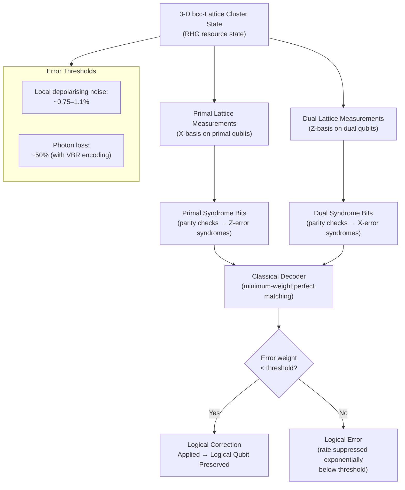

# QCSAA 900-909 · Section 00 · Subsection 907 · Subsubject 006 — Fault-Tolerance in Measurement-Based Computing

## 1. Purpose

Addresses the **fault-tolerant realisation of measurement-based quantum computation**, including the topological approach based on 3-D cluster states (Raussendorf-Harrington-Goyal), surface-code MBQC, percolation-threshold analysis for lossy cluster-state preparation, and loss-tolerant schemes applicable to photonic platforms. This document establishes the error thresholds, syndrome extraction protocols, and logical qubit encoding strategies that enable MBQC to operate below the fault-tolerance threshold in the presence of local stochastic noise and photon loss[^raussendorf_topological][^fowler_surface][^barrett_loss].

## 2. Scope

- Covers the *Fault-Tolerance in Measurement-Based Computing* subsubject (`006`) of subsection `907` *Measurement-Based and One-Way Computing* within section `00` *Fundamentos de Computación Cuántica*.
- Inherits Q-Division authority and ORB support from the parent row in [`../../README.md` §3](../../README.md#3-architecture-table)[^archtable].
- Concepts in scope:
  - **Noise model for MBQC** — local stochastic Pauli noise on cluster-state qubits; measurement-error model; photon-loss as an erasure channel; correlated noise from imperfect entangling operations.
  - **Topological fault-tolerance on 3-D cluster states (RHG scheme)** — the Raussendorf-Harrington-Goyal 3-D bcc-lattice cluster state encodes a topological surface code; primal and dual lattice defect chains; anyon pair creation and braiding; syndrome extraction by single-qubit measurements; error threshold ~0.75%–1.1% for local depolarising noise[^raussendorf_topological].
  - **Surface-code MBQC** — equivalence between planar surface code and a 2-D slice of the 3-D cluster; logical qubit encoding in a 2-D patch; stabilizer syndrome extraction via measurement pattern; logical Pauli and Clifford operations by measurement sequence.
  - **Percolation threshold analysis** — modelling imperfect cluster-state preparation as bond/site percolation on the resource-state graph; sub-threshold percolation allows renormalisation-based error correction; percolation thresholds for square, cubic, and bcc lattices in the presence of loss[^browne_percolation].
  - **Loss tolerance in photonic MBQC** — erasure-based error model for photon loss; loss-tolerant cluster-state protocols (redundant encoding, tree-graph resource states); Varnava-Browne-Rudolph (VBR) loss-tolerant scheme for linear-optical MBQC; loss thresholds achievable with realistic single-photon sources[^varnava_loss].
  - **Magic state distillation in MBQC** — preparing high-fidelity non-Clifford (T-gate, CCZ) resource states by distillation protocols within the MBQC framework; resource overhead estimates per magic state.
  - **Fault-tolerant logical gates** — transversal logical Clifford operations via coordinated measurement patterns; non-transversal T-gate via magic state injection; code switching between different topological codes.
  - **Resource overhead and threshold comparison** — qubit overhead per logical qubit as a function of target logical error rate ε_L; comparison of MBQC, circuit-model surface code, and concatenated code overheads; practical implications for photonic hardware.
- Out of scope: abstract cluster-state and graph-state definitions (`001_`); measurement pattern formalism (`003_`); photonic hardware platforms (`005_`); aerospace-specific system integration (`007_`).

## 3. Diagram — Topological Fault-Tolerance in MBQC (RHG Scheme)

## 4. Footprint

| Metric | Value |
|---|---|
| Architecture | `QCSAA` — Quantum Computing & Sentient Agency Architecture |
| Master range | `900–999` |
| Code range | `900-909` |
| Section | `00` — Fundamentos de Computación Cuántica |
| Subsection | `907` — Measurement-Based and One-Way Computing |
| Subsubject | `006` — Fault-Tolerance in Measurement-Based Computing |
| Primary Q-Division | Q-HORIZON[^qdiv] |
| Support Q-Divisions | Q-HPC, Q-DATAGOV |
| ORB support | ORB-PMO, ORB-LEG |
| Governance class | `restricted`[^gov] |
| Folder path | `Q+ATLANTIDE/900-999_QCSAA/900-909_Fundamentos-de-Computacion-Cuantica/907_Measurement-Based-and-One-Way-Computing/` |
| Document | `006_Fault-Tolerance-in-Measurement-Based-Computing.md` (this file) |
| Parent subsection | [`README.md`](./README.md) · [`000_Overview.md`](./000_Overview.md) |
| Parent architecture | [`../../README.md`](../../README.md) |
| Parent baseline | [`organization/Q+ATLANTIDE.md`](../../../../organization/Q+ATLANTIDE.md) |

## 5. References & Citations

[^baseline]: **Q+ATLANTIDE controlled baseline (v1.0.0)** — [`organization/Q+ATLANTIDE.md`](../../../../organization/Q+ATLANTIDE.md). Defines the controlled `000-999` architecture-band taxonomy and the ATLAS-1000 register subpart.

[^archtable]: **QCSAA §3 Architecture Table** — [`../../README.md` §3](../../README.md#3-architecture-table). Authoritative source for the `900-909` row (Section `00` — Fundamentos de Computación Cuántica, Primary Q-Division Q-HORIZON).

[^qdiv]: **Q-Division authority** — Q-Divisions provide technical authority over an architecture row (Q+ATLANTIDE Note N-002). See [`organization/Q+ATLANTIDE.md` §4](../../../../organization/Q+ATLANTIDE.md#4-notes).

[^gov]: **Governance class** — `restricted` denotes documents requiring additional governance, evidence packages and access controls (rule N-006[^n006]).

[^n006]: **Note N-006 (Restricted bands)** — Quantum-related (`900-999` QCSAA) bands require additional governance, evidence packages and access controls. See [`organization/Q+ATLANTIDE.md` §5.3](../../../../organization/Q+ATLANTIDE.md#53-restricted-band-templates-n-006).

[^raussendorf_topological]: **Raussendorf, R., Harrington, J. & Goyal, K. — "Topological fault-tolerance in cluster state quantum computation" (*New Journal of Physics* 9, 199, 2007)** — 3-D bcc-lattice cluster state as a topological fault-tolerant MBQC resource; anyon braiding, syndrome extraction, and error threshold ~1.1%. [DOI:10.1088/1367-2630/9/6/199](https://doi.org/10.1088/1367-2630/9/6/199).

[^fowler_surface]: **Fowler, A. G., Martinis, J. M. et al. — "Surface codes: Towards practical large-scale quantum computation" (*Physical Review A* 86, 032324, 2012)** — Surface-code architecture, minimum-weight perfect matching decoder, and practical resource overhead estimates. [DOI:10.1103/PhysRevA.86.032324](https://doi.org/10.1103/PhysRevA.86.032324).

[^barrett_loss]: **Barrett, S. D. & Kok, P. — "Efficient high-fidelity quantum computation using matter qubits and linear optics" (*Physical Review A* 71, 060310(R), 2005)** — Loss-tolerant cluster-state generation protocols and photonic fault-tolerance analysis. [DOI:10.1103/PhysRevA.71.060310](https://doi.org/10.1103/PhysRevA.71.060310).

[^browne_percolation]: **Browne, D. E., Silva, M., Perdrix, S. & Kashefi, E. — "Phase transition of computational power in the resource states for one-way quantum computation" (*New Journal of Physics* 10, 023010, 2008)** — Percolation-threshold analysis for lossy cluster-state preparation; renormalisation-based error correction. [DOI:10.1088/1367-2630/10/2/023010](https://doi.org/10.1088/1367-2630/10/2/023010).

[^varnava_loss]: **Varnava, M., Browne, D. E. & Rudolph, T. — "How Good Must Single Photon Sources and Detectors Be for Efficient Linear Optical Quantum Computation?" (*Physical Review Letters* 100, 060502, 2008)** — Varnava-Browne-Rudolph (VBR) loss-tolerant scheme; loss threshold ~50% for scalable photonic MBQC. [DOI:10.1103/PhysRevLett.100.060502](https://doi.org/10.1103/PhysRevLett.100.060502).

[^iso4879]: **ISO/IEC 4879:2023 — Information technology — Quantum computing — Vocabulary** — Normative vocabulary for fault-tolerance, error threshold, topological code, and related terms.

### Applicable standards

- Raussendorf, Harrington & Goyal — *Topological fault-tolerance in cluster state QC* (NJP, 2007)[^raussendorf_topological]
- Fowler et al. — *Surface codes: Towards practical large-scale QC* (PRA, 2012)[^fowler_surface]
- Barrett & Kok — *Efficient high-fidelity QC using matter qubits and linear optics* (PRA, 2005)[^barrett_loss]
- Browne et al. — *Phase transition of computational power in resource states* (NJP, 2008)[^browne_percolation]
- Varnava, Browne & Rudolph — *Loss-tolerant linear optical MBQC* (PRL, 2008)[^varnava_loss]
- ISO/IEC 4879:2023 — Quantum computing — Vocabulary[^iso4879]
