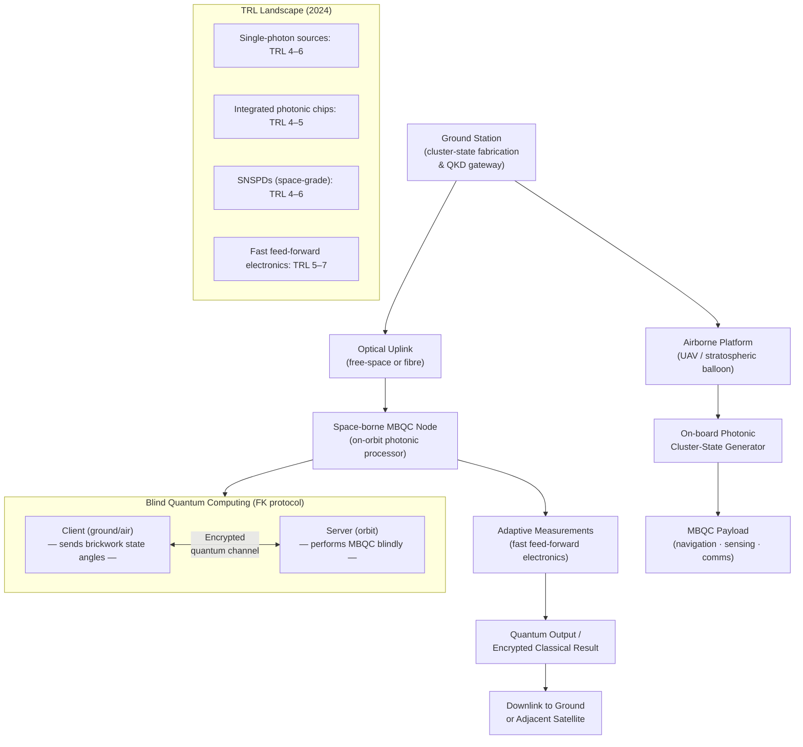

# QCSAA 900-909 · Section 00 · Subsection 907 · Subsubject 007 — Aerospace Applicability and Hardware Realizations

## 1. Purpose

Addresses the **applicability of measurement-based quantum computation to aerospace missions and platforms** — including space-borne quantum computing nodes, airborne quantum processing payloads, satellite quantum communication links, and ground-station integration — and the specific hardware realizations suited to the operational constraints of these environments. This document identifies the MBQC properties that make it particularly advantageous for aerospace deployment (photonic substrate, room-temperature operation, compatibility with free-space optical links, and physical resource separation), and maps them to the Q+ATLANTIDE programme's Q-HORIZON and Q-HPC divisional responsibilities[^esa_qci][^bedington_satellite][^sidhu_space].

## 2. Scope

- Covers the *Aerospace Applicability and Hardware Realizations* subsubject (`007`) of subsection `907` *Measurement-Based and One-Way Computing* within section `00` *Fundamentos de Computación Cuántica*.
- Inherits Q-Division authority and ORB support from the parent row in [`../../README.md` §3](../../README.md#3-architecture-table)[^archtable].
- Concepts in scope:
  - **MBQC advantages for aerospace** — photonic MBQC requires no cryogenic cooling for the quantum channel (photons propagate at room temperature); resource-state generation can be separated in time and location from computation (pre-fabricated cluster states shipped or generated on-board); inherent compatibility with optical free-space and fibre quantum links.
  - **Space-borne quantum computing nodes** — architecture of an on-orbit MBQC processor: compact integrated-photonic cluster-state generator, fast-feed-forward electronics, and cryo-cooled or room-temperature SNSPDs; mass, power, and volume constraints (SWaP) for cubesat vs. large platform deployment; radiation hardness requirements for photonic chips in the space environment.
  - **Satellite-based quantum communication and MBQC** — cluster-state-based quantum repeater networks for long-distance entanglement distribution; optical ground-to-satellite uplink/downlink for resource-state delivery; MBQC as the processing back-end for satellite quantum key distribution (QKD) and blind quantum computing protocols.
  - **Airborne quantum platforms** — MBQC payload integration in stratospheric balloon platforms, UAVs, and high-altitude aircraft; vibration and thermal management for integrated photonic chips; phase stability of free-space optical links at altitude.
  - **Blind quantum computing for aerospace** — the MBQC model supports universal blind quantum computing (UBQC) protocols where a client delegates computation to a remote server without revealing the algorithm or data; applicability to secure airborne and satellite computing; Fitzsimons-Kashefi (FK) UBQC scheme[^fitzsimons_ubqc].
  - **Quantum sensing and navigation** — use of entangled cluster-state photons for enhanced-sensitivity quantum LIDAR, gravimetry, and inertial navigation systems on aerospace platforms; MBQC post-processing of quantum sensor outputs.
  - **Hardware maturity and TRL assessment** — technology readiness levels (TRL) for photonic MBQC hardware components relevant to aerospace: single-photon sources (TRL 4–6), integrated photonic chips (TRL 4–5), SNSPDs (TRL 4–6), fast classical feed-forward electronics (TRL 5–7); gap analysis against mission requirements.
  - **Q+ATLANTIDE programme linkages** — traceability to Q-HORIZON (quantum technologies and fundamental physics), Q-HPC (high-performance quantum processing), and Q-DATAGOV (quantum data governance); interface with ATLAS bands for avionics, communication, and propulsion system domains.
- Out of scope: abstract MBQC theory (`001_`–`004_`); photonic platform physics (`005_`); fault-tolerance thresholds (`006_`).

## 3. Diagram — Aerospace MBQC Deployment Architecture

## 4. Footprint

| Metric | Value |
|---|---|
| Architecture | `QCSAA` — Quantum Computing & Sentient Agency Architecture |
| Master range | `900–999` |
| Code range | `900-909` |
| Section | `00` — Fundamentos de Computación Cuántica |
| Subsection | `907` — Measurement-Based and One-Way Computing |
| Subsubject | `007` — Aerospace Applicability and Hardware Realizations |
| Primary Q-Division | Q-HORIZON[^qdiv] |
| Support Q-Divisions | Q-HPC, Q-DATAGOV |
| ORB support | ORB-PMO, ORB-LEG |
| Governance class | `restricted`[^gov] |
| Folder path | `Q+ATLANTIDE/900-999_QCSAA/900-909_Fundamentos-de-Computacion-Cuantica/907_Measurement-Based-and-One-Way-Computing/` |
| Document | `007_Aerospace-Applicability-and-Hardware-Realizations.md` (this file) |
| Parent subsection | [`README.md`](./README.md) · [`000_Overview.md`](./000_Overview.md) |
| Parent architecture | [`../../README.md`](../../README.md) |
| Parent baseline | [`organization/Q+ATLANTIDE.md`](../../../../organization/Q+ATLANTIDE.md) |

## 5. References & Citations

[^baseline]: **Q+ATLANTIDE controlled baseline (v1.0.0)** — [`organization/Q+ATLANTIDE.md`](../../../../organization/Q+ATLANTIDE.md). Defines the controlled `000-999` architecture-band taxonomy and the ATLAS-1000 register subpart.

[^archtable]: **QCSAA §3 Architecture Table** — [`../../README.md` §3](../../README.md#3-architecture-table). Authoritative source for the `900-909` row (Section `00` — Fundamentos de Computación Cuántica, Primary Q-Division Q-HORIZON).

[^qdiv]: **Q-Division authority** — Q-Divisions provide technical authority over an architecture row (Q+ATLANTIDE Note N-002). See [`organization/Q+ATLANTIDE.md` §4](../../../../organization/Q+ATLANTIDE.md#4-notes).

[^gov]: **Governance class** — `restricted` denotes documents requiring additional governance, evidence packages and access controls (rule N-006[^n006]).

[^n006]: **Note N-006 (Restricted bands)** — Quantum-related (`900-999` QCSAA) bands require additional governance, evidence packages and access controls. See [`organization/Q+ATLANTIDE.md` §5.3](../../../../organization/Q+ATLANTIDE.md#53-restricted-band-templates-n-006).

[^esa_qci]: **ESA — Quantum Computing and Communication for Space (QCI4Space programme, 2022–)** — European Space Agency strategic initiative addressing space-borne quantum hardware, satellite quantum links, photonic payloads, and aerospace quantum computing applicability including MBQC platforms.

[^bedington_satellite]: **Bedington, R., Arrazola, J. M. & Ling, A. — "Progress in satellite quantum key distribution" (*npj Quantum Information* 3, 30, 2017)** — Satellite QKD architecture, optical uplink/downlink design, and free-space quantum channel parameters relevant to space-borne MBQC. [DOI:10.1038/s41534-017-0031-5](https://doi.org/10.1038/s41534-017-0031-5).

[^sidhu_space]: **Sidhu, J. S. et al. — "Advances in Space Quantum Communications" (*IET Quantum Communication* 2(4), 2021, pp. 182–217)** — Comprehensive review of space quantum communication technologies, platform constraints, and quantum computing integration. [DOI:10.1049/qtc2.12015](https://doi.org/10.1049/qtc2.12015).

[^fitzsimons_ubqc]: **Fitzsimons, J. F. & Kashefi, E. — "Unconditionally verifiable blind quantum computation" (*Physical Review A* 96, 012303, 2017)** — FK UBQC protocol for secure blind quantum computing; applicability to aerospace client-server quantum architectures. [DOI:10.1103/PhysRevA.96.012303](https://doi.org/10.1103/PhysRevA.96.012303).

[^kok_review]: **Kok, P. et al. — "Linear optical quantum computing with photonic qubits" (*Reviews of Modern Physics* 79(1), 2007, pp. 135–174)** — Photonic hardware components (single-photon sources, detectors, integrated optics) and their TRL-relevant performance parameters. [DOI:10.1103/RevModPhys.79.135](https://doi.org/10.1103/RevModPhys.79.135).

[^iso4879]: **ISO/IEC 4879:2023 — Information technology — Quantum computing — Vocabulary** — Normative vocabulary for quantum network, quantum communication, and related terms applicable to aerospace deployments.

### Applicable standards

- ESA — QCI4Space programme (2022–)[^esa_qci]
- Bedington, Arrazola & Ling — *Progress in satellite QKD* (npj Quantum Information, 2017)[^bedington_satellite]
- Sidhu et al. — *Advances in Space Quantum Communications* (IET Quantum Communication, 2021)[^sidhu_space]
- Fitzsimons & Kashefi — *Unconditionally verifiable blind quantum computation* (PRA, 2017)[^fitzsimons_ubqc]
- Kok et al. — *Linear optical quantum computing with photonic qubits* (RMP, 2007)[^kok_review]
- ISO/IEC 4879:2023 — Quantum computing — Vocabulary[^iso4879]
