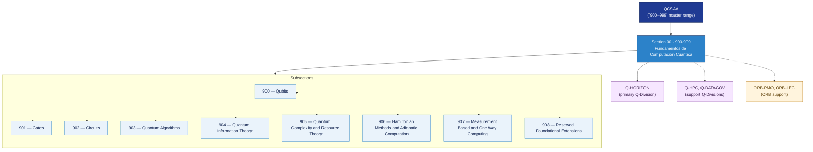

# QCSAA 900–909 · Section 00 — Fundamentos de Computación Cuántica

## 1. Purpose

Section-level index for *Fundamentos de Computación Cuántica* (`900-909`) within the QCSAA band. Quantum Computing Foundations: Qubits, gates, circuits, quantum algorithms, information theory, complexity, and foundational methods.

This section is part of the **ATLAS-1000** register, a subpart of the controlled **Q+ATLANTIDE** baseline[^baseline][^n001]. Bands classify technologies, Q-Divisions provide technical authority and ORB-Functions provide enterprise support[^n002].

**Restricted band (N-006[^n006]).** All subsections and templates under this section additionally inherit `governance_class: restricted`.

## 2. Scope

- Aggregates the subsections within the `900-909` code range listed in §3.
- Inherits Q-Division authority and ORB support from the parent row in [`../README.md` §3](../README.md#3-architecture-table)[^archtable].
- Each subsection folder contains its own `README.md` (subsection index) and may contain Overview and subsubject documents.
- All subsections under this section must declare `governance_class: restricted`, `evidence_package_id` and `access_control_profile` per rule N-006[^n006].

## 3. Subsection Index

| Code | Title | Folder | Status |
|---:|---|---|---|
| `900` | Qubits | [`./900_Qubits/`](./900_Qubits/) | active |
| `901` | Gates | [`./901_Gates/`](./901_Gates/) | active |
| `902` | Circuits | [`./902_Circuits/`](./902_Circuits/) | active |
| `903` | Quantum Algorithms | [`./903_Quantum-Algorithms/`](./903_Quantum-Algorithms/) | active |
| `904` | Quantum Information Theory | [`./904_Quantum-Information-Theory/`](./904_Quantum-Information-Theory/) | active |
| `905` | Quantum Complexity and Resource Theory | [`./905_Quantum-Complexity-and-Resource-Theory/`](./905_Quantum-Complexity-and-Resource-Theory/) | active |
| `906` | Hamiltonian Methods and Adiabatic Computation | [`./906_Hamiltonian-Methods-and-Adiabatic-Computation/`](./906_Hamiltonian-Methods-and-Adiabatic-Computation/) | active |
| `907` | Measurement Based and One Way Computing | [`./907_Measurement-Based-and-One-Way-Computing/`](./907_Measurement-Based-and-One-Way-Computing/) | active |
| `908` | Reserved Foundational Extensions | [`./908_Reserved-Foundational-Extensions/`](./908_Reserved-Foundational-Extensions/) | active |

## 4. Interfaces Diagram

*Solid arrows show parent→section→subsection ownership and primary Q-Division authority; dotted arrows show support Q-Divisions and ORB enterprise support.*

## 5. Footprint

| Metric | Value |
|---|---|
| Architecture | `QCSAA` — Quantum Computing & Sentient Agency Architecture |
| Master range | `900–999` |
| Code range | `900-909` |
| Section | `00` — Fundamentos de Computación Cuántica |
| Subsections | 9 populated |
| Primary Q-Division | Q-HORIZON[^qdiv] |
| Support Q-Divisions | Q-HPC, Q-DATAGOV |
| ORB support | ORB-PMO, ORB-LEG |
| Governance class | `restricted`[^gov] |
| Folder path | `Q+ATLANTIDE/900-999_QCSAA/900-909_Fundamentos-de-Computacion-Cuantica/` |
| Document | `README.md` (this file) |
| Parent architecture | [`../README.md`](../README.md) |
| Parent baseline | [`organization/Q+ATLANTIDE.md`](../../../organization/Q+ATLANTIDE.md) |

## Governance

Governed by [`organization/Q+ATLANTIDE.md`](../../../organization/Q+ATLANTIDE.md)[^baseline]. All subsections under this section inherit `architecture_code = QCSAA`, `primary_q_division = Q-HORIZON`, and `governance_class = restricted` from this section header. Templates declared in this section must also declare `evidence_package_id` and `access_control_profile` per rule N-006[^n006]. The No-AAA Rule[^n004] applies.

## 6. References & Citations

[^baseline]: **Q+ATLANTIDE controlled baseline (v1.0.0)** — [`organization/Q+ATLANTIDE.md`](../../../organization/Q+ATLANTIDE.md). Defines the controlled `000-999` architecture-band taxonomy and the ATLAS-1000 register subpart.

[^archtable]: **§3 — Architecture Table (parent)** — [`../README.md` §3](../README.md#3-architecture-table). Source of authority for primary/support Q-Divisions and ORB support of this section.

[^qdiv]: **Q-Division authority** — [`organization/Q-Divisions/`](../../../organization/Q-Divisions/). Technical-authority units for the Q+ATLANTIDE baseline.

[^gov]: **Governance class** — `restricted` denotes documents requiring additional governance, evidence packages and access controls (rule N-006[^n006]).

[^templates]: **§5 — Templates System** — [`organization/Q+ATLANTIDE.md` §5](../../../organization/Q+ATLANTIDE.md#5-templates-system).

[^n001]: **Note N-001** — Q+ATLANTIDE (with its ATLAS-1000 register subpart) is a taxonomy and traceability ecosystem, not an organization chart. See [`organization/Q+ATLANTIDE.md` §4](../../../organization/Q+ATLANTIDE.md#4-notes).

[^n002]: **Note N-002** — Architecture bands classify technologies; Q-Divisions provide technical authority; ORB-Functions provide enterprise support. See [`organization/Q+ATLANTIDE.md` §4](../../../organization/Q+ATLANTIDE.md#4-notes).

[^n004]: **Note N-004 (No-AAA Rule)** — "AAA" is not a valid domain, division, architecture, interface or function in this baseline. See [`organization/Q+ATLANTIDE.md` §4](../../../organization/Q+ATLANTIDE.md#4-notes).

[^n006]: **Note N-006 (Restricted bands)** — Defence-related (`200-299` DTTA), cybersecurity-related (`800-899` CYB) and quantum-related (`900-999` QCSAA) bands require additional governance, evidence packages and access controls beyond the baseline trace record. Templates must additionally declare `governance_class: restricted`, `evidence_package_id` and `access_control_profile`. See [`organization/Q+ATLANTIDE.md` §5.3](../../../organization/Q+ATLANTIDE.md#53-restricted-band-templates-n-006).
