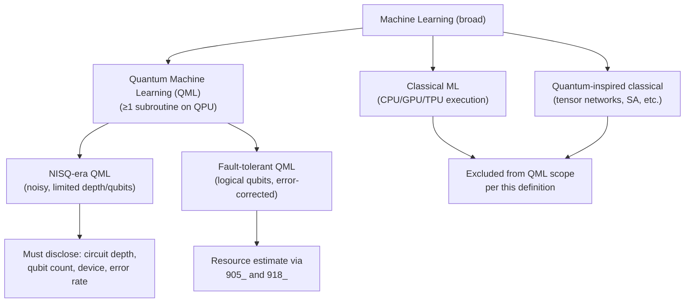

# QCSAA 910–919 · Section 01 · Subsection 910 · Subsubject 001 — QML Controlled Definition

## 1. Purpose

Establishes the **controlled, hardware-anchored definition of Quantum Machine Learning (QML)** used throughout the QCSAA `910-919` band and in any Q+ATLANTIDE document that references QML components. The definition explicitly excludes quantum-inspired classical algorithms, hybrid heuristics without a verifiable quantum subroutine executed on a quantum processing unit (QPU), and marketing uses of the term "quantum AI". Conforming to ISO/IEC 4879[^isoiec4879] vocabulary and the scope conventions of Biamonte et al.[^biamonte], this subsubject prevents definitional drift and ensures that advantage claims are traceable to a verifiable quantum resource.

## 2. Scope

- Covers the *QML Controlled Definition* subsubject (`001`) of subsection `910` *QML Foundations and Taxonomy* within section `01` *Quantum Machine Learning e IA Cuántica*.
- Inherits Q-Division authority and ORB support from the parent row in [`README.md`](./README.md)[^archtable].
- Concepts in scope:
  - **Positive definition** — QML is the field that designs, trains, and deploys learning algorithms in which at least one subroutine is executed on a QPU, such that the QPU contributes a computational resource (superposition, entanglement, quantum interference, or quantum parallelism) to the learning objective. The QPU subroutine must be hardware-realised, not classically simulated, for the execution to count as QML.
  - **Exclusion: quantum-inspired algorithms** — tensor-network methods, simulated annealing, and other classical algorithms conceptually motivated by quantum mechanics do not constitute QML when executed on classical hardware; they belong to the domain of classical ML with quantum-inspired heuristics.
  - **Exclusion: classical simulation of quantum circuits** — an algorithm that executes a parameterised quantum circuit entirely on a classical CPU/GPU via statevector or tensor-network simulation is a classical ML algorithm for the purposes of this taxonomy, regardless of the quantum-mechanical description of its operations.
  - **Exclusion: vague "quantum AI" claims** — references to "quantum AI" that do not specify a QPU, a quantum subroutine, and a concrete computational model are not admissible as QML claims in QCSAA documentation.
  - **NISQ qualification** — in the current era of Noisy Intermediate-Scale Quantum (NISQ) hardware, QPU subroutines are subject to gate error, decoherence, and limited qubit count; NISQ-era QML systems must disclose circuit depth, qubit count, native gate set, and backend device in any performance claim.
  - **Fault-tolerant QML** — a future regime in which QPU subroutines run on error-corrected logical qubits; resource requirements are estimated via `905_` (Quantum Complexity and Resource Theory) and `918_` (QML Resource Estimation and Quantum Advantage Honesty).
  - **Relation to classical ML** — QML is a proper subdomain of a broader ML ecosystem; its boundary with classical ML is treated quantitatively in `003_` (Classical ML vs QML Boundary).
- Out of scope: the taxonomy of QML model types (`002_`), data encoding (`005_`), and specific model families (`006_`).

## 3. Diagram — QML Definition Boundary

## 4. Footprint

| Metric | Value |
|---|---|
| Architecture | `QCSAA` — Quantum Computing & Sentient Agency Architecture |
| Master range | `900–999` |
| Code range | `910-919` |
| Section | `01` — Quantum Machine Learning e IA Cuántica |
| Subsection | `910` — QML Foundations and Taxonomy |
| Subsubject | `001` — QML Controlled Definition |
| Primary Q-Division | Q-HPC[^qdiv] |
| Support Q-Divisions | Q-HORIZON, Q-DATAGOV |
| ORB support | ORB-PMO, ORB-LEG |
| Governance class | `restricted`[^gov] |
| Folder path | `Q+ATLANTIDE/900-999_QCSAA/910-919_Quantum-Machine-Learning-e-IA-Cuantica/910_QML-Foundations-and-Taxonomy/` |
| Document | `001_QML-Controlled-Definition.md` (this file) |
| Parent subsection | [`README.md`](./README.md) · [`000_Overview.md`](./000_Overview.md) |
| Parent architecture | [`../../README.md`](../../README.md) |
| Parent baseline | [`organization/Q+ATLANTIDE.md`](../../../../organization/Q+ATLANTIDE.md) |

## 5. References & Citations

[^baseline]: **Q+ATLANTIDE controlled baseline (v1.0.0)** — [`organization/Q+ATLANTIDE.md`](../../../../organization/Q+ATLANTIDE.md). Defines the controlled `000-999` architecture-band taxonomy and the ATLAS-1000 register subpart.

[^archtable]: **§3 — Subsubject Index (parent README)** — [`README.md` §3](./README.md#3-subsubject-index). Authoritative source for the `910` subsection row (Primary Q-Division Q-HPC).

[^qdiv]: **Q-Division authority** — Q-Divisions provide technical authority over an architecture row (Q+ATLANTIDE Note N-002). See [`organization/Q+ATLANTIDE.md` §4](../../../../organization/Q+ATLANTIDE.md#4-notes).

[^gov]: **Governance class** — `restricted` denotes documents requiring additional governance, evidence packages and access controls (rule N-006[^n006]).

[^n006]: **Note N-006 (Restricted bands)** — Quantum-related (`900-999` QCSAA) bands require additional governance, evidence packages and access controls. See [`organization/Q+ATLANTIDE.md` §5.3](../../../../organization/Q+ATLANTIDE.md#53-restricted-band-templates-n-006).

[^biamonte]: **Biamonte, J. et al. (2017)** — "Quantum machine learning." *Nature*, 549, 195–202. Defines the scope of QML and introduces the CC/CQ/QC/QQ quadrant taxonomy distinguishing hardware-executed quantum subroutines.

[^schuld2021]: **Schuld, M. & Petruccione, F. (2021)** — *Machine Learning with Quantum Computers*. Springer. Chapter 1 provides a comprehensive definition of QML and the boundary with quantum-inspired methods.

[^isoiec4879]: **ISO/IEC 4879:2023** — *Quantum computing — Vocabulary*. Normative vocabulary base; defines quantum processing unit (QPU), quantum algorithm, and related terms used in the definition above.

[^preskill2018]: **Preskill, J. (2018)** — "Quantum Computing in the NISQ Era and Beyond." *Quantum*, 2, 79. Defines the NISQ regime and its practical implications for near-term quantum algorithms including QML.

### Applicable standards

The following standards apply to this subsubject in addition to the cross-cutting Q+ATLANTIDE governance:

- Biamonte et al. (2017) — "Quantum machine learning"[^biamonte]
- Schuld & Petruccione (2021) — *Machine Learning with Quantum Computers*[^schuld2021]
- ISO/IEC 4879:2023 — *Quantum computing — Vocabulary*[^isoiec4879]
- Preskill (2018) — "Quantum Computing in the NISQ Era and Beyond"[^preskill2018]
