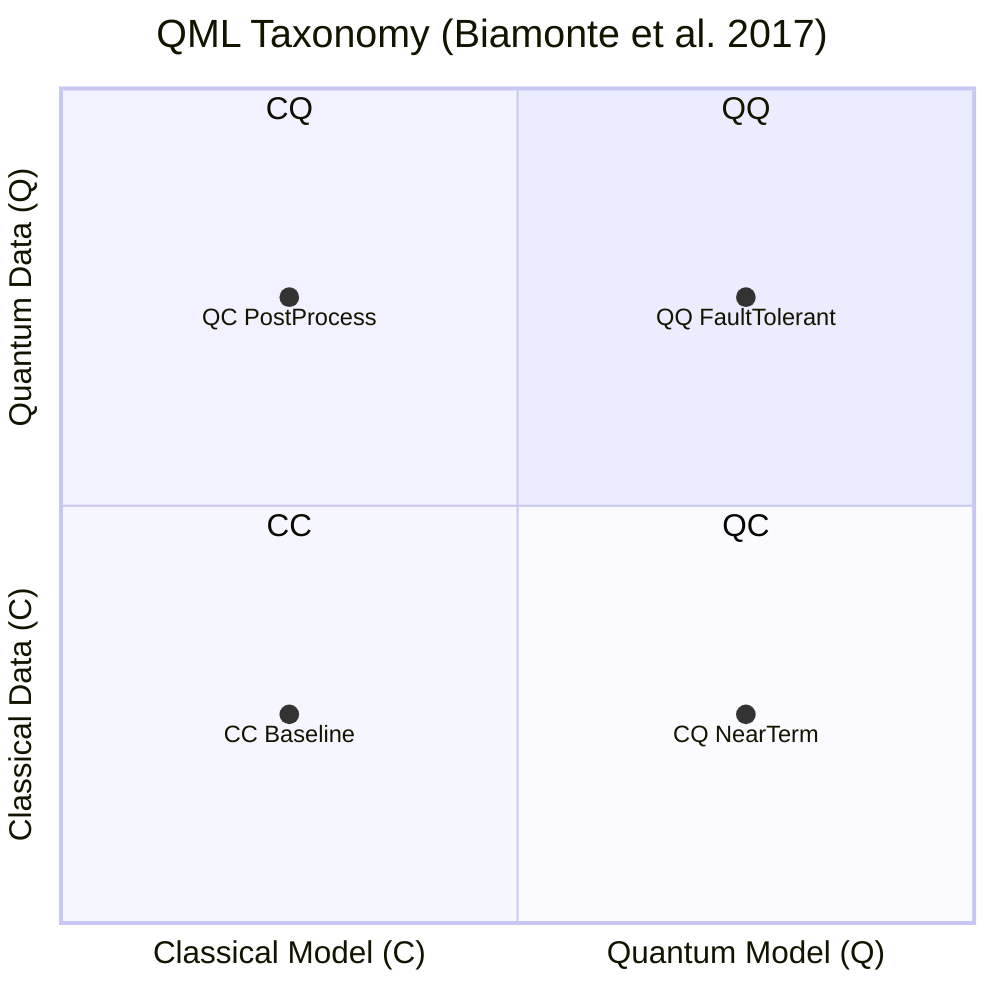

# QCSAA 910–919 · Section 01 · Subsection 910 · Subsubject 002 — QML Taxonomy

## 1. Purpose

Defines the **four-quadrant CC/CQ/QC/QQ taxonomy** of quantum–classical learning models introduced by Biamonte et al.[^biamonte] and adopted as the canonical QML classification scheme within QCSAA `910-919`. Each axis of the quadrant encodes whether the *data* (input representation) is classical (C) or quantum (Q), and whether the *model/processor* is classical (C) or quantum (Q). The taxonomy provides a systematic, hardware-grounded classification that prevents conflation of distinct paradigms and anchors performance expectations to the correct computational substrate.

## 2. Scope

- Covers the *QML Taxonomy* subsubject (`002`) of subsection `910` *QML Foundations and Taxonomy* within section `01` *Quantum Machine Learning e IA Cuántica*.
- Inherits Q-Division authority and ORB support from the parent row in [`README.md`](./README.md)[^archtable].
- Concepts in scope:
  - **CC (Classical data, Classical model)** — baseline classical ML (e.g. deep neural networks, SVMs, random forests); included as reference quadrant for benchmarking and boundary analysis.
  - **CQ (Classical data, Quantum model)** — classical data (sensor readings, flight parameters, image pixels) encoded into quantum states and processed by a QPU; the dominant near-term QML paradigm. Encoding strategies are catalogued in `005_`. Examples: variational quantum classifiers, quantum kernel estimators with classical input data.
  - **QC (Quantum data, Classical model)** — data originating from a quantum process (quantum sensor, quantum chemistry simulation, quantum network measurement) that is measured and processed classically; includes quantum state tomography followed by classical inference and quantum error mitigation post-processing.
  - **QQ (Quantum data, Quantum model)** — quantum data processed directly by a QPU without intermediate classical measurement of the full state; the most advanced and currently least hardware-accessible quadrant. Anticipated in fault-tolerant regimes for quantum simulation, quantum communication network inference, and quantum sensor fusion.
  - **Secondary taxonomy axes** — in addition to the two primary axes, QML models may be further classified by:
    - *Learning paradigm*: supervised, unsupervised, generative, reinforcement.
    - *Training regime*: variational (gradient-based parameter update), kernel-based (no gradient on QPU), adiabatic/annealing.
    - *Hardware era*: NISQ (noisy, < ~1 000 qubits, no error correction), early fault-tolerant, fully fault-tolerant.
    - *Coupling to classical co-processor*: tightly coupled (shared memory, low-latency loop), loosely coupled (batch QPU calls), fully quantum (QQ only).
  - **Taxonomy stability note** — the CC/CQ/QC/QQ scheme is stable and hardware-grounded; the secondary axes may evolve as hardware matures.
- Out of scope: the specific encoding methods for CQ systems (`005_`), concrete model implementations (`006_`), and advantage quantification (`009_`).

## 3. Diagram — CC/CQ/QC/QQ Quadrant Map

*Each point represents the dominant near-term representative of that quadrant. The QQ quadrant requires fault-tolerant hardware and is the least accessible today.*

## 4. Footprint

| Metric | Value |
|---|---|
| Architecture | `QCSAA` — Quantum Computing & Sentient Agency Architecture |
| Master range | `900–999` |
| Code range | `910-919` |
| Section | `01` — Quantum Machine Learning e IA Cuántica |
| Subsection | `910` — QML Foundations and Taxonomy |
| Subsubject | `002` — QML Taxonomy |
| Primary Q-Division | Q-HPC[^qdiv] |
| Support Q-Divisions | Q-HORIZON, Q-DATAGOV |
| ORB support | ORB-PMO, ORB-LEG |
| Governance class | `restricted`[^gov] |
| Folder path | `Q+ATLANTIDE/900-999_QCSAA/910-919_Quantum-Machine-Learning-e-IA-Cuantica/910_QML-Foundations-and-Taxonomy/` |
| Document | `002_QML-Taxonomy.md` (this file) |
| Parent subsection | [`README.md`](./README.md) · [`000_Overview.md`](./000_Overview.md) |
| Parent architecture | [`../../README.md`](../../README.md) |
| Parent baseline | [`organization/Q+ATLANTIDE.md`](../../../../organization/Q+ATLANTIDE.md) |

## 5. References & Citations

[^baseline]: **Q+ATLANTIDE controlled baseline (v1.0.0)** — [`organization/Q+ATLANTIDE.md`](../../../../organization/Q+ATLANTIDE.md). Defines the controlled `000-999` architecture-band taxonomy and the ATLAS-1000 register subpart.

[^archtable]: **§3 — Subsubject Index (parent README)** — [`README.md` §3](./README.md#3-subsubject-index). Authoritative source for the `910` subsection row (Primary Q-Division Q-HPC).

[^qdiv]: **Q-Division authority** — Q-Divisions provide technical authority over an architecture row (Q+ATLANTIDE Note N-002). See [`organization/Q+ATLANTIDE.md` §4](../../../../organization/Q+ATLANTIDE.md#4-notes).

[^gov]: **Governance class** — `restricted` denotes documents requiring additional governance, evidence packages and access controls (rule N-006[^n006]).

[^n006]: **Note N-006 (Restricted bands)** — Quantum-related (`900-999` QCSAA) bands require additional governance, evidence packages and access controls. See [`organization/Q+ATLANTIDE.md` §5.3](../../../../organization/Q+ATLANTIDE.md#53-restricted-band-templates-n-006).

[^biamonte]: **Biamonte, J. et al. (2017)** — "Quantum machine learning." *Nature*, 549, 195–202. Source of the canonical CC/CQ/QC/QQ four-quadrant taxonomy; §1 and Fig. 1 provide the classification scheme adopted here.

[^schuld2021]: **Schuld, M. & Petruccione, F. (2021)** — *Machine Learning with Quantum Computers*. Springer. Extends the taxonomy with secondary axes including learning paradigm and hardware era.

[^preskill2018]: **Preskill, J. (2018)** — "Quantum Computing in the NISQ Era and Beyond." *Quantum*, 2, 79. Defines the NISQ era hardware constraints relevant to the CQ and QC quadrants.

[^isoiec4879]: **ISO/IEC 4879:2023** — *Quantum computing — Vocabulary*. Normative vocabulary base for quantum data, quantum model, and quantum processing.

### Applicable standards

The following standards apply to this subsubject in addition to the cross-cutting Q+ATLANTIDE governance:

- Biamonte et al. (2017) — "Quantum machine learning"[^biamonte]
- Schuld & Petruccione (2021) — *Machine Learning with Quantum Computers*[^schuld2021]
- Preskill (2018) — "Quantum Computing in the NISQ Era and Beyond"[^preskill2018]
- ISO/IEC 4879:2023 — *Quantum computing — Vocabulary*[^isoiec4879]
