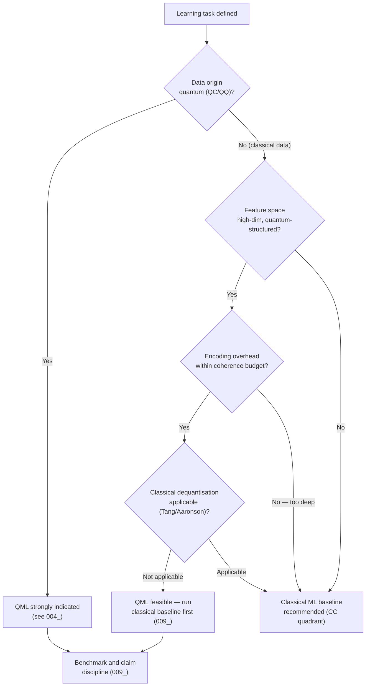

# QCSAA 910–919 · Section 01 · Subsection 910 · Subsubject 003 — Classical ML vs QML Boundary

## 1. Purpose

Establishes the **empirical and theoretical criteria for determining when a Quantum Machine Learning approach is warranted over a classical ML baseline**. The boundary is not static: it depends on dataset size and dimensionality, available qubit count and circuit depth, hardware noise levels, and the specific learning task. This subsubject defines the conditions under which transitioning from classical to quantum processing is theoretically justified, practically feasible, or currently premature, preventing both unjustified quantum replacement and missed quantum opportunities.

## 2. Scope

- Covers the *Classical ML vs QML Boundary* subsubject (`003`) of subsection `910` *QML Foundations and Taxonomy* within section `01` *Quantum Machine Learning e IA Cuántica*.
- Inherits Q-Division authority and ORB support from the parent row in [`README.md`](./README.md)[^archtable].
- Concepts in scope:
  - **Complexity-theoretic separation** — provable quantum advantage in ML requires demonstrating a separation in computational complexity between the best classical and best quantum algorithms for the same learning problem. Currently, proven separations exist for highly structured, artificial problems (e.g. Bernstein-Vazirani, Simon's problem applied to learning); no unconditional separation is proven for general real-world ML tasks.
  - **Heuristic advantage conditions** — empirical conditions under which QML may outperform classical ML on practical tasks: (i) the feature space is intrinsically high-dimensional and corresponds to a quantum state space efficiently prepared on a QPU; (ii) the dataset has a quantum origin (see `004_`); (iii) the learning task has structure exploitable by quantum interference.
  - **NISQ barrier** — in the NISQ era, circuit depth is limited by coherence time and gate fidelity; for most real-world datasets, the overhead of data encoding (`005_`) and circuit execution consumes the available quantum advantage before it can be exploited. The effective classical simulation threshold (approximate Clifford circuits up to ~50–60 qubits) defines a practical boundary.
  - **Dataset size scaling** — amplitude encoding of N-dimensional data requires O(N) circuit depth in general, eroding advantage; angle/basis encoding is shallow but does not achieve exponential compression. The trade-off is analysed formally in `005_`.
  - **Classical dequantisation** — for kernel methods and linear-algebra subroutines (e.g. HHL-based regression), classical algorithms with sample access to the data matrix can match the quantum speedup if the data matrix has low rank or is well-conditioned (Tang 2019[^tang2019], Aaronson 2015[^aaronson2015]); boundary conditions for valid quantum speedup must be verified before deployment.
  - **Practical boundary criteria** — a QML approach should be justified on the following checklist:
    1. The QPU provides a subroutine that is in scope of the controlled QML definition (`001_`).
    2. The data type and encoding (`004_`, `005_`) do not trivially dequantise the advantage.
    3. The circuit depth required is within the coherent gate budget of the target device.
    4. A rigorous classical baseline has been trained on the same dataset and its performance documented per `009_` (Benchmarking and Claim Discipline).
    5. The advantage (accuracy, speed, resource reduction) is quantified with statistical confidence intervals.
  - **Current realistic boundary (2026)** — on NISQ hardware, QML is not expected to outperform state-of-the-art classical ML on large, classical-origin datasets (e.g. ImageNet-scale). Realistic near-term QML targets are: small-to-medium datasets with quantum-feature-map structure, quantum chemistry simulation inputs (QC quadrant), and quantum communication network inference.
- Out of scope: theoretical proofs of quantum advantage (refer to `905_` Quantum Complexity), specific algorithm benchmarks (`009_`), and aerospace-specific thresholds (`010_`).

## 3. Diagram — Classical vs QML Boundary Decision Flow

## 4. Footprint

| Metric | Value |
|---|---|
| Architecture | `QCSAA` — Quantum Computing & Sentient Agency Architecture |
| Master range | `900–999` |
| Code range | `910-919` |
| Section | `01` — Quantum Machine Learning e IA Cuántica |
| Subsection | `910` — QML Foundations and Taxonomy |
| Subsubject | `003` — Classical ML vs QML Boundary |
| Primary Q-Division | Q-HPC[^qdiv] |
| Support Q-Divisions | Q-HORIZON, Q-DATAGOV |
| ORB support | ORB-PMO, ORB-LEG |
| Governance class | `restricted`[^gov] |
| Folder path | `Q+ATLANTIDE/900-999_QCSAA/910-919_Quantum-Machine-Learning-e-IA-Cuantica/910_QML-Foundations-and-Taxonomy/` |
| Document | `003_Classical-ML-vs-QML-Boundary.md` (this file) |
| Parent subsection | [`README.md`](./README.md) · [`000_Overview.md`](./000_Overview.md) |
| Parent architecture | [`../../README.md`](../../README.md) |
| Parent baseline | [`organization/Q+ATLANTIDE.md`](../../../../organization/Q+ATLANTIDE.md) |

## 5. References & Citations

[^baseline]: **Q+ATLANTIDE controlled baseline (v1.0.0)** — [`organization/Q+ATLANTIDE.md`](../../../../organization/Q+ATLANTIDE.md). Defines the controlled `000-999` architecture-band taxonomy and the ATLAS-1000 register subpart.

[^archtable]: **§3 — Subsubject Index (parent README)** — [`README.md` §3](./README.md#3-subsubject-index). Authoritative source for the `910` subsection row (Primary Q-Division Q-HPC).

[^qdiv]: **Q-Division authority** — Q-Divisions provide technical authority over an architecture row (Q+ATLANTIDE Note N-002). See [`organization/Q+ATLANTIDE.md` §4](../../../../organization/Q+ATLANTIDE.md#4-notes).

[^gov]: **Governance class** — `restricted` denotes documents requiring additional governance, evidence packages and access controls (rule N-006[^n006]).

[^n006]: **Note N-006 (Restricted bands)** — Quantum-related (`900-999` QCSAA) bands require additional governance, evidence packages and access controls. See [`organization/Q+ATLANTIDE.md` §5.3](../../../../organization/Q+ATLANTIDE.md#53-restricted-band-templates-n-006).

[^biamonte]: **Biamonte, J. et al. (2017)** — "Quantum machine learning." *Nature*, 549, 195–202. Discusses conditions for quantum advantage in ML and limitations of near-term approaches.

[^tang2019]: **Tang, E. (2019)** — "A quantum-inspired classical algorithm for recommendation systems." *Proceedings of STOC 2019*, pp. 217–228. Demonstrates classical dequantisation of quantum linear-algebra speedups for low-rank matrices.

[^aaronson2015]: **Aaronson, S. (2015)** — "Read the fine print." *Nature Physics*, 11, 291–293. Analyses the conditions under which quantum ML speedups survive scrutiny and identifies common pitfalls.

[^cerezo2022]: **Cerezo, M. et al. (2022)** — "Challenges and opportunities of near-term quantum computing systems." *Reports on Progress in Physics*, 85, 046001. Reviews NISQ-era limitations relevant to the classical–QML boundary analysis.

[^preskill2018]: **Preskill, J. (2018)** — "Quantum Computing in the NISQ Era and Beyond." *Quantum*, 2, 79. Defines the NISQ regime constraints (coherence time, gate fidelity, qubit count) that govern the practical boundary.

[^isoiec4879]: **ISO/IEC 4879:2023** — *Quantum computing — Vocabulary*. Normative vocabulary base.

### Applicable standards

The following standards apply to this subsubject in addition to the cross-cutting Q+ATLANTIDE governance:

- Biamonte et al. (2017) — "Quantum machine learning"[^biamonte]
- Tang (2019) — "A quantum-inspired classical algorithm for recommendation systems"[^tang2019]
- Aaronson (2015) — "Read the fine print"[^aaronson2015]
- Cerezo et al. (2022) — "Challenges and opportunities of near-term quantum computing systems"[^cerezo2022]
- Preskill (2018) — "Quantum Computing in the NISQ Era and Beyond"[^preskill2018]
- ISO/IEC 4879:2023 — *Quantum computing — Vocabulary*[^isoiec4879]
