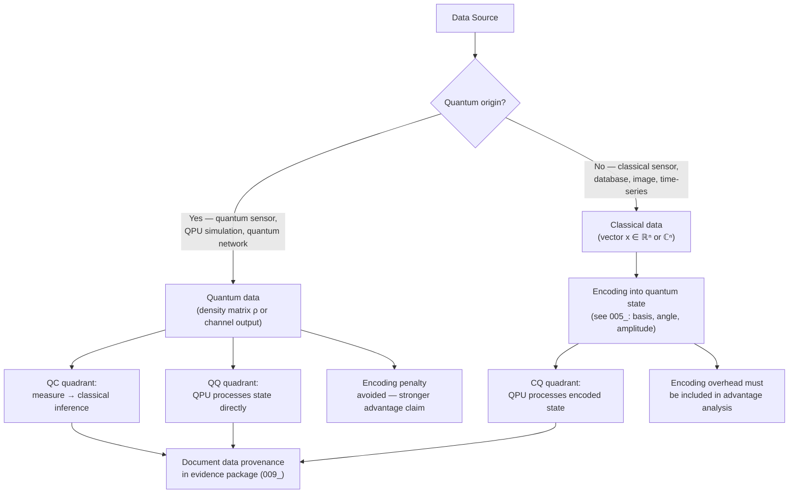

# QCSAA 910–919 · Section 01 · Subsection 910 · Subsubject 004 — Quantum Data vs Classical Data

## 1. Purpose

Establishes the **distinction between quantum data and classical data** as used in QCSAA `910-919` and in any Q+ATLANTIDE document referencing QML data pipelines. The distinction has direct implications for the validity of quantum advantage claims, the choice of QML model quadrant (see `002_`), and the design of data pipelines in hybrid quantum-classical systems. Quantum data that bypasses the classical encoding bottleneck (see `005_`) may support stronger advantage claims than classically encoded data.

## 2. Scope

- Covers the *Quantum Data vs Classical Data* subsubject (`004`) of subsection `910` *QML Foundations and Taxonomy* within section `01` *Quantum Machine Learning e IA Cuántica*.
- Inherits Q-Division authority and ORB support from the parent row in [`README.md`](./README.md)[^archtable].
- Concepts in scope:
  - **Quantum data (definition)** — data that originates as a quantum state or as the output of a quantum process and whose relevant information content is encoded in quantum-mechanical degrees of freedom (amplitudes, phases, entanglement structure). Quantum data is naturally represented as a density matrix ρ or a quantum channel output; measuring it collapses the quantum state and irrecoverably loses the unmeasured degrees of freedom.
  - **Sources of quantum data** — (i) *quantum sensors*: interferometers, atomic clocks, magnetometers, gravimeters that exploit superposition or entanglement to achieve sub-classical precision; (ii) *quantum simulations*: QPU outputs from Hamiltonian simulation experiments (energy spectra, ground states, time-evolved states); (iii) *quantum communication networks*: states transmitted over quantum channels, including entangled pairs distributed for QKD or quantum teleportation; (iv) *quantum-chemistry experiments*: molecular spectra measured on trapped-ion or superconducting QPUs.
  - **Classical data (definition)** — data that originates from classical sensors, databases, images, time-series, or any source representable as a real or complex vector of fixed dimension; it has no intrinsic quantum-mechanical structure and must be *encoded* into quantum states to be processed by a QPU.
  - **Encoding penalty for classical data** — loading an N-dimensional classical vector into a quantum state generally requires O(N) circuit depth (basis encoding) or O(poly(N)) controlled rotations (amplitude encoding), negating exponential speedups unless the data is sparse or has exploitable structure. This bottleneck is detailed in `005_`.
  - **Natively quantum advantage** — QML models operating on quantum data (QC or QQ quadrant) may avoid the encoding penalty entirely, supporting stronger and more defensible advantage claims. The advantage is particularly strong for quantum simulation outputs, where the quantum state is generated by the QPU itself and fed directly into a learning subroutine.
  - **Mixed pipelines** — aerospace applications frequently involve hybrid data pipelines: classical sensor data (e.g. radar, LIDAR, inertial navigation) combined with quantum-sensor outputs (e.g. quantum gravimetry, quantum magnetometry). The data type of each modality must be identified and documented before selecting an encoding strategy.
  - **Data provenance requirement** — every QML system documented under QCSAA `910-919` must declare the data type (quantum / classical / mixed) in its evidence package and justify the encoding strategy accordingly per `005_` and `009_`.
- Out of scope: specific encoding circuits (`005_`), quantum sensor architecture (see `940-949_Sensores-y-Metrologia-Cuantica`), and quantum communication network protocols (see `920-929_Redes-y-Comunicaciones-Cuanticas`).

## 3. Diagram — Data Type and Pipeline Taxonomy

## 4. Footprint

| Metric | Value |
|---|---|
| Architecture | `QCSAA` — Quantum Computing & Sentient Agency Architecture |
| Master range | `900–999` |
| Code range | `910-919` |
| Section | `01` — Quantum Machine Learning e IA Cuántica |
| Subsection | `910` — QML Foundations and Taxonomy |
| Subsubject | `004` — Quantum Data vs Classical Data |
| Primary Q-Division | Q-HPC[^qdiv] |
| Support Q-Divisions | Q-HORIZON, Q-DATAGOV |
| ORB support | ORB-PMO, ORB-LEG |
| Governance class | `restricted`[^gov] |
| Folder path | `Q+ATLANTIDE/900-999_QCSAA/910-919_Quantum-Machine-Learning-e-IA-Cuantica/910_QML-Foundations-and-Taxonomy/` |
| Document | `004_Quantum-Data-vs-Classical-Data.md` (this file) |
| Parent subsection | [`README.md`](./README.md) · [`000_Overview.md`](./000_Overview.md) |
| Parent architecture | [`../../README.md`](../../README.md) |
| Parent baseline | [`organization/Q+ATLANTIDE.md`](../../../../organization/Q+ATLANTIDE.md) |

## 5. References & Citations

[^baseline]: **Q+ATLANTIDE controlled baseline (v1.0.0)** — [`organization/Q+ATLANTIDE.md`](../../../../organization/Q+ATLANTIDE.md). Defines the controlled `000-999` architecture-band taxonomy and the ATLAS-1000 register subpart.

[^archtable]: **§3 — Subsubject Index (parent README)** — [`README.md` §3](./README.md#3-subsubject-index). Authoritative source for the `910` subsection row (Primary Q-Division Q-HPC).

[^qdiv]: **Q-Division authority** — Q-Divisions provide technical authority over an architecture row (Q+ATLANTIDE Note N-002). See [`organization/Q+ATLANTIDE.md` §4](../../../../organization/Q+ATLANTIDE.md#4-notes).

[^gov]: **Governance class** — `restricted` denotes documents requiring additional governance, evidence packages and access controls (rule N-006[^n006]).

[^n006]: **Note N-006 (Restricted bands)** — Quantum-related (`900-999` QCSAA) bands require additional governance, evidence packages and access controls. See [`organization/Q+ATLANTIDE.md` §5.3](../../../../organization/Q+ATLANTIDE.md#53-restricted-band-templates-n-006).

[^biamonte]: **Biamonte, J. et al. (2017)** — "Quantum machine learning." *Nature*, 549, 195–202. Discusses the role of data type (quantum vs classical) in determining the appropriate QML model quadrant.

[^schuld2021]: **Schuld, M. & Petruccione, F. (2021)** — *Machine Learning with Quantum Computers*. Springer. Chapter 4 analyses data encoding overhead and its impact on quantum advantage for classically originated data.

[^lloyd2013]: **Lloyd, S., Mohseni, M. & Rebentrost, P. (2013)** — "Quantum algorithms for supervised and unsupervised machine learning." arXiv:1307.0411. Introduces quantum RAM (qRAM) models for loading classical data and analyses the conditions for speedup.

[^isoiec4879]: **ISO/IEC 4879:2023** — *Quantum computing — Vocabulary*. Defines quantum state, quantum measurement, quantum channel, and related terms relevant to quantum data characterisation.

### Applicable standards

The following standards apply to this subsubject in addition to the cross-cutting Q+ATLANTIDE governance:

- Biamonte et al. (2017) — "Quantum machine learning"[^biamonte]
- Schuld & Petruccione (2021) — *Machine Learning with Quantum Computers*[^schuld2021]
- Lloyd, Mohseni & Rebentrost (2013) — "Quantum algorithms for supervised and unsupervised machine learning"[^lloyd2013]
- ISO/IEC 4879:2023 — *Quantum computing — Vocabulary*[^isoiec4879]
