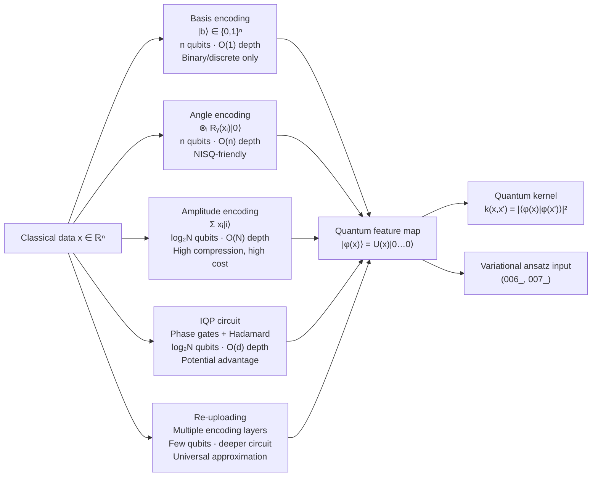

# QCSAA 910–919 · Section 01 · Subsection 910 · Subsubject 005 — Feature Maps and Data Encoding

## 1. Purpose

Defines the **quantum feature map** as a parameterised quantum circuit that embeds classical data into a quantum Hilbert space, and catalogues the principal **data encoding strategies** used in CQ-quadrant QML systems. Feature maps are the critical interface between classical data pipelines and quantum processors; their choice determines the effective dimension of the hypothesis space, the circuit depth budget, and the validity of quantum kernel and advantage arguments. This subsubject establishes the canonical encoding vocabulary referenced by `911_` (Quantum Feature Maps and Embeddings) and `913_` (Quantum Kernels and Kernel Methods).

## 2. Scope

- Covers the *Feature Maps and Data Encoding* subsubject (`005`) of subsection `910` *QML Foundations and Taxonomy* within section `01` *Quantum Machine Learning e IA Cuántica*.
- Inherits Q-Division authority and ORB support from the parent row in [`README.md`](./README.md)[^archtable].
- Concepts in scope:
  - **Quantum feature map (definition)** — a unitary circuit U(x) that maps a classical input x ∈ ℝⁿ to a quantum state |φ(x)⟩ = U(x)|0⟩^⊗m in a Hilbert space of dimension 2^m. The corresponding quantum kernel is k(x, x') = |⟨φ(x)|φ(x')⟩|², exploited in quantum support vector machines and kernel methods.
  - **Basis encoding (computational basis)** — encodes a binary string b ∈ {0,1}ⁿ directly into the computational basis state |b⟩; requires n qubits and O(1) circuit depth per sample; applicable only to binary or discretised data; no compression achieved.
  - **Angle encoding (Pauli rotations)** — encodes each feature xᵢ as a rotation angle of a single-qubit gate Rᵧ(xᵢ) or Rz(xᵢ); requires n qubits for an n-feature vector; circuit depth O(n) for a single-layer encoding; most hardware-efficient strategy; used in variational quantum classifiers.
  - **Amplitude encoding** — encodes a normalized real vector x ∈ ℝᴺ (with ‖x‖ = 1) as the amplitudes of a quantum state |x⟩ = Σᵢ xᵢ|i⟩, requiring O(log₂ N) qubits; achieves exponential compression in qubit count but requires O(N) circuit depth in general, or O(poly(log N)) with qRAM assuming ideal hardware. The encoding overhead negates the compression benefit for many practical datasets.
  - **IQP (Instantaneous Quantum Polynomial) circuits** — diagonal circuits that interleave Hadamard layers with data-dependent phase gates; feature maps of this form are conjectured to produce classically hard-to-simulate distributions, supporting potential quantum kernel advantage. Used in the Havlíček et al.[^havlicek2019] quantum kernel experiment.
  - **Expressibility and entanglement capacity** — metrics for comparing feature maps: expressibility measures how uniformly the parameterised circuit covers the Hilbert space (Sim et al. 2019[^sim2019]); entanglement capability measures the degree of entanglement generated. High expressibility does not guarantee trainability (see `008_`).
  - **Re-uploading strategy** — data re-uploading (Pérez-Salinas et al. 2020[^perez2020]) encodes the same data multiple times at different circuit layers, enabling universal function approximation with a single-qubit circuit; trades additional circuit depth for improved model capacity.
  - **Encoding selection criteria** — basis encoding: binary data only; angle encoding: shallow-circuit NISQ, continuous features; amplitude encoding: high-dimensional sparse data with qRAM; IQP: quantum advantage arguments; re-uploading: expressibility with limited qubits.
- Out of scope: the detailed design of feature maps for quantum kernel methods (`911_`, `913_`), and the training of model parameters (`007_`, `008_`).

## 3. Diagram — Encoding Strategy Comparison

## 4. Footprint

| Metric | Value |
|---|---|
| Architecture | `QCSAA` — Quantum Computing & Sentient Agency Architecture |
| Master range | `900–999` |
| Code range | `910-919` |
| Section | `01` — Quantum Machine Learning e IA Cuántica |
| Subsection | `910` — QML Foundations and Taxonomy |
| Subsubject | `005` — Feature Maps and Data Encoding |
| Primary Q-Division | Q-HPC[^qdiv] |
| Support Q-Divisions | Q-HORIZON, Q-DATAGOV |
| ORB support | ORB-PMO, ORB-LEG |
| Governance class | `restricted`[^gov] |
| Folder path | `Q+ATLANTIDE/900-999_QCSAA/910-919_Quantum-Machine-Learning-e-IA-Cuantica/910_QML-Foundations-and-Taxonomy/` |
| Document | `005_Feature-Maps-and-Data-Encoding.md` (this file) |
| Parent subsection | [`README.md`](./README.md) · [`000_Overview.md`](./000_Overview.md) |
| Parent architecture | [`../../README.md`](../../README.md) |
| Parent baseline | [`organization/Q+ATLANTIDE.md`](../../../../organization/Q+ATLANTIDE.md) |

## 5. References & Citations

[^baseline]: **Q+ATLANTIDE controlled baseline (v1.0.0)** — [`organization/Q+ATLANTIDE.md`](../../../../organization/Q+ATLANTIDE.md). Defines the controlled `000-999` architecture-band taxonomy and the ATLAS-1000 register subpart.

[^archtable]: **§3 — Subsubject Index (parent README)** — [`README.md` §3](./README.md#3-subsubject-index). Authoritative source for the `910` subsection row (Primary Q-Division Q-HPC).

[^qdiv]: **Q-Division authority** — Q-Divisions provide technical authority over an architecture row (Q+ATLANTIDE Note N-002). See [`organization/Q+ATLANTIDE.md` §4](../../../../organization/Q+ATLANTIDE.md#4-notes).

[^gov]: **Governance class** — `restricted` denotes documents requiring additional governance, evidence packages and access controls (rule N-006[^n006]).

[^n006]: **Note N-006 (Restricted bands)** — Quantum-related (`900-999` QCSAA) bands require additional governance, evidence packages and access controls. See [`organization/Q+ATLANTIDE.md` §5.3](../../../../organization/Q+ATLANTIDE.md#53-restricted-band-templates-n-006).

[^havlicek2019]: **Havlíček, V. et al. (2019)** — "Supervised learning with quantum-enhanced feature spaces." *Nature*, 567, 209–212. Experimental demonstration of quantum kernel classification using IQP feature maps on a superconducting QPU.

[^schuld2019]: **Schuld, M. & Killoran, N. (2019)** — "Quantum Machine Learning in Feature Hilbert Spaces." *Physical Review Letters*, 122, 040504. Establishes the quantum kernel framework and the role of feature maps in defining the hypothesis space.

[^sim2019]: **Sim, S., Johnson, P. D. & Aspuru-Guzik, A. (2019)** — "Expressibility and Entangling Capability of Parameterized Quantum Circuits for Hybrid Quantum-Classical Algorithms." *Advanced Quantum Technologies*, 2, 1900070. Defines expressibility and entanglement capability metrics for parameterised quantum circuits.

[^perez2020]: **Pérez-Salinas, A. et al. (2020)** — "Data re-uploading for a universal quantum classifier." *Quantum*, 4, 226. Introduces the re-uploading strategy enabling universal function approximation with single-qubit circuits.

[^schuld2021]: **Schuld, M. & Petruccione, F. (2021)** — *Machine Learning with Quantum Computers*. Springer. Chapters 3–5 provide systematic treatment of all major encoding strategies and their resource trade-offs.

[^isoiec4879]: **ISO/IEC 4879:2023** — *Quantum computing — Vocabulary*. Normative vocabulary base.

### Applicable standards

The following standards apply to this subsubject in addition to the cross-cutting Q+ATLANTIDE governance:

- Havlíček et al. (2019) — "Supervised learning with quantum-enhanced feature spaces"[^havlicek2019]
- Schuld & Killoran (2019) — "Quantum Machine Learning in Feature Hilbert Spaces"[^schuld2019]
- Sim, Johnson & Aspuru-Guzik (2019) — "Expressibility and Entangling Capability of Parameterized Quantum Circuits"[^sim2019]
- Pérez-Salinas et al. (2020) — "Data re-uploading for a universal quantum classifier"[^perez2020]
- Schuld & Petruccione (2021) — *Machine Learning with Quantum Computers*[^schuld2021]
- ISO/IEC 4879:2023 — *Quantum computing — Vocabulary*[^isoiec4879]
