# QCSAA 910–919 · Section 01 · Subsection 910 · Subsubject 006 — QML Model Families

## 1. Purpose

Catalogues the **principal families of Quantum Machine Learning models** used within QCSAA `910-919`, providing a standardised taxonomy that maps each family to its learning paradigm, QPU role, training method, current TRL, and the downstream subsection that provides its detailed specification. The taxonomy prevents conflation of fundamentally different architectures and establishes the reference nomenclature for all QML model documentation within Q+ATLANTIDE.

## 2. Scope

- Covers the *QML Model Families* subsubject (`006`) of subsection `910` *QML Foundations and Taxonomy* within section `01` *Quantum Machine Learning e IA Cuántica*.
- Inherits Q-Division authority and ORB support from the parent row in [`README.md`](./README.md)[^archtable].
- Concepts in scope:
  - **Variational Quantum Classifier/Regressor (VQC/VQR)** — a parameterised quantum circuit U(θ, x) combining data encoding (feature map) and trainable ansatz gates; classical optimiser updates θ to minimise a loss function evaluated on QPU measurement outcomes. Supervised learning paradigm; gradient estimated via parameter-shift rule. Detailed in `912_`.
  - **Quantum Kernel Method (QKM) / Quantum Support Vector Machine (QSVM)** — exploits the quantum feature map kernel k(x, x') = |⟨φ(x)|φ(x')⟩|² computed on a QPU; the classical SVM optimisation is solved classically using the quantum kernel matrix. No QPU gradient computation required. Detailed in `913_`.
  - **Quantum Neural Network (QNN)** — a layered parameterised quantum circuit whose structure is analogous to a classical neural network; layers alternate data re-uploading, trainable rotation gates, and entangling gates. Generalist supervised and unsupervised applications. Subject to barren-plateau trainability issues (`008_`). Detailed in `912_` and `916_`.
  - **Quantum Generative Adversarial Network (QGAN)** — extends the classical GAN framework with a quantum generator (a parameterised quantum circuit producing a quantum state output) and a classical or quantum discriminator; trains adversarially to match a target distribution. Detailed in `914_`.
  - **Quantum Boltzmann Machine (QBM)** — a generative model based on a transverse-field Ising Hamiltonian; thermal sampling of the quantum distribution replaces classical Gibbs sampling; training via quantum annealing or VQE-style Hamiltonian preparation. Detailed in `914_`.
  - **Quantum Reinforcement Learning (QRL)** — applies QPU-based policy representations or value functions within a reinforcement learning loop; variants include QNN-parameterised policies, quantum amplitude amplification for action selection, and quantum walk-based environment models. Detailed in `915_`.
  - **Quantum Convolutional Neural Network (QCNN)** — a translationally invariant parameterised quantum circuit with alternating convolution and pooling layers; proven to be free of barren plateaus under certain conditions (Pesah et al. 2021[^pesah2021]); relevant for quantum data classification. Detailed in `916_`.
  - **Model family selection criteria** — the appropriate model family for a given task depends on: learning paradigm (supervised/unsupervised/generative/RL), data type (classical/quantum per `004_`), qubit budget, circuit depth budget, trainability constraints (see `008_`), and the current hardware TRL.
- Out of scope: detailed circuit ansatz designs (covered in `912_`–`916_`), training algorithms (`007_`), and barren-plateau mitigations (`008_`).

## 3. Diagram — QML Model Family Overview

```mermaid
flowchart TB
    FAMILIES["QML Model Families"]

    FAMILIES --> VQC["VQC / VQR<br/>Supervised classification/regression<br/>Parameter-shift gradient<br/>→ 912_"]
    FAMILIES --> QKM["QKM / QSVM<br/>Supervised kernel method<br/>No QPU gradient<br/>→ 913_"]
    FAMILIES --> QNN["QNN<br/>Supervised / unsupervised<br/>Layered parameterised circuit<br/>→ 912_, 916_"]
    FAMILIES --> QGAN["QGAN<br/>Generative (adversarial)<br/>Quantum generator<br/>→ 914_"]
    FAMILIES --> QBM["QBM<br/>Generative (thermal)<br/>Ising Hamiltonian sampling<br/>→ 914_"]
    FAMILIES --> QRL["QRL<br/>Reinforcement learning<br/>QPU policy/value function<br/>→ 915_"]
    FAMILIES --> QCNN["QCNN<br/>Quantum data classification<br/>Convolution + pooling layers<br/>→ 916_"]

    TRAIN["Training method"] --> PSR["Parameter-shift rule<br/>(VQC, QNN, QGAN, QRL, QCNN)"]
    TRAIN --> NOGRAD["No QPU gradient<br/>(QKM/QSVM)"]
    TRAIN --> ANNEAL["Quantum annealing / VQE<br/>(QBM)"]
```

## 4. Footprint

| Metric | Value |
|---|---|
| Architecture | `QCSAA` — Quantum Computing & Sentient Agency Architecture |
| Master range | `900–999` |
| Code range | `910-919` |
| Section | `01` — Quantum Machine Learning e IA Cuántica |
| Subsection | `910` — QML Foundations and Taxonomy |
| Subsubject | `006` — QML Model Families |
| Primary Q-Division | Q-HPC[^qdiv] |
| Support Q-Divisions | Q-HORIZON, Q-DATAGOV |
| ORB support | ORB-PMO, ORB-LEG |
| Governance class | `restricted`[^gov] |
| Folder path | `Q+ATLANTIDE/900-999_QCSAA/910-919_Quantum-Machine-Learning-e-IA-Cuantica/910_QML-Foundations-and-Taxonomy/` |
| Document | `006_QML-Model-Families.md` (this file) |
| Parent subsection | [`README.md`](./README.md) · [`000_Overview.md`](./000_Overview.md) |
| Parent architecture | [`../../README.md`](../../README.md) |
| Parent baseline | [`organization/Q+ATLANTIDE.md`](../../../../organization/Q+ATLANTIDE.md) |

## 5. References & Citations

[^baseline]: **Q+ATLANTIDE controlled baseline (v1.0.0)** — [`organization/Q+ATLANTIDE.md`](../../../../organization/Q+ATLANTIDE.md). Defines the controlled `000-999` architecture-band taxonomy and the ATLAS-1000 register subpart.

[^archtable]: **§3 — Subsubject Index (parent README)** — [`README.md` §3](./README.md#3-subsubject-index). Authoritative source for the `910` subsection row (Primary Q-Division Q-HPC).

[^qdiv]: **Q-Division authority** — Q-Divisions provide technical authority over an architecture row (Q+ATLANTIDE Note N-002). See [`organization/Q+ATLANTIDE.md` §4](../../../../organization/Q+ATLANTIDE.md#4-notes).

[^gov]: **Governance class** — `restricted` denotes documents requiring additional governance, evidence packages and access controls (rule N-006[^n006]).

[^n006]: **Note N-006 (Restricted bands)** — Quantum-related (`900-999` QCSAA) bands require additional governance, evidence packages and access controls. See [`organization/Q+ATLANTIDE.md` §5.3](../../../../organization/Q+ATLANTIDE.md#53-restricted-band-templates-n-006).

[^biamonte]: **Biamonte, J. et al. (2017)** — "Quantum machine learning." *Nature*, 549, 195–202. Surveys the principal QML model families and their computational characteristics.

[^cerezo2021]: **Cerezo, M. et al. (2021)** — "Variational quantum algorithms." *Nature Reviews Physics*, 3, 625–644. Comprehensive treatment of variational model families including VQC, QNN, QGAN, and their training methods.

[^havlicek2019]: **Havlíček, V. et al. (2019)** — "Supervised learning with quantum-enhanced feature spaces." *Nature*, 567, 209–212. Experimental realisation of the QSVM / QKM model family on a superconducting QPU.

[^pesah2021]: **Pesah, A. et al. (2021)** — "Absence of barren plateaus in quantum convolutional neural networks." *Physical Review X*, 11, 041011. Proves trainability of QCNNs under translationally invariant ansatz structures.

[^schuld2021]: **Schuld, M. & Petruccione, F. (2021)** — *Machine Learning with Quantum Computers*. Springer. Part II provides a unified treatment of all major QML model families.

[^isoiec4879]: **ISO/IEC 4879:2023** — *Quantum computing — Vocabulary*. Normative vocabulary base.

### Applicable standards

The following standards apply to this subsubject in addition to the cross-cutting Q+ATLANTIDE governance:

- Biamonte et al. (2017) — "Quantum machine learning"[^biamonte]
- Cerezo et al. (2021) — "Variational quantum algorithms"[^cerezo2021]
- Havlíček et al. (2019) — "Supervised learning with quantum-enhanced feature spaces"[^havlicek2019]
- Pesah et al. (2021) — "Absence of barren plateaus in quantum convolutional neural networks"[^pesah2021]
- Schuld & Petruccione (2021) — *Machine Learning with Quantum Computers*[^schuld2021]
- ISO/IEC 4879:2023 — *Quantum computing — Vocabulary*[^isoiec4879]
