# QCSAA 910–919 · Section 01 · Subsection 910 · Subsubject 007 — Hybrid Quantum-Classical Architecture

## 1. Purpose

Defines the **hybrid quantum-classical architecture** as the standard computational model for NISQ-era QML systems, in which a classical co-processor manages data preparation, parameter optimisation, and post-processing while a QPU executes parameterised quantum circuits and returns measurement outcomes. This subsubject establishes the interface contract between classical and quantum components, the gradient estimation method (parameter-shift rule), the shot-budget framework, and the coupling latency constraints relevant to real-time and batch aerospace applications.

## 2. Scope

- Covers the *Hybrid Quantum-Classical Architecture* subsubject (`007`) of subsection `910` *QML Foundations and Taxonomy* within section `01` *Quantum Machine Learning e IA Cuántica*.
- Inherits Q-Division authority and ORB support from the parent row in [`README.md`](./README.md)[^archtable].
- Concepts in scope:
  - **Hybrid loop structure** — the variational hybrid loop consists of: (1) classical initialisation of parameters θ ∈ ℝᵐ; (2) QPU execution of the parameterised circuit U(θ, x) and measurement of expectation value ⟨C⟩; (3) classical optimiser updates θ ← θ − η∇θ L(θ); (4) iteration until convergence. The QPU is an oracle callable from the classical optimiser; the loop terminates classically.
  - **Parameter-shift rule** — provides an analytic gradient formula for gate generators of the form e^(−iθG/2) where G has two eigenvalues: ∂⟨C⟩/∂θ = [⟨C⟩(θ + π/2) − ⟨C⟩(θ − π/2)] / 2. Each gradient component requires two additional circuit executions (shots); the total gradient evaluation cost scales as O(m) QPU calls where m is the number of trainable parameters.
  - **Finite-difference vs parameter-shift** — finite-difference gradient approximation introduces bias and is sensitive to shot noise; the parameter-shift rule is exact for the relevant gate families and is preferred in QCSAA documentation.
  - **Shot budget** — each expectation value estimate ⟨C⟩ is subject to finite-sample noise σ ∝ 1/√S where S is the number of measurement shots; the shot budget S per iteration is constrained by QPU access time, queue latency, and cost. Optimal shot allocation is a resource-estimation problem (see `918_`).
  - **Classical optimiser interface** — gradient-based optimisers (ADAM, L-BFGS, SPSA) and gradient-free methods (Nelder-Mead, COBYLA) are both used; SPSA (Simultaneous Perturbation Stochastic Approximation) is common for noisy QPU gradients as it requires only two circuit evaluations per gradient step regardless of parameter count.
  - **Coupling modes** — (i) *tightly coupled*: classical processor and QPU share low-latency interconnect (< 1 µs round-trip); required for real-time control loops; (ii) *loosely coupled*: QPU is accessed via REST API or cloud queue with latency > 100 ms; suitable for batch training offline; (iii) *offline training + online classical inference*: model trained offline on QPU, parameters θ* frozen, inference runs on classical emulator or QPU; relevant for aerospace certification (see `010_`).
  - **VQE and QAOA as canonical instances** — the Variational Quantum Eigensolver (VQE) minimises ⟨ψ(θ)|H|ψ(θ)⟩ to estimate ground-state energies; the Quantum Approximate Optimisation Algorithm (QAOA) prepares a state that approximately solves combinatorial optimisation problems; both are canonical hybrid loop instances applicable to QML training.
  - **Quantum error mitigation in the hybrid loop** — zero-noise extrapolation (ZNE), probabilistic error cancellation (PEC), and symmetry verification are classical post-processing techniques applied to raw QPU measurement data before the loss function is evaluated; they trade additional shots for improved effective fidelity.
- Out of scope: specific ansatz design (see `912_`), barren-plateau trainability (see `008_`), and resource estimation (see `918_`).

## 3. Diagram — Hybrid Quantum-Classical Loop

```mermaid
flowchart LR
    DATA["Training data  {(xᵢ, yᵢ)}"]
    INIT["Classical: initialise θ₀"]
    DATA --> INIT

    INIT --> QPU

    subgraph QPU["QPU (quantum oracle)"]
        direction TB
        ENC["Encode x via U(x)"]
        ANS["Apply ansatz U(θ)"]
        MEAS["Measure → ⟨C(θ,x)⟩"]
        ENC --> ANS --> MEAS
    end

    MEAS --> MIT["Error mitigation<br/>(ZNE / PEC)"]
    MIT --> LOSS["Classical: compute L(θ)"]
    LOSS --> GRAD["Gradient ∇θL<br/>(parameter-shift rule)"]
    GRAD --> OPT["Classical optimiser<br/>(ADAM / COBYLA / SPSA)"]
    OPT --> CONV{"Converged?"}
    CONV -->|"No"| QPU
    CONV -->|"Yes"| PARAM["Optimal parameters θ*"]
    PARAM --> INFER["Inference<br/>(QPU or classical emulator)"]
```

## 4. Footprint

| Metric | Value |
|---|---|
| Architecture | `QCSAA` — Quantum Computing & Sentient Agency Architecture |
| Master range | `900–999` |
| Code range | `910-919` |
| Section | `01` — Quantum Machine Learning e IA Cuántica |
| Subsection | `910` — QML Foundations and Taxonomy |
| Subsubject | `007` — Hybrid Quantum-Classical Architecture |
| Primary Q-Division | Q-HPC[^qdiv] |
| Support Q-Divisions | Q-HORIZON, Q-DATAGOV |
| ORB support | ORB-PMO, ORB-LEG |
| Governance class | `restricted`[^gov] |
| Folder path | `Q+ATLANTIDE/900-999_QCSAA/910-919_Quantum-Machine-Learning-e-IA-Cuantica/910_QML-Foundations-and-Taxonomy/` |
| Document | `007_Hybrid-Quantum-Classical-Architecture.md` (this file) |
| Parent subsection | [`README.md`](./README.md) · [`000_Overview.md`](./000_Overview.md) |
| Parent architecture | [`../../README.md`](../../README.md) |
| Parent baseline | [`organization/Q+ATLANTIDE.md`](../../../../organization/Q+ATLANTIDE.md) |

## 5. References & Citations

[^baseline]: **Q+ATLANTIDE controlled baseline (v1.0.0)** — [`organization/Q+ATLANTIDE.md`](../../../../organization/Q+ATLANTIDE.md). Defines the controlled `000-999` architecture-band taxonomy and the ATLAS-1000 register subpart.

[^archtable]: **§3 — Subsubject Index (parent README)** — [`README.md` §3](./README.md#3-subsubject-index). Authoritative source for the `910` subsection row (Primary Q-Division Q-HPC).

[^qdiv]: **Q-Division authority** — Q-Divisions provide technical authority over an architecture row (Q+ATLANTIDE Note N-002). See [`organization/Q+ATLANTIDE.md` §4](../../../../organization/Q+ATLANTIDE.md#4-notes).

[^gov]: **Governance class** — `restricted` denotes documents requiring additional governance, evidence packages and access controls (rule N-006[^n006]).

[^n006]: **Note N-006 (Restricted bands)** — Quantum-related (`900-999` QCSAA) bands require additional governance, evidence packages and access controls. See [`organization/Q+ATLANTIDE.md` §5.3](../../../../organization/Q+ATLANTIDE.md#53-restricted-band-templates-n-006).

[^cerezo2021]: **Cerezo, M. et al. (2021)** — "Variational quantum algorithms." *Nature Reviews Physics*, 3, 625–644. Canonical reference for the hybrid variational loop, parameter-shift rule, and quantum error mitigation techniques.

[^mitarai2018]: **Mitarai, K. et al. (2018)** — "Quantum circuit learning." *Physical Review A*, 98, 032309. Introduces the parameter-shift rule for analytic gradient computation in parameterised quantum circuits.

[^peruzzo2014]: **Peruzzo, A. et al. (2014)** — "A variational eigenvalue solver on a photonic quantum processor." *Nature Communications*, 5, 4213. First experimental demonstration of VQE as a hybrid quantum-classical algorithm.

[^farhi2014]: **Farhi, E., Goldstone, J. & Gutmann, S. (2014)** — "A Quantum Approximate Optimization Algorithm." arXiv:1411.4028. Introduces QAOA as a canonical hybrid loop for combinatorial optimisation.

[^temme2017]: **Temme, K., Bravyi, S. & Gambetta, J. M. (2017)** — "Error mitigation for short-depth quantum circuits." *Physical Review Letters*, 119, 180509. Foundational paper on zero-noise extrapolation (ZNE) for the hybrid loop.

[^isoiec4879]: **ISO/IEC 4879:2023** — *Quantum computing — Vocabulary*. Normative vocabulary base.

### Applicable standards

The following standards apply to this subsubject in addition to the cross-cutting Q+ATLANTIDE governance:

- Cerezo et al. (2021) — "Variational quantum algorithms"[^cerezo2021]
- Mitarai et al. (2018) — "Quantum circuit learning"[^mitarai2018]
- Peruzzo et al. (2014) — "A variational eigenvalue solver on a photonic quantum processor"[^peruzzo2014]
- Farhi, Goldstone & Gutmann (2014) — "A Quantum Approximate Optimization Algorithm"[^farhi2014]
- Temme, Bravyi & Gambetta (2017) — "Error mitigation for short-depth quantum circuits"[^temme2017]
- ISO/IEC 4879:2023 — *Quantum computing — Vocabulary*[^isoiec4879]
