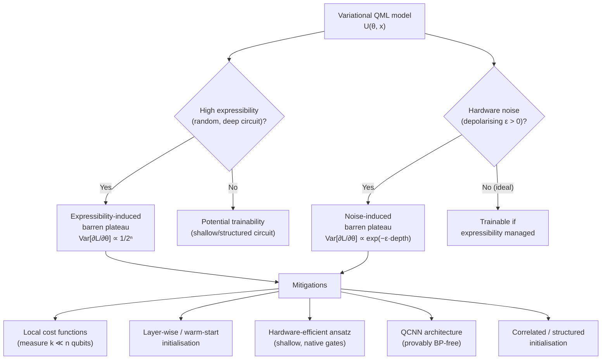

# QCSAA 910–919 · Section 01 · Subsection 910 · Subsubject 008 — Trainability, Noise and Barren Plateaus

## 1. Purpose

Establishes the **trainability constraints** of variational QML models, with particular focus on the **barren-plateau phenomenon** — the exponential vanishing of cost-function gradients in random or deep parameterised quantum circuits — and the compounding effect of hardware noise. This subsubject is the mandatory trainability reference for any QCSAA `910-919` document describing a variational model; it defines the failure modes, their theoretical origin, and the mitigation strategies that must be evaluated before a variational QML system is adopted. Detailed treatment is in `917_` (QML Trainability, Barren Plateaus and Optimization).

## 2. Scope

- Covers the *Trainability, Noise and Barren Plateaus* subsubject (`008`) of subsection `910` *QML Foundations and Taxonomy* within section `01` *Quantum Machine Learning e IA Cuántica*.
- Inherits Q-Division authority and ORB support from the parent row in [`README.md`](./README.md)[^archtable].
- Concepts in scope:
  - **Barren plateau (definition)** — a region of the parameter landscape of a parameterised quantum circuit U(θ) where the variance of the cost-function gradient ∂L/∂θᵢ vanishes exponentially with the number of qubits n: Var[∂L/∂θᵢ] ∈ O(1/2ⁿ). In a barren plateau, the gradient is effectively zero everywhere; gradient-based optimisers cannot make progress. Established by McClean et al.[^mcclean2018].
  - **Origin: expressibility and t-designs** — random circuits that form approximate unitary 2-designs (sufficiently expressive) exhibit barren plateaus by concentration of measure: expectation values concentrate around their mean and gradients vanish. Deep entangling circuits generically satisfy this condition.
  - **Noise-induced barren plateaus** — even without expressibility-induced concentration, hardware noise introduces a separate barren-plateau mechanism: depolarising noise exponentially damps all off-diagonal density matrix elements as circuit depth increases, concentrating the state toward the maximally mixed state I/2ⁿ and driving all gradients to zero exponentially in circuit depth × error rate (Wang et al. 2021[^wang2021]).
  - **Locality of cost functions as mitigation** — replacing a global cost function (measuring the full n-qubit state) with a local cost function (measuring only k ≤ O(log n) qubits) reduces barren plateaus from exponential in n to exponential in k for hardware-efficient ansätze; however, local costs may underspecify the learning problem.
  - **Layer-wise training and warm-starting** — initialising parameters near zero (identity initialisation) or training layer by layer can avoid the random initialisation that causes barren plateaus; these strategies are analysed in `917_`.
  - **Hardware-efficient ansatz (HEA)** — ansätze restricted to native gate sets and nearest-neighbour connectivity reduce circuit depth and noise but may also reduce expressibility; the expressibility–trainability trade-off must be evaluated for each target device.
  - **QCNN exception** — quantum convolutional neural networks (QCNN) with translationally invariant structure are proven to be free of barren plateaus under their specific architecture constraints (Pesah et al. 2021[^pesah2021]); see `006_` and `916_`.
  - **Practical trainability checklist** — before deploying a variational QML model, the following must be assessed: (i) circuit depth vs. coherence time budget; (ii) number of trainable parameters vs. exponential gradient suppression scaling; (iii) cost function locality; (iv) initialisation strategy; (v) noise rate of target device and noise-induced plateau threshold.
- Out of scope: detailed mitigation algorithm designs and benchmarks (see `917_`), and resource estimation (see `918_`).

## 3. Diagram — Barren Plateau Origin and Mitigation Map

## 4. Footprint

| Metric | Value |
|---|---|
| Architecture | `QCSAA` — Quantum Computing & Sentient Agency Architecture |
| Master range | `900–999` |
| Code range | `910-919` |
| Section | `01` — Quantum Machine Learning e IA Cuántica |
| Subsection | `910` — QML Foundations and Taxonomy |
| Subsubject | `008` — Trainability, Noise and Barren Plateaus |
| Primary Q-Division | Q-HPC[^qdiv] |
| Support Q-Divisions | Q-HORIZON, Q-DATAGOV |
| ORB support | ORB-PMO, ORB-LEG |
| Governance class | `restricted`[^gov] |
| Folder path | `Q+ATLANTIDE/900-999_QCSAA/910-919_Quantum-Machine-Learning-e-IA-Cuantica/910_QML-Foundations-and-Taxonomy/` |
| Document | `008_Trainability-Noise-and-Barren-Plateaus.md` (this file) |
| Parent subsection | [`README.md`](./README.md) · [`000_Overview.md`](./000_Overview.md) |
| Parent architecture | [`../../README.md`](../../README.md) |
| Parent baseline | [`organization/Q+ATLANTIDE.md`](../../../../organization/Q+ATLANTIDE.md) |

## 5. References & Citations

[^baseline]: **Q+ATLANTIDE controlled baseline (v1.0.0)** — [`organization/Q+ATLANTIDE.md`](../../../../organization/Q+ATLANTIDE.md). Defines the controlled `000-999` architecture-band taxonomy and the ATLAS-1000 register subpart.

[^archtable]: **§3 — Subsubject Index (parent README)** — [`README.md` §3](./README.md#3-subsubject-index). Authoritative source for the `910` subsection row (Primary Q-Division Q-HPC).

[^qdiv]: **Q-Division authority** — Q-Divisions provide technical authority over an architecture row (Q+ATLANTIDE Note N-002). See [`organization/Q+ATLANTIDE.md` §4](../../../../organization/Q+ATLANTIDE.md#4-notes).

[^gov]: **Governance class** — `restricted` denotes documents requiring additional governance, evidence packages and access controls (rule N-006[^n006]).

[^n006]: **Note N-006 (Restricted bands)** — Quantum-related (`900-999` QCSAA) bands require additional governance, evidence packages and access controls. See [`organization/Q+ATLANTIDE.md` §5.3](../../../../organization/Q+ATLANTIDE.md#53-restricted-band-templates-n-006).

[^mcclean2018]: **McClean, J. R. et al. (2018)** — "Barren plateaus in quantum neural network training landscapes." *Nature Communications*, 9, 4812. Original identification of exponential gradient vanishing in random quantum circuits.

[^wang2021]: **Wang, S. et al. (2021)** — "Noise-induced barren plateaus in variational quantum algorithms." *Nature Communications*, 12, 6961. Demonstrates that hardware noise independently causes barren plateaus, compounding with expressibility-induced concentration.

[^cerezo2021]: **Cerezo, M. et al. (2021)** — "Variational quantum algorithms." *Nature Reviews Physics*, 3, 625–644. §5 provides a comprehensive review of trainability issues and mitigation strategies.

[^pesah2021]: **Pesah, A. et al. (2021)** — "Absence of barren plateaus in quantum convolutional neural networks." *Physical Review X*, 11, 041011. Proves gradient scaling for QCNN architecture.

[^cerezo2021local]: **Cerezo, M. et al. (2021)** — "Cost function dependent barren plateaus in shallow parametrized quantum circuits." *Nature Communications*, 12, 1791. Demonstrates that local cost functions avoid exponential gradient suppression in shallow circuits.

[^isoiec4879]: **ISO/IEC 4879:2023** — *Quantum computing — Vocabulary*. Normative vocabulary base.

### Applicable standards

The following standards apply to this subsubject in addition to the cross-cutting Q+ATLANTIDE governance:

- McClean et al. (2018) — "Barren plateaus in quantum neural network training landscapes"[^mcclean2018]
- Wang et al. (2021) — "Noise-induced barren plateaus in variational quantum algorithms"[^wang2021]
- Cerezo et al. (2021) — "Variational quantum algorithms"[^cerezo2021]
- Pesah et al. (2021) — "Absence of barren plateaus in quantum convolutional neural networks"[^pesah2021]
- Cerezo et al. (2021) — "Cost function dependent barren plateaus in shallow parametrized quantum circuits"[^cerezo2021local]
- ISO/IEC 4879:2023 — *Quantum computing — Vocabulary*[^isoiec4879]
