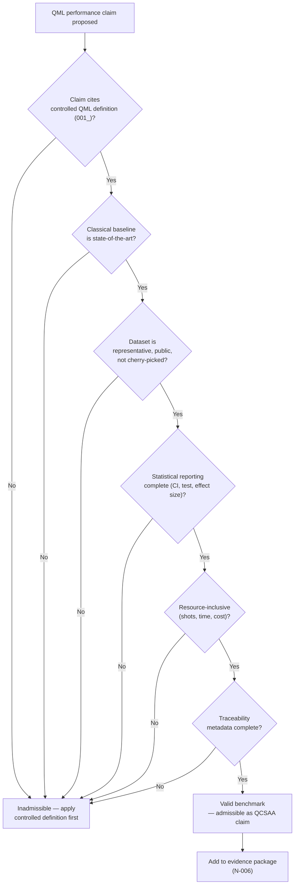

# QCSAA 910–919 · Section 01 · Subsection 910 · Subsubject 009 — Benchmarking and Claim Discipline

## 1. Purpose

Establishes the **controlled rules for benchmarking QML models against classical baselines and for reporting quantum advantage claims** in QCSAA `910-919` documentation. Premature, misleading, or unverifiable quantum advantage claims pose governance and safety risks, particularly in safety-critical aerospace applications. This subsubject defines the minimum requirements for a valid benchmark, the prohibited claim patterns, the statistical reporting standards, and the traceability requirements that apply to all QML performance statements within Q+ATLANTIDE.

## 2. Scope

- Covers the *Benchmarking and Claim Discipline* subsubject (`009`) of subsection `910` *QML Foundations and Taxonomy* within section `01` *Quantum Machine Learning e IA Cuántica*.
- Inherits Q-Division authority and ORB support from the parent row in [`README.md`](./README.md)[^archtable].
- Concepts in scope:
  - **Valid benchmark requirements** — a benchmark comparing a QML model against a classical baseline must satisfy all of the following: (i) the same training and test splits are used for both models; (ii) the classical baseline is a state-of-the-art model for the task (not a trivially weak comparator); (iii) hyperparameter optimisation budgets are comparable; (iv) performance metrics (accuracy, F1, AUC, RMSE, etc.) and their confidence intervals are reported; (v) wall-clock time, QPU shot count, and classical compute cost are reported separately.
  - **Prohibited claim patterns** — the following claim patterns are inadmissible in QCSAA documentation: (i) "quantum speedup" without specifying the classical algorithm being compared and the problem size scaling; (ii) advantage claims based on classically simulated QML runs (see `001_`); (iii) advantage claims on artificially small or structured datasets that do not represent the target application; (iv) "quantum supremacy" language applied to learning tasks without a complexity-theoretic proof of separation.
  - **Statistical reporting standards** — all performance comparisons must report: mean ± standard deviation (or 95% confidence interval) over ≥ 5 independent runs with different random seeds; paired statistical tests (e.g. Wilcoxon signed-rank or paired t-test) when comparing two models on the same dataset; effect size (Cohen's d or similar) in addition to p-values.
  - **Dataset selection discipline** — benchmarking datasets must be: representative of the target application domain; publicly available or documented with sufficient detail for reproducibility; not pre-selected to favour the QML model (i.e. not cherry-picked); of sufficient size to provide meaningful statistical power.
  - **Scaling analysis requirement** — quantum advantage claims that depend on problem size must include a scaling analysis: performance (accuracy, time, resource) as a function of input dimension n or dataset size N; both QML and classical models must be included in the scaling plot.
  - **Resource-inclusive advantage** — a QML approach does not constitute a practical advantage if its superior performance is achieved only at the cost of exponentially more QPU shots, circuit executions, or wall-clock time than the classical baseline. Total resource consumption must be compared.
  - **Traceability requirement** — every QML performance claim in Q+ATLANTIDE documentation must cite: the dataset used, the classical baseline, the QPU device (or simulator), the software stack version, the number of shots, and the hyperparameter search procedure. This information forms part of the evidence package required by N-006[^n006].
- Out of scope: resource estimation methodology (`918_`) and aerospace-specific performance criteria (`010_`).

## 3. Diagram — Benchmarking and Claim Validation Flow

## 4. Footprint

| Metric | Value |
|---|---|
| Architecture | `QCSAA` — Quantum Computing & Sentient Agency Architecture |
| Master range | `900–999` |
| Code range | `910-919` |
| Section | `01` — Quantum Machine Learning e IA Cuántica |
| Subsection | `910` — QML Foundations and Taxonomy |
| Subsubject | `009` — Benchmarking and Claim Discipline |
| Primary Q-Division | Q-HPC[^qdiv] |
| Support Q-Divisions | Q-HORIZON, Q-DATAGOV |
| ORB support | ORB-PMO, ORB-LEG |
| Governance class | `restricted`[^gov] |
| Folder path | `Q+ATLANTIDE/900-999_QCSAA/910-919_Quantum-Machine-Learning-e-IA-Cuantica/910_QML-Foundations-and-Taxonomy/` |
| Document | `009_Benchmarking-and-Claim-Discipline.md` (this file) |
| Parent subsection | [`README.md`](./README.md) · [`000_Overview.md`](./000_Overview.md) |
| Parent architecture | [`../../README.md`](../../README.md) |
| Parent baseline | [`organization/Q+ATLANTIDE.md`](../../../../organization/Q+ATLANTIDE.md) |

## 5. References & Citations

[^baseline]: **Q+ATLANTIDE controlled baseline (v1.0.0)** — [`organization/Q+ATLANTIDE.md`](../../../../organization/Q+ATLANTIDE.md). Defines the controlled `000-999` architecture-band taxonomy and the ATLAS-1000 register subpart.

[^archtable]: **§3 — Subsubject Index (parent README)** — [`README.md` §3](./README.md#3-subsubject-index). Authoritative source for the `910` subsection row (Primary Q-Division Q-HPC).

[^qdiv]: **Q-Division authority** — Q-Divisions provide technical authority over an architecture row (Q+ATLANTIDE Note N-002). See [`organization/Q+ATLANTIDE.md` §4](../../../../organization/Q+ATLANTIDE.md#4-notes).

[^gov]: **Governance class** — `restricted` denotes documents requiring additional governance, evidence packages and access controls (rule N-006[^n006]).

[^n006]: **Note N-006 (Restricted bands)** — Quantum-related (`900-999` QCSAA) bands require additional governance, evidence packages and access controls. See [`organization/Q+ATLANTIDE.md` §5.3](../../../../organization/Q+ATLANTIDE.md#53-restricted-band-templates-n-006).

[^aaronson2015]: **Aaronson, S. (2015)** — "Read the fine print." *Nature Physics*, 11, 291–293. Foundational critique of premature quantum advantage claims in ML; provides the analytical framework for distinguishing genuine advantage from artefacts.

[^schuld2022]: **Schuld, M. (2022)** — "Supervised quantum machine learning models are kernel methods." arXiv:2101.11020 (published in *Physical Review A*). Establishes the kernel equivalence of supervised QML and the conditions under which quantum kernels offer a genuine advantage.

[^bowles2024]: **Bowles, J. et al. (2024)** — "Better than classical? The subtle art of benchmarking quantum machine learning models." arXiv:2403.07059. Provides rigorous benchmarking methodology and common pitfalls in QML comparisons.

[^biamonte]: **Biamonte, J. et al. (2017)** — "Quantum machine learning." *Nature*, 549, 195–202. §6 discusses the honest assessment of quantum advantage claims and the limitations of near-term QML.

[^isoiec4879]: **ISO/IEC 4879:2023** — *Quantum computing — Vocabulary*. Normative vocabulary base.

### Applicable standards

The following standards apply to this subsubject in addition to the cross-cutting Q+ATLANTIDE governance:

- Aaronson (2015) — "Read the fine print"[^aaronson2015]
- Schuld (2022) — "Supervised quantum machine learning models are kernel methods"[^schuld2022]
- Bowles et al. (2024) — "Better than classical? The subtle art of benchmarking quantum machine learning models"[^bowles2024]
- Biamonte et al. (2017) — "Quantum machine learning"[^biamonte]
- ISO/IEC 4879:2023 — *Quantum computing — Vocabulary*[^isoiec4879]
