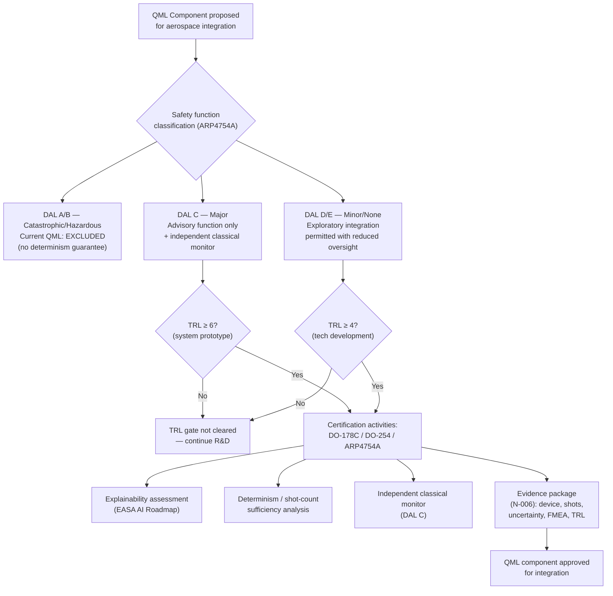

# QCSAA 910–919 · Section 01 · Subsection 910 · Subsubject 010 — Aerospace Assurance Boundaries

## 1. Purpose

Defines the **aerospace assurance boundaries** that govern the deployment of Quantum Machine Learning components in civil and defence aerospace systems. These boundaries map QML model families and hardware maturity levels to the applicable certification frameworks (DO-178C, DO-254, ARP4754A, EASA AI Roadmap), establish the Design Assurance Level (DAL) constraints under which QML functions may operate, and set the Technology Readiness Level (TRL) gates that must be cleared before a QML component is integrated into a safety-critical airborne system. This subsubject is the foundational aerospace reference for all of `910-919` and provides the assurance framework expanded in `919_` (Aerospace QML Use Cases and Assurance Boundaries).

## 2. Scope

- Covers the *Aerospace Assurance Boundaries* subsubject (`010`) of subsection `910` *QML Foundations and Taxonomy* within section `01` *Quantum Machine Learning e IA Cuántica*.
- Inherits Q-Division authority and ORB support from the parent row in [`README.md`](./README.md)[^archtable].
- Concepts in scope:
  - **Applicable certification frameworks** — aerospace QML systems are subject to: DO-178C[^do178c] (Software Considerations in Airborne Systems and Equipment Certification) for software components; DO-254[^do254] (Design Assurance Guidance for Airborne Electronic Hardware) for QPU and FPGA-based hardware accelerators; ARP4754A[^arp4754a] (Guidelines for Development of Civil Aircraft and Systems) for system-level development assurance; EASA AI Roadmap 2.0[^easa_ai] for AI/ML-specific considerations in civil aviation.
  - **Design Assurance Level (DAL) mapping** — QML components are assigned a DAL based on the failure condition severity of the function they perform (DO-178C §2.3 / ARP4754A §5): DAL A (catastrophic) and DAL B (hazardous) impose the most stringent verification requirements and currently exclude variational QML due to lack of determinism guarantees; DAL C (major) may be applicable for advisory functions with independent classical monitoring; DAL D/E (minor/no safety effect) permit exploratory QML integration with reduced oversight. All DAL assignments must be justified via Failure Modes and Effects Analysis (FMEA).
  - **TRL gating for QML** — Technology Readiness Levels (NASA TRL 1–9 / EASA TRL) gate QML integration: TRL 1–3 (basic research, proof of concept): laboratory QPU experiments, simulation-only validation; TRL 4–5 (technology development): QPU hardware integration, NISQ-era benchmarking against classical baselines; TRL 6 (system prototype): QPU-in-the-loop demonstrations in representative environments; TRL 7–8 (system demonstration): ground and flight test demonstrations on representative aircraft systems; TRL 9 (operational deployment): certified airborne deployment. Current NISQ-era QML is assessed at TRL 3–5 for most aerospace tasks as of 2026.
  - **Explainability requirement** — EASA AI Roadmap Level 1 (Explainability) requires that AI/ML model decisions relevant to safety be explainable to the extent needed for the assurance activity; variational QML circuits lack the symbolic interpretability of rule-based systems; explainability mitigations must be documented (e.g. classical surrogate models, SHAP values computed from QPU outputs, or restriction to QML functions with analytical output descriptions).
  - **Determinism and repeatability** — DO-178C requires software to produce deterministic, repeatable outputs for identical inputs; QPU outputs are inherently probabilistic (shot noise); QML inference must be managed via: (i) shot-count sufficiency analysis to bound probabilistic output variation within acceptable limits; (ii) classical majority-vote or averaging post-processing; (iii) restriction to classically emulatable inference paths (offline-trained parameters frozen, QPU replaced by classical emulator for airborne deployment).
  - **Independent monitoring requirement** — for DAL B/C functions, QML outputs must be independently monitored by a classical function of equal or higher DAL assurance; the monitor must detect and flag anomalous QML outputs within the required integrity budget.
  - **QPU as COTS hardware** — commercial QPU devices are treated as Commercial Off-The-Shelf (COTS) hardware per DO-178C §2.7 and DO-254; their use requires additional assurance activities including service history analysis, hardware qualification, and supplier oversight. Cloud QPU access introduces additional assurance complexity (latency, availability, data sovereignty) that must be addressed in the safety case.
  - **Evidence package requirements (N-006)** — every QML component integrated into an aerospace system must include in its evidence package: QPU device identification and qualification status, circuit depth and qubit count, shot budget and output uncertainty bound, DAL assignment and justification, FMEA reference, TRL evidence, and classical baseline comparison per `009_`.
- Out of scope: specific aerospace use-case analyses (see `919_`), QPU hardware qualification details (see `900-909_` physical qubit subsections), and detailed FMEA methodology (refer to ARP4754A).

## 3. Diagram — QML Aerospace Assurance Boundary Framework

## 4. Footprint

| Metric | Value |
|---|---|
| Architecture | `QCSAA` — Quantum Computing & Sentient Agency Architecture |
| Master range | `900–999` |
| Code range | `910-919` |
| Section | `01` — Quantum Machine Learning e IA Cuántica |
| Subsection | `910` — QML Foundations and Taxonomy |
| Subsubject | `010` — Aerospace Assurance Boundaries |
| Primary Q-Division | Q-HPC[^qdiv] |
| Support Q-Divisions | Q-HORIZON, Q-DATAGOV |
| ORB support | ORB-PMO, ORB-LEG |
| Governance class | `restricted`[^gov] |
| Folder path | `Q+ATLANTIDE/900-999_QCSAA/910-919_Quantum-Machine-Learning-e-IA-Cuantica/910_QML-Foundations-and-Taxonomy/` |
| Document | `010_Aerospace-Assurance-Boundaries.md` (this file) |
| Parent subsection | [`README.md`](./README.md) · [`000_Overview.md`](./000_Overview.md) |
| Parent architecture | [`../../README.md`](../../README.md) |
| Parent baseline | [`organization/Q+ATLANTIDE.md`](../../../../organization/Q+ATLANTIDE.md) |

## 5. References & Citations

[^baseline]: **Q+ATLANTIDE controlled baseline (v1.0.0)** — [`organization/Q+ATLANTIDE.md`](../../../../organization/Q+ATLANTIDE.md). Defines the controlled `000-999` architecture-band taxonomy and the ATLAS-1000 register subpart.

[^archtable]: **§3 — Subsubject Index (parent README)** — [`README.md` §3](./README.md#3-subsubject-index). Authoritative source for the `910` subsection row (Primary Q-Division Q-HPC).

[^qdiv]: **Q-Division authority** — Q-Divisions provide technical authority over an architecture row (Q+ATLANTIDE Note N-002). See [`organization/Q+ATLANTIDE.md` §4](../../../../organization/Q+ATLANTIDE.md#4-notes).

[^gov]: **Governance class** — `restricted` denotes documents requiring additional governance, evidence packages and access controls (rule N-006[^n006]).

[^n006]: **Note N-006 (Restricted bands)** — Quantum-related (`900-999` QCSAA) bands require additional governance, evidence packages and access controls. See [`organization/Q+ATLANTIDE.md` §5.3](../../../../organization/Q+ATLANTIDE.md#53-restricted-band-templates-n-006).

[^do178c]: **RTCA DO-178C / EUROCAE ED-12C (2011)** — *Software Considerations in Airborne Systems and Equipment Certification*. Primary software certification standard for airborne systems; defines DAL A–E and verification requirements. Applicable to all software components of QML systems deployed in airborne environments.

[^do254]: **RTCA DO-254 / EUROCAE ED-80 (2000)** — *Design Assurance Guidance for Airborne Electronic Hardware*. Applicable to QPU hardware accelerators, FPGAs, and custom ASICs used in QML inference hardware.

[^arp4754a]: **SAE ARP4754A (2010)** — *Guidelines for Development of Civil Aircraft and Systems*. System-level development assurance guidelines; defines the FMEA-based failure condition classification (catastrophic / hazardous / major / minor / no safety effect) used for DAL assignment.

[^easa_ai]: **EASA (2023)** — *EASA Artificial Intelligence Roadmap 2.0*. European Union Aviation Safety Agency framework for AI/ML in aviation; defines explainability levels, performance-based learning assurance (PBLA), and the concept model inventory (CMI). Directly applicable to QML systems used in civil aviation.

[^preskill2018]: **Preskill, J. (2018)** — "Quantum Computing in the NISQ Era and Beyond." *Quantum*, 2, 79. Defines TRL-equivalent maturity levels for NISQ-era QPU systems relevant to the TRL gating framework.

[^isoiec4879]: **ISO/IEC 4879:2023** — *Quantum computing — Vocabulary*. Normative vocabulary base.

### Applicable standards

The following standards apply to this subsubject in addition to the cross-cutting Q+ATLANTIDE governance:

- RTCA DO-178C / EUROCAE ED-12C (2011) — *Software Considerations in Airborne Systems and Equipment Certification*[^do178c]
- RTCA DO-254 / EUROCAE ED-80 (2000) — *Design Assurance Guidance for Airborne Electronic Hardware*[^do254]
- SAE ARP4754A (2010) — *Guidelines for Development of Civil Aircraft and Systems*[^arp4754a]
- EASA Artificial Intelligence Roadmap 2.0 (2023)[^easa_ai]
- Preskill (2018) — "Quantum Computing in the NISQ Era and Beyond"[^preskill2018]
- ISO/IEC 4879:2023 — *Quantum computing — Vocabulary*[^isoiec4879]
