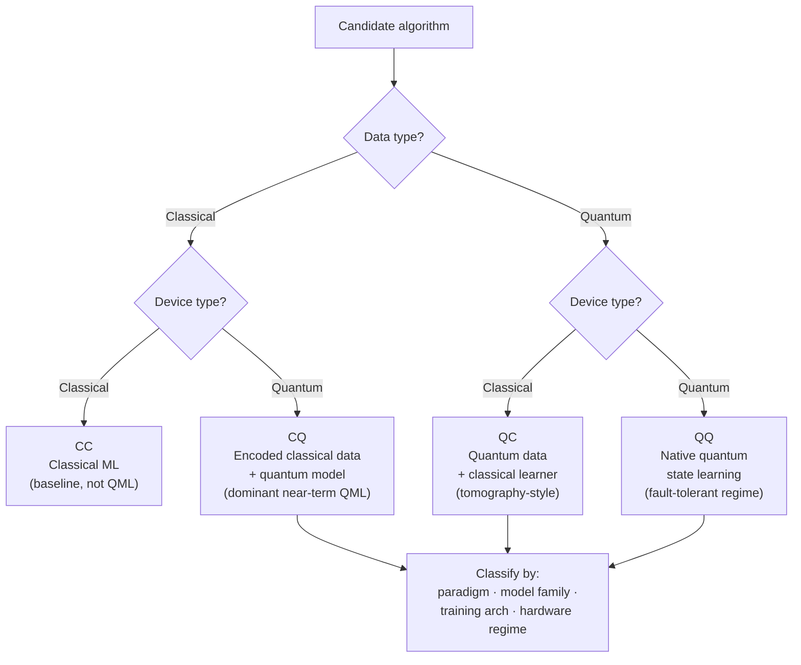

# QCSAA 910-919 · Section 01 · Subsection 010 · Subsubject 001 — QML Definition and Taxonomy

## 1. Purpose

Defines **Quantum Machine Learning (QML)** as the family of learning algorithms in which the *data*, the *model*, or the *training procedure* is fully or partially executed on a quantum processor, and establishes a four-quadrant taxonomy (CC, CQ, QC, QQ) that classifies any QML claim by the nature of its data and its computation. Aligns the register with the IEEE P7130 vocabulary[^ieeep7130] and with the controlled Q+ATLANTIDE baseline[^baseline] so that downstream QCSAA chapters can refer to a single, unambiguous QML category.

## 2. Scope

- Covers the *QML Definition and Taxonomy* subsubject (`001`) of subsection `010` *QML* within section `01` *Quantum Machine Learning e IA Cuántica*.
- Inherits Q-Division authority and ORB support from the parent row in [`../../README.md` §3](../../README.md#3-architecture-table)[^archtable].
- Concepts in scope:
  - **Definition** — QML is the application of parameterised quantum operations to a learning task whose loss is defined either on classical data, on quantum states, or on a mixture of both. The model must be (i) parameterised, (ii) trained against a loss, and (iii) at least partly evaluated on a quantum device or its simulator.
  - **Aerts–Schuld–Petruccione four-quadrant taxonomy** — by *data type* × *device type*:
    - **CC** — *Classical data, Classical device.* Baseline; not QML, but the comparison reference for any QML claim.
    - **CQ** — *Classical data, Quantum device.* The dominant near-term setting (encoded inputs, variational ansatz, quantum kernel methods); the focus of subsubjects `002`–`007`.
    - **QC** — *Quantum data, Classical device.* Tomography-style learning where measurement outcomes from a quantum source feed a classical learner.
    - **QQ** — *Quantum data, Quantum device.* Native quantum-state learning (e.g. quantum convolutional networks on quantum data); presupposes fault-tolerant or large NISQ resources.
  - **Orthogonal axes** that further qualify a QML algorithm:
    - **Learning paradigm** — supervised, unsupervised, reinforcement, generative.
    - **Model family** — quantum kernel (`003_`), variational / parameterised quantum circuit (`004_`), quantum Boltzmann machine, quantum generative adversarial network.
    - **Training architecture** — fully quantum, hybrid quantum-classical (`005_`), classical-only with quantum-inspired regularisation.
    - **Hardware regime** — NISQ, early-fault-tolerant, fault-tolerant.
  - **Boundary conditions** — what is *not* QML in this register: classical ML applied to quantum-physics datasets without a quantum model, quantum-inspired tensor-network methods running entirely on classical hardware, and post-quantum cryptography (handled in CYB `880-889`).
- Out of scope: encoding strategies (`002_`), kernel constructions (`003_`), variational architectures (`004_`), hybrid loops (`005_`), trainability obstructions (`006_`), verification (`007_`) and aerospace assurance (`008_`).

## 3. Diagram — QML Four-Quadrant Taxonomy

The four-quadrant taxonomy partitions any candidate algorithm by data type and device type. Only the CQ, QC and QQ quadrants are QML in this register's strict sense; CC is the comparison baseline that QML claims must beat or replace.

## 4. Footprint

| Metric | Value |
|---|---|
| Architecture | `QCSAA` — Quantum Computing & Sentient Agency Architecture |
| Master range | `900–999` |
| Code range | `910-919` |
| Section | `01` — Quantum Machine Learning e IA Cuántica |
| Subject | `00` — General Information |
| Subsection | `010` — QML |
| Subsubject | `001` — QML Definition and Taxonomy |
| Primary Q-Division | Q-HPC[^qdiv] |
| Support Q-Divisions | Q-HORIZON, Q-DATAGOV |
| ORB support | ORB-PMO, ORB-LEG |
| Governance class | `restricted`[^gov] |
| Folder path | `Q+ATLANTIDE/900-999_QCSAA/910-919_Quantum-Machine-Learning-e-IA-Cuantica/910_QML/` |
| Document | `001_QML-Definition-and-Taxonomy.md` (this file) |
| Parent subsection | [`README.md`](./README.md) · [`000_Overview.md`](./000_Overview.md) |
| Parent architecture | [`../../README.md`](../../README.md) |
| Parent baseline | [`organization/Q+ATLANTIDE.md`](../../../../organization/Q+ATLANTIDE.md) |

## 5. References & Citations

[^baseline]: **Q+ATLANTIDE controlled baseline (v1.0.0)** — [`organization/Q+ATLANTIDE.md`](../../../../organization/Q+ATLANTIDE.md). Defines the controlled `000-999` architecture-band taxonomy and the ATLAS-1000 register subpart.

[^archtable]: **QCSAA §3 Architecture Table** — [`../../README.md` §3](../../README.md#3-architecture-table). Authoritative source for the `910-919` row (Section `01` — Quantum Machine Learning e IA Cuántica, Primary Q-Division Q-HPC).

[^qdiv]: **Q-Division authority** — Q-Divisions provide technical authority over an architecture row (Q+ATLANTIDE Note N-002). See [`organization/Q+ATLANTIDE.md` §4](../../../../organization/Q+ATLANTIDE.md#4-notes).

[^gov]: **Governance class** — Bands are classified as `baseline` or `restricted` per Q+ATLANTIDE §4 governance rules.

[^ieeep7130]: **IEEE P7130 — Standard for Quantum Computing Definitions** — Vocabulary baseline for the quantum computing scope of QCSAA `900-999`.

[^s1000d]: **S1000D Issue 6.0 — International specification for technical publications** — Common Source DataBase (CSDB) and Data Module Code (DMC) specification used for all Q+ATLANTIDE artefacts.

[^as9100d]: **AS9100D — Quality Management Systems — Aviation, Space and Defense Organizations** — Quality-management baseline for all Q+ATLANTIDE deliverables.

### Applicable industry standards

The following standards apply to this subsubject in addition to the cross-cutting Q+ATLANTIDE governance:

- IEEE P7130 — Standard for Quantum Computing Definitions[^ieeep7130]
- S1000D Issue 6.0 — International specification for technical publications[^s1000d]
- AS9100D — Quality Management Systems — Aviation, Space and Defense Organizations[^as9100d]
