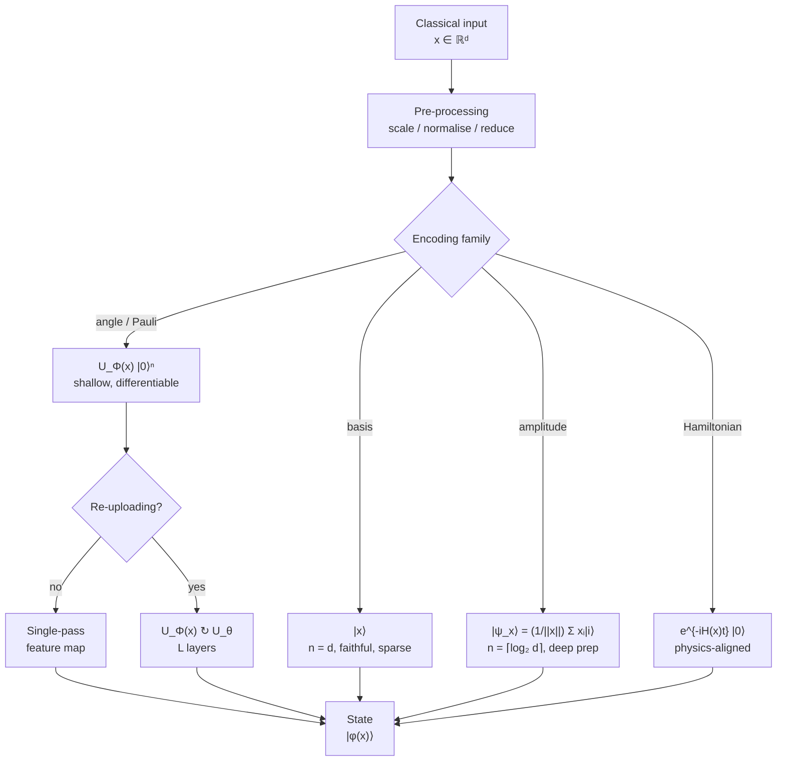

# QCSAA 910-919 · Section 01 · Subsection 010 · Subsubject 002 — Data Encoding and Feature Maps

## 1. Purpose

Defines how classical inputs $\mathbf{x} \in \mathbb{R}^d$ are mapped into a quantum state $|\phi(\mathbf{x})\rangle$ — the **quantum feature map** — and catalogues the encoding strategies that the rest of subsection `010` builds on. The encoding choice fixes the model's input dimensionality, qubit budget, circuit depth and inductive bias, and is therefore the single most consequential design decision in any CQ-quadrant QML system (per the taxonomy in `001_`).

## 2. Scope

- Covers the *Data Encoding and Feature Maps* subsubject (`002`) of subsection `010` *QML*.
- Inherits Q-Division authority and ORB support from the parent row in [`../../README.md` §3](../../README.md#3-architecture-table)[^archtable].
- Encoding families in scope:
  - **Basis encoding** — $\mathbf{x} \in \{0,1\}^n \mapsto |\mathbf{x}\rangle$. Faithful, sparse, exponentially expensive in qubits for arbitrary inputs; primarily used for combinatorial inputs.
  - **Amplitude encoding** — $\mathbf{x} \in \mathbb{R}^{2^n} \mapsto |\psi_\mathbf{x}\rangle = \tfrac{1}{\|\mathbf{x}\|}\sum_i x_i |i\rangle$. Logarithmic qubit cost ($n = \lceil \log_2 d \rceil$) but generically requires deep state-preparation circuits and destroys the input norm; care needed when the norm carries information.
  - **Angle / rotation encoding** — $x_i \mapsto R_y(x_i)$ or $R_z(x_i)$ on qubit $i$. Linear qubit cost, shallow circuit, easy to differentiate; the default for near-term hybrid loops (`005_`).
  - **IQP-style and Pauli feature maps** — $|\phi(\mathbf{x})\rangle = U_\Phi(\mathbf{x})|0\rangle^{\otimes n}$ with $U_\Phi$ a product of diagonal Pauli rotations and entangling layers; the canonical map for quantum kernels (`003_`).
  - **Hamiltonian / time-evolution encoding** — $\mathbf{x} \mapsto e^{-iH(\mathbf{x})t}|0\rangle$, useful when the data has a physical interpretation as a Hamiltonian parameter.
  - **Data re-uploading** — interleaving encoding layers with trainable layers, $U_{\theta_L}\,U_\Phi(\mathbf{x})\,\dots\,U_{\theta_1}\,U_\Phi(\mathbf{x})|0\rangle$, which provably increases the model's expressivity beyond a single-pass map.
- **Inductive bias and Fourier view** — every angle/Pauli feature map induces a partial Fourier series in $\mathbf{x}$ whose accessible frequencies are determined by the eigenvalues of the data-encoding generators; re-uploading widens the accessible frequency set.
- **Pre-processing pipeline** — feature scaling to $[-\pi,\pi]$, normalisation for amplitude encoding, dimensionality reduction (PCA, autoencoders) when the qubit budget is tighter than $d$, and class-balancing checks before kernel evaluation.
- Out of scope: kernel similarity computations using these maps (`003_`), variational layers stacked on top of them (`004_`), and the noise impact on encoding fidelity (`006_`).

## 3. Diagram — Encoding Pipeline

The encoding pipeline turns a classical input vector into a quantum state through a fixed pre-processing chain and one of the canonical feature-map families. Re-uploading is shown as a feedback path that interleaves the encoding with a trainable block.

## 4. Footprint

| Metric | Value |
|---|---|
| Architecture | `QCSAA` — Quantum Computing & Sentient Agency Architecture |
| Master range | `900–999` |
| Code range | `910-919` |
| Section | `01` — Quantum Machine Learning e IA Cuántica |
| Subject | `00` — General Information |
| Subsection | `010` — QML |
| Subsubject | `002` — Data Encoding and Feature Maps |
| Primary Q-Division | Q-HPC[^qdiv] |
| Support Q-Divisions | Q-HORIZON, Q-DATAGOV |
| ORB support | ORB-PMO, ORB-LEG |
| Governance class | `restricted`[^gov] |
| Folder path | `Q+ATLANTIDE/900-999_QCSAA/910-919_Quantum-Machine-Learning-e-IA-Cuantica/910_QML/` |
| Document | `002_Data-Encoding-and-Feature-Maps.md` (this file) |
| Parent subsection | [`README.md`](./README.md) · [`000_Overview.md`](./000_Overview.md) |
| Parent architecture | [`../../README.md`](../../README.md) |
| Parent baseline | [`organization/Q+ATLANTIDE.md`](../../../../organization/Q+ATLANTIDE.md) |

## 5. References & Citations

[^baseline]: **Q+ATLANTIDE controlled baseline (v1.0.0)** — [`organization/Q+ATLANTIDE.md`](../../../../organization/Q+ATLANTIDE.md). Defines the controlled `000-999` architecture-band taxonomy and the ATLAS-1000 register subpart.

[^archtable]: **QCSAA §3 Architecture Table** — [`../../README.md` §3](../../README.md#3-architecture-table). Authoritative source for the `910-919` row (Section `01` — Quantum Machine Learning e IA Cuántica, Primary Q-Division Q-HPC).

[^qdiv]: **Q-Division authority** — Q-Divisions provide technical authority over an architecture row (Q+ATLANTIDE Note N-002). See [`organization/Q+ATLANTIDE.md` §4](../../../../organization/Q+ATLANTIDE.md#4-notes).

[^gov]: **Governance class** — Bands are classified as `baseline` or `restricted` per Q+ATLANTIDE §4 governance rules.

[^ieeep7130]: **IEEE P7130 — Standard for Quantum Computing Definitions** — Vocabulary baseline for the quantum computing scope of QCSAA `900-999`.

[^s1000d]: **S1000D Issue 6.0 — International specification for technical publications** — Common Source DataBase (CSDB) and Data Module Code (DMC) specification used for all Q+ATLANTIDE artefacts.

[^as9100d]: **AS9100D — Quality Management Systems — Aviation, Space and Defense Organizations** — Quality-management baseline for all Q+ATLANTIDE deliverables.

### Applicable industry standards

The following standards apply to this subsubject in addition to the cross-cutting Q+ATLANTIDE governance:

- IEEE P7130 — Standard for Quantum Computing Definitions[^ieeep7130]
- S1000D Issue 6.0 — International specification for technical publications[^s1000d]
- AS9100D — Quality Management Systems — Aviation, Space and Defense Organizations[^as9100d]
