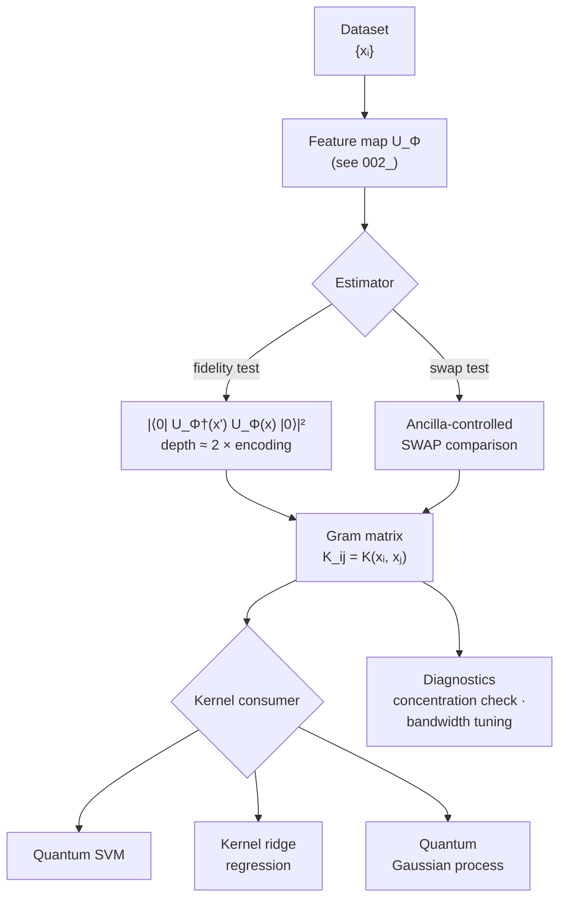

# QCSAA 910-919 · Section 01 · Subsection 010 · Subsubject 003 — Quantum Kernels and Similarity Models

## 1. Purpose

Defines a **quantum kernel** as the inner product of two encoded states, $K(\mathbf{x},\mathbf{x}') = |\langle \phi(\mathbf{x}) | \phi(\mathbf{x}') \rangle|^2$, and explains how such kernels plug into classical similarity models — quantum support vector machines (QSVM), quantum kernel ridge regression, and Gaussian-process-style models — in the CQ quadrant of the taxonomy (`001_`). Establishes the conditions under which a quantum kernel can deliver a learning advantage over any classically tractable kernel, and the conditions under which it provably cannot.

## 2. Scope

- Covers the *Quantum Kernels and Similarity Models* subsubject (`003`) of subsection `010` *QML*.
- Inherits Q-Division authority and ORB support from the parent row in [`../../README.md` §3](../../README.md#3-architecture-table)[^archtable].
- Concepts in scope:
  - **Quantum kernel definition** — $K(\mathbf{x},\mathbf{x}') = |\langle 0 | U_\Phi^\dagger(\mathbf{x}') U_\Phi(\mathbf{x}) | 0 \rangle|^2$ for a feature map $U_\Phi$ chosen per `002_`.
  - **Estimation protocols** — (i) **fidelity test**: prepare $U_\Phi^\dagger(\mathbf{x}') U_\Phi(\mathbf{x}) |0\rangle$ and measure the all-zeros probability; (ii) **swap test**: ancilla-controlled comparison of two encoded states; trade-off between circuit depth (i) and ancilla width (ii).
  - **Mercer property** — a quantum kernel is positive semi-definite by construction, hence valid for any kernel-method consumer (QSVM, kernel ridge regression, kernel PCA, Gaussian processes).
  - **Plug-in models**:
    - **Quantum SVM** — solve the dual SVM problem with the quantum Gram matrix; classification is classical once $K$ is known.
    - **Quantum kernel ridge regression** — closed-form regressor on the quantum Gram matrix.
    - **Quantum Gaussian processes** — quantum kernel as covariance function for Bayesian regression.
  - **Advantage criteria** — a quantum kernel can yield a *provable* separation only when the feature map encodes a problem-structured similarity that is not efficiently computable classically (e.g. discrete-log-based feature maps); generic IQP feature maps are **not** automatically advantageous.
  - **Concentration / curse-of-dimensionality** — for randomly chosen feature maps the kernel matrix concentrates around a constant value as $n$ grows, making the model untrainable; bandwidth tuning, problem-specific maps and projected kernels are the standard mitigations.
- Out of scope: variational kernel learning where $U_\Phi$ itself is trained — that is treated as a variational model in `004_`; trainability obstructions in `006_`; benchmarking protocols in `007_`.

## 3. Diagram — Quantum Kernel Pipeline

The pipeline shows how the encoded states from `002_` produce a Gram matrix that is consumed by an off-the-shelf classical kernel method, and where the two estimation protocols (fidelity test vs. swap test) sit.

## 4. Footprint

| Metric | Value |
|---|---|
| Architecture | `QCSAA` — Quantum Computing & Sentient Agency Architecture |
| Master range | `900–999` |
| Code range | `910-919` |
| Section | `01` — Quantum Machine Learning e IA Cuántica |
| Subject | `00` — General Information |
| Subsection | `010` — QML |
| Subsubject | `003` — Quantum Kernels and Similarity Models |
| Primary Q-Division | Q-HPC[^qdiv] |
| Support Q-Divisions | Q-HORIZON, Q-DATAGOV |
| ORB support | ORB-PMO, ORB-LEG |
| Governance class | `restricted`[^gov] |
| Folder path | `Q+ATLANTIDE/900-999_QCSAA/910-919_Quantum-Machine-Learning-e-IA-Cuantica/910_QML/` |
| Document | `003_Quantum-Kernels-and-Similarity-Models.md` (this file) |
| Parent subsection | [`README.md`](./README.md) · [`000_Overview.md`](./000_Overview.md) |
| Parent architecture | [`../../README.md`](../../README.md) |
| Parent baseline | [`organization/Q+ATLANTIDE.md`](../../../../organization/Q+ATLANTIDE.md) |

## 5. References & Citations

[^baseline]: **Q+ATLANTIDE controlled baseline (v1.0.0)** — [`organization/Q+ATLANTIDE.md`](../../../../organization/Q+ATLANTIDE.md). Defines the controlled `000-999` architecture-band taxonomy and the ATLAS-1000 register subpart.

[^archtable]: **QCSAA §3 Architecture Table** — [`../../README.md` §3](../../README.md#3-architecture-table). Authoritative source for the `910-919` row (Section `01` — Quantum Machine Learning e IA Cuántica, Primary Q-Division Q-HPC).

[^qdiv]: **Q-Division authority** — Q-Divisions provide technical authority over an architecture row (Q+ATLANTIDE Note N-002). See [`organization/Q+ATLANTIDE.md` §4](../../../../organization/Q+ATLANTIDE.md#4-notes).

[^gov]: **Governance class** — Bands are classified as `baseline` or `restricted` per Q+ATLANTIDE §4 governance rules.

[^ieeep7130]: **IEEE P7130 — Standard for Quantum Computing Definitions** — Vocabulary baseline for the quantum computing scope of QCSAA `900-999`.

[^s1000d]: **S1000D Issue 6.0 — International specification for technical publications** — Common Source DataBase (CSDB) and Data Module Code (DMC) specification used for all Q+ATLANTIDE artefacts.

[^as9100d]: **AS9100D — Quality Management Systems — Aviation, Space and Defense Organizations** — Quality-management baseline for all Q+ATLANTIDE deliverables.

### Applicable industry standards

The following standards apply to this subsubject in addition to the cross-cutting Q+ATLANTIDE governance:

- IEEE P7130 — Standard for Quantum Computing Definitions[^ieeep7130]
- S1000D Issue 6.0 — International specification for technical publications[^s1000d]
- AS9100D — Quality Management Systems — Aviation, Space and Defense Organizations[^as9100d]
