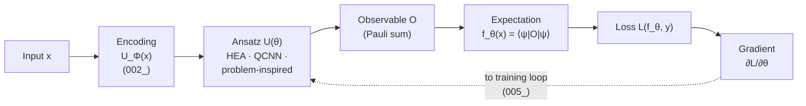

# QCSAA 910-919 · Section 01 · Subsection 010 · Subsubject 004 — Variational QML and Parameterized Circuits

## 1. Purpose

Defines a **Parameterized Quantum Circuit (PQC)** — also called an *ansatz* or *variational quantum circuit* — as a unitary $U(\boldsymbol{\theta})$ whose gate parameters $\boldsymbol{\theta}$ are optimised against a measurable cost. Explains the canonical ansatz families used in QML, the role of the observable that defines the model output, and how PQCs compose with the encoding maps of `002_` to form a **Variational Quantum Classifier (VQC)** or regressor — the dominant model class in the CQ quadrant.

## 2. Scope

- Covers the *Variational QML and Parameterized Circuits* subsubject (`004`) of subsection `010` *QML*.
- Inherits Q-Division authority and ORB support from the parent row in [`../../README.md` §3](../../README.md#3-architecture-table)[^archtable].
- Concepts in scope:
  - **PQC structure** — alternating layers of single-qubit rotations $R_\alpha(\theta)$ and fixed entangling gates (CNOT, CZ, iSWAP) arranged on a circuit topology that matches the device coupling map.
  - **Canonical ansatz families**:
    - **Hardware-Efficient Ansatz (HEA)** — generic, depth-tunable, no problem-structure prior; expressive but prone to barren plateaus (`006_`).
    - **Problem-inspired ansätze** — UCC (chemistry), QAOA-style (combinatorial), permutation-equivariant ansätze for symmetric data.
    - **Quantum Convolutional Neural Network (QCNN)** — alternating convolution and pooling layers; provably free of barren plateaus under standard assumptions.
    - **Tree-tensor-network and MPS ansätze** — shallow, geometry-respecting, classically simulable up to a bond dimension.
  - **Model output** — a PQC defines a function $f_{\boldsymbol{\theta}}(\mathbf{x}) = \langle \phi(\mathbf{x}) | U^\dagger(\boldsymbol{\theta}) \, O \, U(\boldsymbol{\theta}) | \phi(\mathbf{x}) \rangle$ via an observable $O$ (typically a Pauli string or a sum thereof). The observable choice is part of the model.
  - **Inductive bias and expressivity** — the ansatz family fixes the hypothesis class; over-parameterisation (more parameters than dimensions of the dynamical Lie algebra) can ease optimisation but worsens generalisation if uncontrolled.
  - **Composition with encoding** — full pipeline is $|\psi\rangle = U(\boldsymbol{\theta}_L) U_\Phi(\mathbf{x}) \dots U(\boldsymbol{\theta}_1) U_\Phi(\mathbf{x}) |0\rangle^{\otimes n}$ when data re-uploading from `002_` is used.
- Out of scope: how the parameters $\boldsymbol{\theta}$ are actually updated (deferred to `005_`), trainability obstructions (`006_`), verification of the trained model (`007_`).

## 3. Diagram — Variational QML Pipeline

A VQC composes an encoding block (from `002_`) with a parameterised ansatz $U(\boldsymbol{\theta})$ and a measurement of a problem-relevant observable. The pipeline below highlights the interface to the training loop of `005_` (cost from observable expectation, gradient back to parameters).

## 4. Footprint

| Metric | Value |
|---|---|
| Architecture | `QCSAA` — Quantum Computing & Sentient Agency Architecture |
| Master range | `900–999` |
| Code range | `910-919` |
| Section | `01` — Quantum Machine Learning e IA Cuántica |
| Subject | `00` — General Information |
| Subsection | `010` — QML |
| Subsubject | `004` — Variational QML and Parameterized Circuits |
| Primary Q-Division | Q-HPC[^qdiv] |
| Support Q-Divisions | Q-HORIZON, Q-DATAGOV |
| ORB support | ORB-PMO, ORB-LEG |
| Governance class | `restricted`[^gov] |
| Folder path | `Q+ATLANTIDE/900-999_QCSAA/910-919_Quantum-Machine-Learning-e-IA-Cuantica/910_QML/` |
| Document | `004_Variational-QML-and-Parameterized-Circuits.md` (this file) |
| Parent subsection | [`README.md`](./README.md) · [`000_Overview.md`](./000_Overview.md) |
| Parent architecture | [`../../README.md`](../../README.md) |
| Parent baseline | [`organization/Q+ATLANTIDE.md`](../../../../organization/Q+ATLANTIDE.md) |

## 5. References & Citations

[^baseline]: **Q+ATLANTIDE controlled baseline (v1.0.0)** — [`organization/Q+ATLANTIDE.md`](../../../../organization/Q+ATLANTIDE.md). Defines the controlled `000-999` architecture-band taxonomy and the ATLAS-1000 register subpart.

[^archtable]: **QCSAA §3 Architecture Table** — [`../../README.md` §3](../../README.md#3-architecture-table). Authoritative source for the `910-919` row (Section `01` — Quantum Machine Learning e IA Cuántica, Primary Q-Division Q-HPC).

[^qdiv]: **Q-Division authority** — Q-Divisions provide technical authority over an architecture row (Q+ATLANTIDE Note N-002). See [`organization/Q+ATLANTIDE.md` §4](../../../../organization/Q+ATLANTIDE.md#4-notes).

[^gov]: **Governance class** — Bands are classified as `baseline` or `restricted` per Q+ATLANTIDE §4 governance rules.

[^ieeep7130]: **IEEE P7130 — Standard for Quantum Computing Definitions** — Vocabulary baseline for the quantum computing scope of QCSAA `900-999`.

[^s1000d]: **S1000D Issue 6.0 — International specification for technical publications** — Common Source DataBase (CSDB) and Data Module Code (DMC) specification used for all Q+ATLANTIDE artefacts.

[^as9100d]: **AS9100D — Quality Management Systems — Aviation, Space and Defense Organizations** — Quality-management baseline for all Q+ATLANTIDE deliverables.

### Applicable industry standards

The following standards apply to this subsubject in addition to the cross-cutting Q+ATLANTIDE governance:

- IEEE P7130 — Standard for Quantum Computing Definitions[^ieeep7130]
- S1000D Issue 6.0 — International specification for technical publications[^s1000d]
- AS9100D — Quality Management Systems — Aviation, Space and Defense Organizations[^as9100d]
