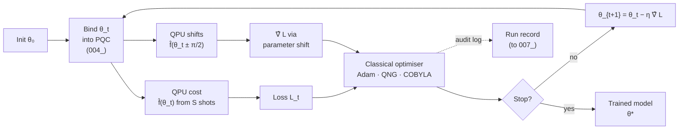

# QCSAA 910-919 · Section 01 · Subsection 010 · Subsubject 005 — Hybrid Quantum-Classical Training Loops

## 1. Purpose

Defines the **hybrid quantum-classical training loop** that drives every variational QML model (`004_`): the QPU evaluates the cost (and/or gradient estimators) for the current parameters $\boldsymbol{\theta}_t$, the classical optimiser updates them to $\boldsymbol{\theta}_{t+1}$, and the cycle repeats until a stopping criterion is met. Specifies gradient estimation via the **parameter-shift rule**, the choice of classical optimiser, the impact of finite-shot noise on each step, and the orchestration interface between the classical scheduler and the quantum back-end.

## 2. Scope

- Covers the *Hybrid Quantum-Classical Training Loops* subsubject (`005`) of subsection `010` *QML*.
- Inherits Q-Division authority and ORB support from the parent row in [`../../README.md` §3](../../README.md#3-architecture-table)[^archtable].
- Loop components in scope:
  - **Cost evaluation** — for parameters $\boldsymbol{\theta}$ and observable $O$, the QPU returns an estimate $\hat{f}_{\boldsymbol{\theta}}(\mathbf{x})$ of $\langle \psi(\boldsymbol{\theta},\mathbf{x}) | O | \psi(\boldsymbol{\theta},\mathbf{x}) \rangle$ from $S$ shots; finite $S$ adds shot noise of order $1/\sqrt{S}$.
  - **Gradient estimation**:
    - **Parameter-shift rule** — for gates of the form $e^{-i\theta P/2}$ with Pauli $P$, $\partial f/\partial\theta = \tfrac{1}{2}\,[f(\theta + \pi/2) - f(\theta - \pi/2)]$. Exact, requires two extra circuit evaluations per parameter.
    - **Stochastic / SPSA gradient** — single-shot, finite-difference estimate; cheaper per step but noisier.
    - **Finite differences** — only for ablation; biased and shot-hungry.
  - **Classical optimisers** — Adam, RMSProp, momentum-SGD, L-BFGS for cost-only, COBYLA for noisy black-box, natural-gradient and Quantum Natural Gradient (QNG) when the Fubini-Study metric is affordable.
  - **Mini-batching and shot scheduling** — adaptive shot allocation (more shots near convergence), batched expectation estimation across data points, gradient accumulation across mini-batches.
  - **Stopping criteria** — fixed wall-clock budget, validation-loss plateau, gradient-norm threshold respecting shot noise.
  - **Orchestration interface** — classical scheduler issues circuit jobs (parameter-bound OpenQASM/Qiskit/PennyLane circuits) to the quantum back-end (simulator, NISQ device or fault-tolerant target), receives shot histograms, computes expectations, and updates parameters; the interface must be auditable to satisfy the verification requirements of `007_`.
- Out of scope: trainability obstructions intrinsic to the loss landscape (`006_`), end-to-end verification protocols (`007_`), and the safety envelope for hybrid loops embedded in aerospace functions (`008_`).

## 3. Diagram — Hybrid Training Loop

The loop has two cleanly separated halves: the QPU side evaluates the cost and the parameter-shift gradient, and the classical optimiser updates the parameters. The interface between them is the only auditable surface and must be logged for verification (`007_`).

## 4. Footprint

| Metric | Value |
|---|---|
| Architecture | `QCSAA` — Quantum Computing & Sentient Agency Architecture |
| Master range | `900–999` |
| Code range | `910-919` |
| Section | `01` — Quantum Machine Learning e IA Cuántica |
| Subject | `00` — General Information |
| Subsection | `010` — QML |
| Subsubject | `005` — Hybrid Quantum-Classical Training Loops |
| Primary Q-Division | Q-HPC[^qdiv] |
| Support Q-Divisions | Q-HORIZON, Q-DATAGOV |
| ORB support | ORB-PMO, ORB-LEG |
| Governance class | `restricted`[^gov] |
| Folder path | `Q+ATLANTIDE/900-999_QCSAA/910-919_Quantum-Machine-Learning-e-IA-Cuantica/910_QML/` |
| Document | `005_Hybrid-Quantum-Classical-Training-Loops.md` (this file) |
| Parent subsection | [`README.md`](./README.md) · [`000_Overview.md`](./000_Overview.md) |
| Parent architecture | [`../../README.md`](../../README.md) |
| Parent baseline | [`organization/Q+ATLANTIDE.md`](../../../../organization/Q+ATLANTIDE.md) |

## 5. References & Citations

[^baseline]: **Q+ATLANTIDE controlled baseline (v1.0.0)** — [`organization/Q+ATLANTIDE.md`](../../../../organization/Q+ATLANTIDE.md). Defines the controlled `000-999` architecture-band taxonomy and the ATLAS-1000 register subpart.

[^archtable]: **QCSAA §3 Architecture Table** — [`../../README.md` §3](../../README.md#3-architecture-table). Authoritative source for the `910-919` row (Section `01` — Quantum Machine Learning e IA Cuántica, Primary Q-Division Q-HPC).

[^qdiv]: **Q-Division authority** — Q-Divisions provide technical authority over an architecture row (Q+ATLANTIDE Note N-002). See [`organization/Q+ATLANTIDE.md` §4](../../../../organization/Q+ATLANTIDE.md#4-notes).

[^gov]: **Governance class** — Bands are classified as `baseline` or `restricted` per Q+ATLANTIDE §4 governance rules.

[^ieeep7130]: **IEEE P7130 — Standard for Quantum Computing Definitions** — Vocabulary baseline for the quantum computing scope of QCSAA `900-999`.

[^s1000d]: **S1000D Issue 6.0 — International specification for technical publications** — Common Source DataBase (CSDB) and Data Module Code (DMC) specification used for all Q+ATLANTIDE artefacts.

[^as9100d]: **AS9100D — Quality Management Systems — Aviation, Space and Defense Organizations** — Quality-management baseline for all Q+ATLANTIDE deliverables.

### Applicable industry standards

The following standards apply to this subsubject in addition to the cross-cutting Q+ATLANTIDE governance:

- IEEE P7130 — Standard for Quantum Computing Definitions[^ieeep7130]
- S1000D Issue 6.0 — International specification for technical publications[^s1000d]
- AS9100D — Quality Management Systems — Aviation, Space and Defense Organizations[^as9100d]
