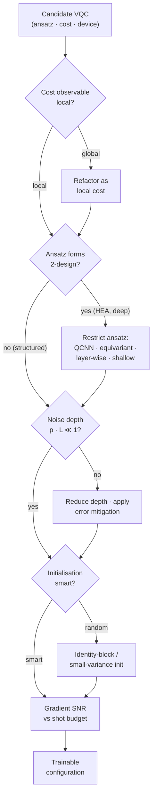

# QCSAA 910-919 · Section 01 · Subsection 010 · Subsubject 006 — Noise, Barren Plateaus and Trainability

## 1. Purpose

Catalogues the **trainability obstructions** that decide whether a variational QML model (`004_`) can actually be trained by the hybrid loop of `005_`. Covers the four canonical pathologies — (i) **barren plateaus** from random initialisation in expressive ansätze, (ii) **noise-induced barren plateaus** from hardware decoherence, (iii) **kernel concentration** for random feature maps, and (iv) **cost-landscape narrow gorges and local minima** — and the standard mitigations: structured ansätze, smart initialisation, layer-wise training, locality of the cost observable, and shot-aware optimisation.

## 2. Scope

- Covers the *Noise, Barren Plateaus and Trainability* subsubject (`006`) of subsection `010` *QML*.
- Inherits Q-Division authority and ORB support from the parent row in [`../../README.md` §3](../../README.md#3-architecture-table)[^archtable].
- Pathologies in scope:
  - **Barren plateaus (BP)** — for random PQC parameters in a sufficiently expressive ansatz (2-design property), the variance of the gradient $\mathrm{Var}[\partial L/\partial\theta]$ decays exponentially with the number of qubits $n$. Practically untrainable beyond modest $n$ without mitigation.
  - **Noise-induced barren plateaus** — under local Pauli noise of strength $p$ per layer, the gradient also decays exponentially with circuit depth, *independently* of the initialisation. This sets a hard depth ceiling for any near-term VQC.
  - **Cost-function locality effect** — global observables (e.g. projector onto $|0\rangle^{\otimes n}$) admit BPs even at shallow depth; local observables (single-qubit Paulis) preserve trainability up to logarithmic depth in $n$.
  - **Kernel concentration** — for random feature maps the off-diagonal entries of the quantum Gram matrix concentrate around a constant, leaving the kernel method unable to discriminate (reference back to `003_`).
  - **Narrow gorges, local minima, ill-conditioning** — even when the gradient does not vanish on average, the loss landscape can be dominated by narrow minima or near-flat plateaus that defeat first-order optimisers.
- Mitigations and design rules in scope:
  - **Structured ansätze** — QCNNs, equivariant ansätze and shallow problem-inspired circuits are provably free of BPs under stated assumptions.
  - **Smart initialisation** — identity-block initialisation, Gaussian initialisation with small variance, transfer of pre-trained parameters.
  - **Layer-wise training** — train one layer at a time, freezing earlier layers; reduces effective expressivity per step.
  - **Local cost functions** — design $O$ as a sum of local Paulis whenever the task allows.
  - **Shot-aware optimisation** — match shot budget to the gradient's signal-to-noise ratio; use SPSA or QNG when full parameter-shift gradients are unaffordable.
  - **Error mitigation** — zero-noise extrapolation, probabilistic error cancellation and readout calibration to push back the noise-induced BP threshold (interfaces with `005_`).
- Out of scope: device-level noise models themselves (`900_Qubits/004_Decoherence-Noise-and-Fidelity.md`), benchmarking protocols that *measure* trainability (`007_`), and the safety implications of accepting an under-trained model (`008_`).

## 3. Diagram — Trainability Decision Flow

A practical trainability check follows the decision flow below: rule out cost locality, ansatz expressivity and noise depth before declaring a model trainable. Failures map to the corresponding mitigation arm.

## 4. Footprint

| Metric | Value |
|---|---|
| Architecture | `QCSAA` — Quantum Computing & Sentient Agency Architecture |
| Master range | `900–999` |
| Code range | `910-919` |
| Section | `01` — Quantum Machine Learning e IA Cuántica |
| Subject | `00` — General Information |
| Subsection | `010` — QML |
| Subsubject | `006` — Noise, Barren Plateaus and Trainability |
| Primary Q-Division | Q-HPC[^qdiv] |
| Support Q-Divisions | Q-HORIZON, Q-DATAGOV |
| ORB support | ORB-PMO, ORB-LEG |
| Governance class | `restricted`[^gov] |
| Folder path | `Q+ATLANTIDE/900-999_QCSAA/910-919_Quantum-Machine-Learning-e-IA-Cuantica/910_QML/` |
| Document | `006_Noise-Barren-Plateaus-and-Trainability.md` (this file) |
| Parent subsection | [`README.md`](./README.md) · [`000_Overview.md`](./000_Overview.md) |
| Parent architecture | [`../../README.md`](../../README.md) |
| Parent baseline | [`organization/Q+ATLANTIDE.md`](../../../../organization/Q+ATLANTIDE.md) |

## 5. References & Citations

[^baseline]: **Q+ATLANTIDE controlled baseline (v1.0.0)** — [`organization/Q+ATLANTIDE.md`](../../../../organization/Q+ATLANTIDE.md). Defines the controlled `000-999` architecture-band taxonomy and the ATLAS-1000 register subpart.

[^archtable]: **QCSAA §3 Architecture Table** — [`../../README.md` §3](../../README.md#3-architecture-table). Authoritative source for the `910-919` row (Section `01` — Quantum Machine Learning e IA Cuántica, Primary Q-Division Q-HPC).

[^qdiv]: **Q-Division authority** — Q-Divisions provide technical authority over an architecture row (Q+ATLANTIDE Note N-002). See [`organization/Q+ATLANTIDE.md` §4](../../../../organization/Q+ATLANTIDE.md#4-notes).

[^gov]: **Governance class** — Bands are classified as `baseline` or `restricted` per Q+ATLANTIDE §4 governance rules.

[^ieeep7130]: **IEEE P7130 — Standard for Quantum Computing Definitions** — Vocabulary baseline for the quantum computing scope of QCSAA `900-999`.

[^s1000d]: **S1000D Issue 6.0 — International specification for technical publications** — Common Source DataBase (CSDB) and Data Module Code (DMC) specification used for all Q+ATLANTIDE artefacts.

[^as9100d]: **AS9100D — Quality Management Systems — Aviation, Space and Defense Organizations** — Quality-management baseline for all Q+ATLANTIDE deliverables.

### Applicable industry standards

The following standards apply to this subsubject in addition to the cross-cutting Q+ATLANTIDE governance:

- IEEE P7130 — Standard for Quantum Computing Definitions[^ieeep7130]
- S1000D Issue 6.0 — International specification for technical publications[^s1000d]
- AS9100D — Quality Management Systems — Aviation, Space and Defense Organizations[^as9100d]
