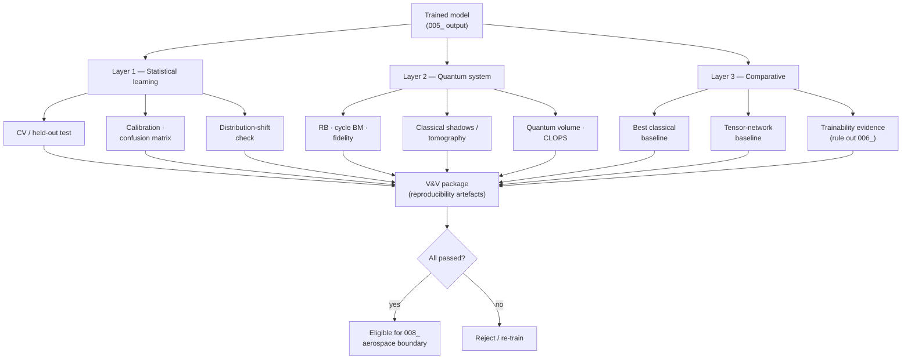

# QCSAA 910-919 · Section 01 · Subsection 010 · Subsubject 007 — QML Verification and Benchmarking

## 1. Purpose

Defines the **verification and benchmarking** evidence that a QML model must produce before it can be cited as the basis for any QCSAA decision (and, *a fortiori*, before crossing the assurance boundary of `008_`). Covers (i) **statistical-learning verification** (generalisation bounds, cross-validation, calibration), (ii) **quantum-system verification** (state, process and randomised benchmarking of the underlying circuits), (iii) **classical-baseline benchmarking** (the only legitimate way to substantiate a "quantum advantage" claim), and (iv) the **reproducibility artefacts** required for an audit trail.

## 2. Scope

- Covers the *QML Verification and Benchmarking* subsubject (`007`) of subsection `010` *QML*.
- Inherits Q-Division authority and ORB support from the parent row in [`../../README.md` §3](../../README.md#3-architecture-table)[^archtable].
- Verification dimensions in scope:
  - **Statistical-learning verification**:
    - Train / validation / test split discipline; held-out test never seen during model selection.
    - Cross-validation ($k$-fold, stratified) for small datasets typical of near-term QML.
    - Generalisation diagnostics — bias-variance decomposition, learning curves, calibration plots (reliability diagrams), confusion matrices and per-class metrics.
    - Distribution-shift checks between training and deployment data.
  - **Quantum-system verification** of the underlying circuits (`004_`):
    - **State tomography / classical shadows** for low-qubit verification of $|\psi(\boldsymbol{\theta})\rangle$.
    - **Process tomography** for sub-circuits where it is affordable.
    - **Randomised benchmarking (RB)** and **cycle benchmarking** for average gate fidelity on the device-coupled gate set.
    - **Quantum volume** and **CLOPS** as device-level capability metrics that bound what the QML model can reasonably claim.
  - **Classical-baseline benchmarking** — every QML claim is reported alongside (a) the best classical model trained on the same data with comparable wall-clock and parameter budgets, and (b) a quantum-inspired tensor-network baseline where applicable. A QML "advantage" is only declared after this comparison.
  - **Trainability evidence** — gradient-variance scaling vs. $n$ (rule out the BPs of `006_`), kernel-concentration check (rule out the kernel pathology of `003_`/`006_`), shot-budget vs. gradient-SNR curves.
  - **Reproducibility artefacts** — versioned dataset hash, seeded RNGs (classical and shot), pinned framework versions, full circuit OpenQASM dump, calibration snapshot of the device, classical-optimiser configuration, and the audit log emitted by the training loop of `005_`.
- Out of scope: the certification process itself for an aerospace function (deferred to `008_`); the underlying decoherence physics that justifies RB as a metric (`900_Qubits/004_`).

## 3. Diagram — QML V&V Stack

The verification stack stratifies into three layers that must all pass before a QML model crosses the assurance boundary of `008_`. Each layer produces named artefacts that go into the audit package.

## 4. Footprint

| Metric | Value |
|---|---|
| Architecture | `QCSAA` — Quantum Computing & Sentient Agency Architecture |
| Master range | `900–999` |
| Code range | `910-919` |
| Section | `01` — Quantum Machine Learning e IA Cuántica |
| Subject | `00` — General Information |
| Subsection | `010` — QML |
| Subsubject | `007` — QML Verification and Benchmarking |
| Primary Q-Division | Q-HPC[^qdiv] |
| Support Q-Divisions | Q-HORIZON, Q-DATAGOV |
| ORB support | ORB-PMO, ORB-LEG |
| Governance class | `restricted`[^gov] |
| Folder path | `Q+ATLANTIDE/900-999_QCSAA/910-919_Quantum-Machine-Learning-e-IA-Cuantica/910_QML/` |
| Document | `007_QML-Verification-and-Benchmarking.md` (this file) |
| Parent subsection | [`README.md`](./README.md) · [`000_Overview.md`](./000_Overview.md) |
| Parent architecture | [`../../README.md`](../../README.md) |
| Parent baseline | [`organization/Q+ATLANTIDE.md`](../../../../organization/Q+ATLANTIDE.md) |

## 5. References & Citations

[^baseline]: **Q+ATLANTIDE controlled baseline (v1.0.0)** — [`organization/Q+ATLANTIDE.md`](../../../../organization/Q+ATLANTIDE.md). Defines the controlled `000-999` architecture-band taxonomy and the ATLAS-1000 register subpart.

[^archtable]: **QCSAA §3 Architecture Table** — [`../../README.md` §3](../../README.md#3-architecture-table). Authoritative source for the `910-919` row (Section `01` — Quantum Machine Learning e IA Cuántica, Primary Q-Division Q-HPC).

[^qdiv]: **Q-Division authority** — Q-Divisions provide technical authority over an architecture row (Q+ATLANTIDE Note N-002). See [`organization/Q+ATLANTIDE.md` §4](../../../../organization/Q+ATLANTIDE.md#4-notes).

[^gov]: **Governance class** — Bands are classified as `baseline` or `restricted` per Q+ATLANTIDE §4 governance rules.

[^ieeep7130]: **IEEE P7130 — Standard for Quantum Computing Definitions** — Vocabulary baseline for the quantum computing scope of QCSAA `900-999`.

[^s1000d]: **S1000D Issue 6.0 — International specification for technical publications** — Common Source DataBase (CSDB) and Data Module Code (DMC) specification used for all Q+ATLANTIDE artefacts.

[^as9100d]: **AS9100D — Quality Management Systems — Aviation, Space and Defense Organizations** — Quality-management baseline for all Q+ATLANTIDE deliverables.

### Applicable industry standards

The following standards apply to this subsubject in addition to the cross-cutting Q+ATLANTIDE governance:

- IEEE P7130 — Standard for Quantum Computing Definitions[^ieeep7130]
- S1000D Issue 6.0 — International specification for technical publications[^s1000d]
- AS9100D — Quality Management Systems — Aviation, Space and Defense Organizations[^as9100d]
