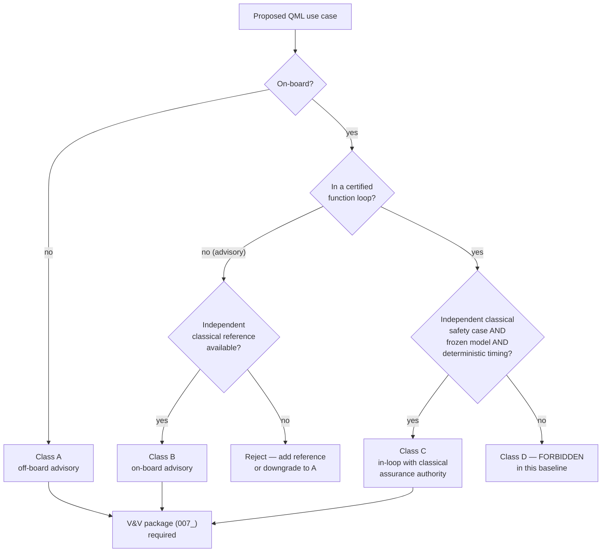

# QCSAA 910-919 · Section 01 · Subsection 010 · Subsubject 008 — Aerospace Use Cases and Assurance Boundaries

## 1. Purpose

Catalogues the aerospace use cases for which QML is a credible candidate, and — equally importantly — draws the **assurance boundary** beyond which a QML model **shall not** be embedded without dedicated certification evidence. This is the contract between the QCSAA `910-919` register and the ATLAS aerospace bands: every downstream proposal to use a QML component inside an aircraft, satellite or ground-segment function must back-reference this subsubject and inherit its boundary.

## 2. Scope

- Covers the *Aerospace Use Cases and Assurance Boundaries* subsubject (`008`) of subsection `010` *QML*.
- Inherits Q-Division authority and ORB support from the parent row in [`../../README.md` §3](../../README.md#3-architecture-table)[^archtable].
- **Candidate aerospace use cases** (each is a *candidate*; eligibility is decided by §3 below):
  - **Design & engineering** — surrogate models for high-fidelity CFD/FEA, materials discovery (alloys, composites, lattice metamaterials), topology optimisation, generative design of structural parts.
  - **Manufacturing & MRO** — anomaly detection on inspection imagery and acoustic emissions, predictive maintenance from sensor logs, scheduling and routing of MRO operations.
  - **Operations** — trajectory optimisation, fuel-burn forecasting, crew/aircraft pairing, airspace flow management.
  - **Earth-observation and space-domain awareness** — classification of hyperspectral imagery, denoising of low-SNR sensor data, conjunction-screening prioritisation.
  - **Safety analytics (off-board)** — fleet-wide trend monitoring, FOQA / FDM analytics, post-flight diagnostics.
- **Assurance-boundary classes** — the maximum permissible coupling of the QML output to a certified function:
  - **Class A — Off-board, advisory only.** No direct effect on a certified function. Allowed once the V&V package of `007_` is complete. *Default class for all QML in this baseline release.*
  - **Class B — On-board, monitored, advisory.** Output presented to crew or operator with an independent classical reference and an explicit "advisory only" label. Requires a documented degradation-mode strategy when the QML output is unavailable or out-of-distribution.
  - **Class C — On-board, in the loop, with independent classical assurance.** QML output may influence a certified function only when a classical, certified function provides an *independent* safety case for the same output and remains authoritative on disagreement. Requires bit-exact reproducibility, deterministic timing, and an offline-trained, frozen model — *no* on-line learning.
  - **Class D — Forbidden in this baseline.** QML directly inside a flight-critical control loop, inside a safety monitor, or inside a certification-credit-bearing function without an independent classical assurance path. Future baselines may revise this class only after the relevant authority publishes a quantum-aware certification framework.
- **Inheritance rule** — every aerospace document that proposes a QML component shall (i) cite this subsubject, (ii) state the assurance class, (iii) attach the V&V package of `007_`, and (iv) state explicitly when the model was last re-trained and frozen.
- **Hard prohibitions** — on-line (in-flight) parameter updates of any QML model inside an aerospace function; use of unverified noise-mitigation post-processing inside a certified function; substitution of a quantum kernel for a certified classical kernel without an explicit equivalence argument.
- Out of scope: the certification framework of any specific authority (EASA, FAA, ESA) — those are referenced from the ATLAS bands; this subsubject only fixes the *internal* QCSAA boundary.

## 3. Diagram — Assurance-Boundary Decision

The decision flow turns a use-case proposal into one of the four assurance classes A–D. Class D is forbidden in this baseline; classes A–C are admissible only when the listed evidence is present.

## 4. Footprint

| Metric | Value |
|---|---|
| Architecture | `QCSAA` — Quantum Computing & Sentient Agency Architecture |
| Master range | `900–999` |
| Code range | `910-919` |
| Section | `01` — Quantum Machine Learning e IA Cuántica |
| Subject | `00` — General Information |
| Subsection | `010` — QML |
| Subsubject | `008` — Aerospace Use Cases and Assurance Boundaries |
| Primary Q-Division | Q-HPC[^qdiv] |
| Support Q-Divisions | Q-HORIZON, Q-DATAGOV |
| ORB support | ORB-PMO, ORB-LEG |
| Governance class | `restricted`[^gov] |
| Folder path | `Q+ATLANTIDE/900-999_QCSAA/910-919_Quantum-Machine-Learning-e-IA-Cuantica/910_QML/` |
| Document | `008_Aerospace-Use-Cases-and-Assurance-Boundaries.md` (this file) |
| Parent subsection | [`README.md`](./README.md) · [`000_Overview.md`](./000_Overview.md) |
| Parent architecture | [`../../README.md`](../../README.md) |
| Parent baseline | [`organization/Q+ATLANTIDE.md`](../../../../organization/Q+ATLANTIDE.md) |

## 5. References & Citations

[^baseline]: **Q+ATLANTIDE controlled baseline (v1.0.0)** — [`organization/Q+ATLANTIDE.md`](../../../../organization/Q+ATLANTIDE.md). Defines the controlled `000-999` architecture-band taxonomy and the ATLAS-1000 register subpart.

[^archtable]: **QCSAA §3 Architecture Table** — [`../../README.md` §3](../../README.md#3-architecture-table). Authoritative source for the `910-919` row (Section `01` — Quantum Machine Learning e IA Cuántica, Primary Q-Division Q-HPC).

[^qdiv]: **Q-Division authority** — Q-Divisions provide technical authority over an architecture row (Q+ATLANTIDE Note N-002). See [`organization/Q+ATLANTIDE.md` §4](../../../../organization/Q+ATLANTIDE.md#4-notes).

[^gov]: **Governance class** — Bands are classified as `baseline` or `restricted` per Q+ATLANTIDE §4 governance rules.

[^ieeep7130]: **IEEE P7130 — Standard for Quantum Computing Definitions** — Vocabulary baseline for the quantum computing scope of QCSAA `900-999`.

[^s1000d]: **S1000D Issue 6.0 — International specification for technical publications** — Common Source DataBase (CSDB) and Data Module Code (DMC) specification used for all Q+ATLANTIDE artefacts.

[^as9100d]: **AS9100D — Quality Management Systems — Aviation, Space and Defense Organizations** — Quality-management baseline for all Q+ATLANTIDE deliverables.

### Applicable industry standards

The following standards apply to this subsubject in addition to the cross-cutting Q+ATLANTIDE governance:

- IEEE P7130 — Standard for Quantum Computing Definitions[^ieeep7130]
- S1000D Issue 6.0 — International specification for technical publications[^s1000d]
- AS9100D — Quality Management Systems — Aviation, Space and Defense Organizations[^as9100d]
