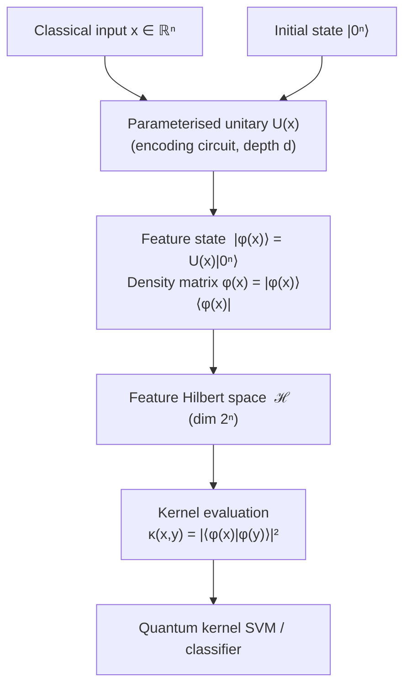

# QCSAA 910–919 · Section 01 · Subsection 911 · Subsubject 001 — Feature Map Controlled Definition

## 1. Purpose

Establishes the controlled QCSAA definition of a **quantum feature map** φ: ℝⁿ → ℋ as a parameterised unitary U(x) that maps a classical input vector x ∈ ℝⁿ to a quantum state |φ(x)⟩ = U(x)|0⟩ living in a 2ⁿ-dimensional Hilbert space ℋ[^havlicek]. This definition is the canonical reference for every downstream QCSAA document that names, invokes, or builds upon a feature map primitive.

The feature map is realised as a quantum circuit composed of parameterised unitary gates whose angles or axis orientations depend on the classical input x. The resulting density matrix φ(x) = U(x)|0⟩⟨0|U(x)† encodes the input in the quantum state space, where inner products between feature states define a kernel function that drives quantum machine learning models[^schuld2019]. This document conforms to the vocabulary of ISO/IEC 4879[^isoiec4879] and the Hilbert-space formalism of Nielsen & Chuang[^nielchung].

**Restricted band (N-006[^n006]).** This document inherits `governance_class: restricted`.

## 2. Scope

- Covers the *Feature Map Controlled Definition* subsubject (`001`) of subsection `911` *Quantum Feature Maps and Embeddings* within section `01` *Quantum Machine Learning e IA Cuántica*.
- Inherits Q-Division authority and ORB support from the parent row in [`README.md`](./README.md)[^archtable].
- Concepts in scope:
  - **Formal definition** — a quantum feature map is the function φ: ℝⁿ → D(ℋ) where D(ℋ) is the set of density operators on ℋ, defined by φ(x) = U(x)|0ⁿ⟩⟨0ⁿ|U(x)†; for pure states the feature state is |φ(x)⟩ = U(x)|0ⁿ⟩.
  - **Parameterised unitary U(x)** — U(x) is a product of quantum gates whose parameters are functions of x; it is unitary by construction (U†U = 𝕀) and thus maps the initial state |0ⁿ⟩ to a normalised state on the unit sphere in ℋ.
  - **Induced kernel** — the quantum kernel κ: ℝⁿ × ℝⁿ → [0,1] is defined as κ(x,y) = |⟨φ(x)|φ(y)⟩|² = |⟨0ⁿ|U(x)†U(y)|0ⁿ⟩|²; this is a valid positive-semidefinite kernel by the properties of inner products in Hilbert space[^schuld2021].
  - **Role in Hilbert-space separation** — the feature map lifts non-linearly separable classical data into a high-dimensional feature space where classes may become linearly separable; the geometry of ℋ replaces the explicit computation of a nonlinear map required by classical kernel machines.
  - **Distinction from classical kernel methods** — in classical kernel methods the feature map is implicit and the kernel is evaluated analytically; in quantum feature maps the kernel is evaluated by preparing and measuring quantum states, and the feature space dimension 2ⁿ grows exponentially in the number of qubits, a regime inaccessible classically for large n[^havlicek].
  - **Injectivity and expressibility** — a feature map is injective (informationally complete) if distinct inputs x ≠ y yield orthogonal or at minimum distinguishable feature states; expressibility measures how uniformly U(x) covers the unitary group as x ranges over the input domain.
  - **Data-dependence conventions** — the QCSAA convention is that U(x) is the encoding circuit only (no trainable parameters); trainable parameters belong to the ansatz layer and are treated separately in subsection `912` (VQC) and `917` (trainability).
- Out of scope: choice of specific encoding strategy (see `003_`–`007_`), kernel evaluation circuits (see `008_`), embedding (broader than feature map, see `002_`), and trainability/expressibility quantification (see `009_`).

## 3. Diagram — Quantum Feature Map Pipeline

The following diagram traces the flow from a classical input vector through the parameterised unitary circuit to the resulting feature state and kernel evaluation.

## 4. Footprint

| Metric | Value |
|---|---|
| Architecture | `QCSAA` — Quantum Computing & Sentient Agency Architecture |
| Master range | `900–999` |
| Code range | `910-919` |
| Section | `01` — Quantum Machine Learning e IA Cuántica |
| Subsection | `911` — Quantum Feature Maps and Embeddings |
| Subsubject | `001` — Feature Map Controlled Definition |
| Primary Q-Division | Q-HPC[^qdiv] |
| Support Q-Divisions | Q-HORIZON, Q-DATAGOV |
| ORB support | ORB-PMO, ORB-LEG |
| Governance class | `restricted`[^gov] |
| Folder path | `Q+ATLANTIDE/900-999_QCSAA/910-919_Quantum-Machine-Learning-e-IA-Cuantica/911_Quantum-Feature-Maps-and-Embeddings/` |
| Document | `001_Feature-Map-Controlled-Definition.md` (this file) |
| Parent subsection | [`README.md`](./README.md) · [`000_Overview.md`](./000_Overview.md) |
| Parent architecture | [`../../README.md`](../../README.md) |
| Parent baseline | [`organization/Q+ATLANTIDE.md`](../../../../organization/Q+ATLANTIDE.md) |

## 5. References & Citations

[^baseline]: **Q+ATLANTIDE controlled baseline (v1.0.0)** — [`organization/Q+ATLANTIDE.md`](../../../../organization/Q+ATLANTIDE.md). Defines the controlled `000-999` architecture-band taxonomy and the ATLAS-1000 register subpart.

[^archtable]: **§3 — Subsubject Index (parent README)** — [`README.md` §3](./README.md#3-subsubject-index). Authoritative source for the `911` subsection row (Primary Q-Division Q-HPC).

[^qdiv]: **Q-Division authority** — Q-Divisions provide technical authority over an architecture row (Q+ATLANTIDE Note N-002). See [`organization/Q+ATLANTIDE.md` §4](../../../../organization/Q+ATLANTIDE.md#4-notes).

[^gov]: **Governance class** — `restricted` denotes documents requiring additional governance, evidence packages and access controls (rule N-006[^n006]).

[^n006]: **Note N-006 (Restricted bands)** — Quantum-related (`900-999` QCSAA) bands require additional governance, evidence packages and access controls. Templates must additionally declare `governance_class: restricted`, `evidence_package_id` and `access_control_profile`. See [`organization/Q+ATLANTIDE.md` §5.3](../../../../organization/Q+ATLANTIDE.md#53-restricted-band-templates-n-006).

[^havlicek]: **Havlíček, V., Córcoles, A. D., Temme, K., et al. (2019)** — "Supervised learning with quantum-enhanced feature spaces." *Nature*, 567, 209–212. Introduces quantum feature maps and kernel-based classification; canonical source for the definition φ(x) = U(x)|0⟩ and the induced kernel.

[^schuld2019]: **Schuld, M. & Killoran, N. (2019)** — "Quantum Machine Learning in Feature Hilbert Spaces." *Physical Review Letters*, 122, 040504. Formulates quantum ML as function approximation in feature Hilbert spaces.

[^schuld2021]: **Schuld, M. (2021)** — "Supervised quantum machine learning models are kernel methods." arXiv:2101.11020. Proves the formal equivalence between quantum models and kernel methods and establishes the positive-semidefiniteness of quantum kernels.

[^nielchung]: **Nielsen, M. A. & Chuang, I. L. (2010)** — *Quantum Computation and Quantum Information* (10th Anniversary Edition). Cambridge University Press. Canonical reference for Hilbert-space formalism, unitary operators, and density matrices.

[^isoiec4879]: **ISO/IEC 4879:2023** — *Quantum computing — Vocabulary*. International standard defining quantum computing terms including quantum state, unitary operation, and quantum circuit.

### Applicable standards

The following standards apply to this subsubject in addition to the cross-cutting Q+ATLANTIDE governance:

- Havlíček et al. (2019) — "Supervised learning with quantum-enhanced feature spaces"[^havlicek]
- Schuld & Killoran (2019) — "Quantum Machine Learning in Feature Hilbert Spaces"[^schuld2019]
- Schuld (2021) — "Supervised quantum machine learning models are kernel methods"[^schuld2021]
- Nielsen & Chuang (2010) — *Quantum Computation and Quantum Information*[^nielchung]
- ISO/IEC 4879:2023 — *Quantum computing — Vocabulary*[^isoiec4879]
