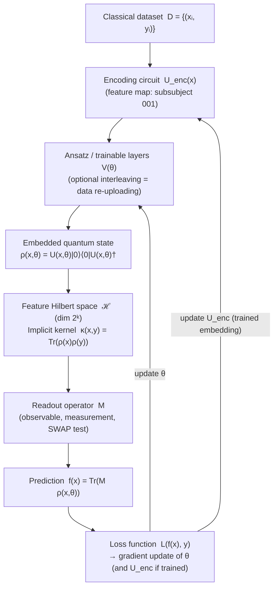

# QCSAA 910–919 · Section 01 · Subsection 911 · Subsubject 002 — Embedding Controlled Definition

## 1. Purpose

Establishes the controlled QCSAA definition of a **quantum embedding** as the complete specification — encoding circuit, Hilbert space, and readout strategy — that maps a classical dataset D = {(xᵢ, yᵢ)} into a quantum state space for machine learning[^lloyd2020]. While a feature map (subsubject `001`) is purely the encoding unitary U(x), an embedding encompasses the broader representational contract: it determines the inductive bias of the quantum model, the metric structure imposed on the input space, and the effective kernel computed by the learning algorithm[^schuld2021].

This definition is the canonical reference for QCSAA documents that design, certify, or compare quantum ML models at the embedding level, distinct from the narrower feature-map primitive. It conforms to the vocabulary of ISO/IEC 4879[^isoiec4879] and the quantum information formalism of Nielsen & Chuang[^nielchung].

**Restricted band (N-006[^n006]).** This document inherits `governance_class: restricted`.

## 2. Scope

- Covers the *Embedding Controlled Definition* subsubject (`002`) of subsection `911` *Quantum Feature Maps and Embeddings* within section `01` *Quantum Machine Learning e IA Cuántica*.
- Inherits Q-Division authority and ORB support from the parent row in [`README.md`](./README.md)[^archtable].
- Concepts in scope:
  - **Formal definition** — a quantum embedding E is the triple E = (U_enc, ℋ, M) where U_enc: ℝⁿ → U(2ᵏ) is the parameterised encoding circuit acting on k qubits, ℋ = ℂ^(2ᵏ) is the feature Hilbert space, and M is a readout operator (observable or measurement scheme) that extracts classical predictions from the embedded state.
  - **Distinction from feature map** — a feature map φ(x) = U_enc(x)|0ᵏ⟩ is the quantum-state image of a single input; the embedding includes additionally the readout operator M and the associated loss function, making it the full input-output specification of the quantum ML model's data interface.
  - **Data re-uploading** — an embedding may repeat the encoding unitary multiple times interleaved with trainable ansatz layers: U(x,θ) = V_L(θ_L) U_enc(x) … V_1(θ_1) U_enc(x); this data re-uploading strategy[^schuld2019] increases the expressibility of the embedding beyond a single encoding layer and allows the model to learn higher-order features of x.
  - **Inductive bias** — the choice of embedding determines which functions of x the model can efficiently approximate; a product-state angle encoding imposes a separable inductive bias, while an entangling IQP circuit introduces correlations between features and thereby favours learning interacting feature combinations.
  - **Representational power theorem** — for any quantum embedding (U_enc, ℋ, M), the set of functions f(x) = Tr(M ρ(x)) computable by the model is exactly the set of functions in the reproducing kernel Hilbert space (RKHS) of the kernel κ(x,y) = Tr(ρ(x)ρ(y))[^schuld2021]; the embedding choice therefore determines the RKHS and hence the model's function class.
  - **Metric learning perspective** — Lloyd et al.[^lloyd2020] show that quantum embeddings can be trained (via the encoding circuit parameters) to maximise the geometric distance between classes in Hilbert space; this metric learning view makes embeddings first-class learnable objects, not just fixed encoding primitives.
  - **Embedding catalogue conventions** — the QCSAA catalogue distinguishes (a) fixed embeddings (U_enc has no trainable parameters; only readout/ansatz is trained) from (b) trained embeddings (U_enc contains trainable rotation angles updated during model training); aerospace certification requirements (see `010_`) apply differently to each category.
- Out of scope: specific fixed embedding strategies such as basis, amplitude, and angle encoding (see `003_`–`007_`); kernel estimation circuits (see `008_`); trainability and expressibility quantification (see `009_`).

## 3. Diagram — Quantum Embedding Architecture

## 4. Footprint

| Metric | Value |
|---|---|
| Architecture | `QCSAA` — Quantum Computing & Sentient Agency Architecture |
| Master range | `900–999` |
| Code range | `910-919` |
| Section | `01` — Quantum Machine Learning e IA Cuántica |
| Subsection | `911` — Quantum Feature Maps and Embeddings |
| Subsubject | `002` — Embedding Controlled Definition |
| Primary Q-Division | Q-HPC[^qdiv] |
| Support Q-Divisions | Q-HORIZON, Q-DATAGOV |
| ORB support | ORB-PMO, ORB-LEG |
| Governance class | `restricted`[^gov] |
| Folder path | `Q+ATLANTIDE/900-999_QCSAA/910-919_Quantum-Machine-Learning-e-IA-Cuantica/911_Quantum-Feature-Maps-and-Embeddings/` |
| Document | `002_Embedding-Controlled-Definition.md` (this file) |
| Parent subsection | [`README.md`](./README.md) · [`000_Overview.md`](./000_Overview.md) |
| Parent architecture | [`../../README.md`](../../README.md) |
| Parent baseline | [`organization/Q+ATLANTIDE.md`](../../../../organization/Q+ATLANTIDE.md) |

## 5. References & Citations

[^baseline]: **Q+ATLANTIDE controlled baseline (v1.0.0)** — [`organization/Q+ATLANTIDE.md`](../../../../organization/Q+ATLANTIDE.md). Defines the controlled `000-999` architecture-band taxonomy and the ATLAS-1000 register subpart.

[^archtable]: **§3 — Subsubject Index (parent README)** — [`README.md` §3](./README.md#3-subsubject-index). Authoritative source for the `911` subsection row (Primary Q-Division Q-HPC).

[^qdiv]: **Q-Division authority** — Q-Divisions provide technical authority over an architecture row (Q+ATLANTIDE Note N-002). See [`organization/Q+ATLANTIDE.md` §4](../../../../organization/Q+ATLANTIDE.md#4-notes).

[^gov]: **Governance class** — `restricted` denotes documents requiring additional governance, evidence packages and access controls (rule N-006[^n006]).

[^n006]: **Note N-006 (Restricted bands)** — Quantum-related (`900-999` QCSAA) bands require additional governance, evidence packages and access controls. Templates must additionally declare `governance_class: restricted`, `evidence_package_id` and `access_control_profile`. See [`organization/Q+ATLANTIDE.md` §5.3](../../../../organization/Q+ATLANTIDE.md#53-restricted-band-templates-n-006).

[^lloyd2020]: **Lloyd, S., Schuld, M., Ijaz, A., Izaac, J., & Killoran, N. (2020)** — "Quantum embeddings for machine learning." arXiv:2001.03622. Defines quantum embeddings and their role in separating data classes in Hilbert space; introduces trained embeddings and the metric learning perspective.

[^schuld2019]: **Schuld, M. & Killoran, N. (2019)** — "Quantum Machine Learning in Feature Hilbert Spaces." *Physical Review Letters*, 122, 040504. Formulates quantum ML as function approximation in feature Hilbert spaces; introduces the data re-uploading concept.

[^schuld2021]: **Schuld, M. (2021)** — "Supervised quantum machine learning models are kernel methods." arXiv:2101.11020. Proves the RKHS equivalence of quantum models and establishes the representational power theorem linking embeddings to function classes.

[^nielchung]: **Nielsen, M. A. & Chuang, I. L. (2010)** — *Quantum Computation and Quantum Information* (10th Anniversary Edition). Cambridge University Press. Canonical reference for quantum state spaces, density operators, and measurement formalism.

[^isoiec4879]: **ISO/IEC 4879:2023** — *Quantum computing — Vocabulary*. International standard defining quantum computing terms.

### Applicable standards

The following standards apply to this subsubject in addition to the cross-cutting Q+ATLANTIDE governance:

- Lloyd et al. (2020) — "Quantum embeddings for machine learning"[^lloyd2020]
- Schuld & Killoran (2019) — "Quantum Machine Learning in Feature Hilbert Spaces"[^schuld2019]
- Schuld (2021) — "Supervised quantum machine learning models are kernel methods"[^schuld2021]
- ISO/IEC 4879:2023 — *Quantum computing — Vocabulary*[^isoiec4879]
