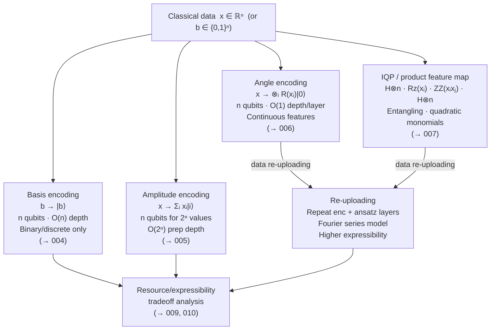

# QCSAA 910–919 · Section 01 · Subsection 911 · Subsubject 003 — Classical to Quantum Data Encoding

## 1. Purpose

Surveys the full taxonomy of strategies for encoding classical data x ∈ ℝⁿ into n-qubit quantum states, covering basis, amplitude, angle, and higher-order encodings and their tradeoffs in circuit depth, qubit count, and expressibility[^schuld2019]. This subsubject is the authoritative QCSAA reference for selecting an encoding strategy; all other subsubjects in the `004`–`007` range detail individual strategies enumerated here.

The encoding problem — transforming classical information into a form that quantum computers can process — is foundational to quantum machine learning. The choice of encoding determines the expressibility of the resulting feature map, the circuit depth and qubit overhead incurred, the precision with which continuous-valued features are represented, and ultimately whether any quantum computational advantage is achievable for a given learning task[^havlicek][^schuld2021]. For aerospace applications, encoding selection must additionally satisfy real-time latency budgets and hardware noise constraints documented in subsubject `010`.

**Restricted band (N-006[^n006]).** This document inherits `governance_class: restricted`.

## 2. Scope

- Covers the *Classical to Quantum Data Encoding* subsubject (`003`) of subsection `911`.
- Inherits Q-Division authority and ORB support from the parent row in [`README.md`](./README.md)[^archtable].
- Concepts in scope:
  - **Taxonomy overview** — encodings are classified along two axes: (a) how the classical data appears in the quantum state (basis register, state amplitudes, rotation angles, or polynomial combinations), and (b) whether the encoding circuit is fixed or trainable (fixed: basis, amplitude, angle, IQP/product; trainable: metric-learned embeddings per `002_`).
  - **Basis encoding** — b ∈ {0,1}ⁿ → |b⟩; requires n qubits, O(n) X-gate depth; limited to discrete/binary inputs; detailed in `004_`.
  - **Amplitude encoding** — x ∈ ℝ^(2ⁿ), ‖x‖=1 → |ψ⟩ = Σᵢ xᵢ|i⟩; requires only n qubits for 2ⁿ values (exponential compression); state preparation depth is O(2ⁿ) in general or O(poly(n)) with QRAM; detailed in `005_`.
  - **Angle encoding** — x ∈ ℝⁿ → ⊗ᵢ R(xᵢ)|0⟩ via single-qubit rotation gates; requires n qubits, O(1) depth per encoding layer; limited expressibility for a single layer; data re-uploading boosts expressibility at cost of additional layers; detailed in `006_`.
  - **IQP / product feature maps** — interleaved Hadamard and diagonal layers encoding x through quadratic monomials xᵢxⱼ in the phase; entangling by design; detailed in `007_`.
  - **Data re-uploading** — a meta-strategy that repeats any base encoding multiple times interleaved with trainable ansatz layers; formally equivalent to a Fourier series expansion of the model function[^schuld2019]; increases expressibility at cost of deeper circuits; applicable to angle and IQP encodings.
  - **Circuit-depth and qubit-count tradeoffs** — the encoding resource table: basis (n qubits, O(n) depth, binary precision), amplitude (n qubits, O(2ⁿ) depth, exponential compression), angle (n qubits, O(1) depth, one qubit per feature), IQP (n qubits, O(depth×layers) depth, interaction terms captured).
  - **Precision vs resource considerations** — analog continuous-valued encodings (amplitude, angle) represent real values exactly (up to gate precision and noise); basis encoding is inherently discrete and requires fixed-point binary representation; precision requirements from aerospace sensor data (16-bit or 32-bit floats) must be mapped to encoding bit-width or qubit count.
  - **Encoding selection criteria for aerospace sensor data** — latency (angle encoding preferable for real-time inference; amplitude encoding may require QRAM latency); dimensionality (high-dimensional telemetry arrays favour amplitude encoding's exponential compression); safety classification (binary fault-flag signals are natural basis encoding candidates); hardware noise budget (shallow angle encoding is noise-resilient; deep amplitude preparation accumulates errors).
- Out of scope: detailed treatment of individual strategies (see `004_`–`007_`), kernel evaluation (see `008_`), expressibility quantification (see `009_`), and aerospace certification boundaries (see `010_`).

## 3. Diagram — Encoding Strategy Taxonomy

## 4. Footprint

| Metric | Value |
|---|---|
| Architecture | `QCSAA` — Quantum Computing & Sentient Agency Architecture |
| Master range | `900–999` |
| Code range | `910-919` |
| Section | `01` — Quantum Machine Learning e IA Cuántica |
| Subsection | `911` — Quantum Feature Maps and Embeddings |
| Subsubject | `003` — Classical to Quantum Data Encoding |
| Primary Q-Division | Q-HPC[^qdiv] |
| Support Q-Divisions | Q-HORIZON, Q-DATAGOV |
| ORB support | ORB-PMO, ORB-LEG |
| Governance class | `restricted`[^gov] |
| Folder path | `Q+ATLANTIDE/900-999_QCSAA/910-919_Quantum-Machine-Learning-e-IA-Cuantica/911_Quantum-Feature-Maps-and-Embeddings/` |
| Document | `003_Classical-to-Quantum-Data-Encoding.md` (this file) |
| Parent subsection | [`README.md`](./README.md) · [`000_Overview.md`](./000_Overview.md) |
| Parent architecture | [`../../README.md`](../../README.md) |
| Parent baseline | [`organization/Q+ATLANTIDE.md`](../../../../organization/Q+ATLANTIDE.md) |

## 5. References & Citations

[^baseline]: **Q+ATLANTIDE controlled baseline (v1.0.0)** — [`organization/Q+ATLANTIDE.md`](../../../../organization/Q+ATLANTIDE.md). Defines the controlled `000-999` architecture-band taxonomy and the ATLAS-1000 register subpart.

[^archtable]: **§3 — Subsubject Index (parent README)** — [`README.md` §3](./README.md#3-subsubject-index). Authoritative source for the `911` subsection row (Primary Q-Division Q-HPC).

[^qdiv]: **Q-Division authority** — Q-Divisions provide technical authority over an architecture row (Q+ATLANTIDE Note N-002). See [`organization/Q+ATLANTIDE.md` §4](../../../../organization/Q+ATLANTIDE.md#4-notes).

[^gov]: **Governance class** — `restricted` denotes documents requiring additional governance, evidence packages and access controls (rule N-006[^n006]).

[^n006]: **Note N-006 (Restricted bands)** — Quantum-related (`900-999` QCSAA) bands require additional governance, evidence packages and access controls. Templates must additionally declare `governance_class: restricted`, `evidence_package_id` and `access_control_profile`. See [`organization/Q+ATLANTIDE.md` §5.3](../../../../organization/Q+ATLANTIDE.md#53-restricted-band-templates-n-006).

[^havlicek]: **Havlíček, V., Córcoles, A. D., Temme, K., et al. (2019)** — "Supervised learning with quantum-enhanced feature spaces." *Nature*, 567, 209–212. Introduces IQP-style feature maps; discusses encoding as the source of quantum advantage.

[^schuld2019]: **Schuld, M. & Killoran, N. (2019)** — "Quantum Machine Learning in Feature Hilbert Spaces." *Physical Review Letters*, 122, 040504. Introduces the data re-uploading strategy and the Fourier series interpretation of quantum models.

[^schuld2021]: **Schuld, M. (2021)** — "Supervised quantum machine learning models are kernel methods." arXiv:2101.11020. Shows that encoding choice determines the implicit kernel and hence the function class.

[^isoiec4879]: **ISO/IEC 4879:2023** — *Quantum computing — Vocabulary*. International standard defining quantum computing terms.

### Applicable standards

The following standards apply to this subsubject in addition to the cross-cutting Q+ATLANTIDE governance:

- Havlíček et al. (2019) — "Supervised learning with quantum-enhanced feature spaces"[^havlicek]
- Schuld & Killoran (2019) — "Quantum Machine Learning in Feature Hilbert Spaces"[^schuld2019]
- Schuld (2021) — "Supervised quantum machine learning models are kernel methods"[^schuld2021]
- ISO/IEC 4879:2023 — *Quantum computing — Vocabulary*[^isoiec4879]
