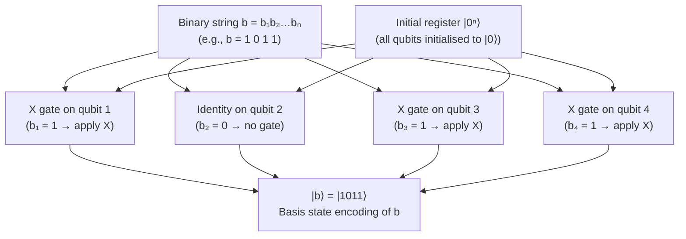

# QCSAA 910–919 · Section 01 · Subsection 911 · Subsubject 004 — Basis Encoding

## 1. Purpose

Defines **basis encoding** (also called computational-basis encoding or bit-string encoding) as the mapping of a classical binary string b = b₁b₂…bₙ ∈ {0,1}ⁿ to the corresponding computational basis state |b₁b₂…bₙ⟩ of an n-qubit register[^nielchung]. The encoding is implemented by applying an X gate to qubit i whenever bᵢ = 1, leaving the qubit unchanged (identity) when bᵢ = 0, starting from the all-zeros initial state |0ⁿ⟩.

Basis encoding is the simplest and most noise-resilient of the classical-to-quantum encoding strategies: the circuit depth is O(n) in the worst case (all bits are 1), the qubit requirement is exactly n, and no continuous-angle rotation gates are required. Its restriction to binary inputs makes it the natural choice for encoding discrete classical data such as binary sensor flags, fault codes, and binary feature vectors derived from thresholding aerospace telemetry.

**Restricted band (N-006[^n006]).** This document inherits `governance_class: restricted`.

## 2. Scope

- Covers the *Basis Encoding* subsubject (`004`) of subsection `911`.
- Inherits Q-Division authority and ORB support from the parent row in [`README.md`](./README.md)[^archtable].
- Concepts in scope:
  - **Binary string to basis state** — the encoding maps b ∈ {0,1}ⁿ → |b⟩ = |b₁⟩ ⊗ |b₂⟩ ⊗ … ⊗ |bₙ⟩; each qubit encodes one bit; the 2ⁿ computational basis states form an orthonormal basis for ℋ = ℂ^(2ⁿ).
  - **Circuit realisation** — the encoding circuit applies Xᵢ (Pauli-X, NOT gate) to qubit i if and only if bᵢ = 1; the resulting circuit depth is at most n single-qubit gates and at minimum 0 (for b = 0ⁿ); no entangling gates are required.
  - **QRAM model** — for large datasets one may assume a quantum random-access memory (QRAM) that loads basis states in O(log n) time by addressing a bucket-brigade tree structure; QRAM hardware is not yet available on NISQ devices and constitutes a future technology assumption that must be explicitly declared in aerospace evidence packages.
  - **Encoding of integers and binary sensor thresholds** — integer values v ∈ {0, …, 2ⁿ−1} are first converted to n-bit two's complement or unsigned binary representation, then encoded as |v⟩; binary sensor thresholds (e.g., altitude > threshold → b = 1) map naturally to single-bit features.
  - **Qubit requirement** — exactly n qubits for n-bit binary strings; no ancilla qubits required by the encoding itself; downstream algorithms (e.g., quantum phase estimation, Grover search) may require additional ancilla registers.
  - **Circuit depth** — O(n) in the worst case; O(1) amortised if QRAM is available; practical depth on NISQ hardware is bounded by qubit count and connectivity.
  - **Limitation to discrete/binary inputs** — continuous-valued features cannot be encoded without prior quantisation (fixed-point binarisation); quantisation error introduces a systematic bias that must be accounted for in model accuracy assessments; a k-bit fixed-point representation requires k qubits per feature.
  - **Aerospace application: binary fault flags** — avionics systems generate binary health-monitoring flags (e.g., engine overheat, sensor out-of-range, communication loss); these map directly to basis-encoded qubits without quantisation error; basis encoding is suitable for quantum classifiers operating on binary diagnostic feature vectors from BITE (Built-In Test Equipment) outputs.
- Out of scope: amplitude encoding (see `005_`), angle encoding (see `006_`), IQP feature maps (see `007_`), continuous-valued encoding strategies, QRAM hardware design.

## 3. Diagram — Basis Encoding Circuit

## 4. Footprint

| Metric | Value |
|---|---|
| Architecture | `QCSAA` — Quantum Computing & Sentient Agency Architecture |
| Master range | `900–999` |
| Code range | `910-919` |
| Section | `01` — Quantum Machine Learning e IA Cuántica |
| Subsection | `911` — Quantum Feature Maps and Embeddings |
| Subsubject | `004` — Basis Encoding |
| Primary Q-Division | Q-HPC[^qdiv] |
| Support Q-Divisions | Q-HORIZON, Q-DATAGOV |
| ORB support | ORB-PMO, ORB-LEG |
| Governance class | `restricted`[^gov] |
| Folder path | `Q+ATLANTIDE/900-999_QCSAA/910-919_Quantum-Machine-Learning-e-IA-Cuantica/911_Quantum-Feature-Maps-and-Embeddings/` |
| Document | `004_Basis-Encoding.md` (this file) |
| Parent subsection | [`README.md`](./README.md) · [`000_Overview.md`](./000_Overview.md) |
| Parent architecture | [`../../README.md`](../../README.md) |
| Parent baseline | [`organization/Q+ATLANTIDE.md`](../../../../organization/Q+ATLANTIDE.md) |

## 5. References & Citations

[^baseline]: **Q+ATLANTIDE controlled baseline (v1.0.0)** — [`organization/Q+ATLANTIDE.md`](../../../../organization/Q+ATLANTIDE.md). Defines the controlled `000-999` architecture-band taxonomy and the ATLAS-1000 register subpart.

[^archtable]: **§3 — Subsubject Index (parent README)** — [`README.md` §3](./README.md#3-subsubject-index). Authoritative source for the `911` subsection row (Primary Q-Division Q-HPC).

[^qdiv]: **Q-Division authority** — Q-Divisions provide technical authority over an architecture row (Q+ATLANTIDE Note N-002). See [`organization/Q+ATLANTIDE.md` §4](../../../../organization/Q+ATLANTIDE.md#4-notes).

[^gov]: **Governance class** — `restricted` denotes documents requiring additional governance, evidence packages and access controls (rule N-006[^n006]).

[^n006]: **Note N-006 (Restricted bands)** — Quantum-related (`900-999` QCSAA) bands require additional governance, evidence packages and access controls. Templates must additionally declare `governance_class: restricted`, `evidence_package_id` and `access_control_profile`. See [`organization/Q+ATLANTIDE.md` §5.3](../../../../organization/Q+ATLANTIDE.md#53-restricted-band-templates-n-006).

[^nielchung]: **Nielsen, M. A. & Chuang, I. L. (2010)** — *Quantum Computation and Quantum Information* (10th Anniversary Edition). Cambridge University Press. Chapter 1 defines the computational basis, X gate, and multi-qubit registers.

[^schuld2019]: **Schuld, M. & Killoran, N. (2019)** — "Quantum Machine Learning in Feature Hilbert Spaces." *Physical Review Letters*, 122, 040504. Surveys encoding strategies including basis encoding and its limitations.

[^isoiec4879]: **ISO/IEC 4879:2023** — *Quantum computing — Vocabulary*. Defines computational basis state and quantum register.

### Applicable standards

The following standards apply to this subsubject in addition to the cross-cutting Q+ATLANTIDE governance:

- Nielsen & Chuang (2010) — *Quantum Computation and Quantum Information*[^nielchung]
- Schuld & Killoran (2019) — "Quantum Machine Learning in Feature Hilbert Spaces"[^schuld2019]
- ISO/IEC 4879:2023 — *Quantum computing — Vocabulary*[^isoiec4879]
