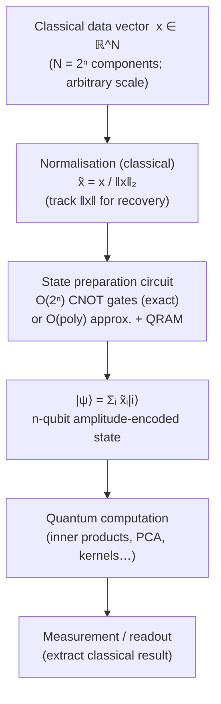

# QCSAA 910–919 · Section 01 · Subsection 911 · Subsubject 005 — Amplitude Encoding

## 1. Purpose

Defines **amplitude encoding** as the mapping of a normalised real (or complex) vector x ∈ ℝ^(2ⁿ) with ‖x‖ = 1 to the quantum state |ψ⟩ = Σᵢ₌₀^(2ⁿ−1) xᵢ|i⟩ using only n qubits, achieving an exponential compression of 2ⁿ classical values into the amplitudes of a single n-qubit quantum state[^schuld2019][^nielchung]. This encoding is one of the primary mechanisms claimed to provide a quantum computational advantage in data-loading — n qubits can represent 2ⁿ features — subject to the caveat that state preparation itself is costly.

Amplitude encoding is the data-loading strategy underlying quantum principal component analysis (qPCA), quantum linear systems solvers (HHL), and several quantum sampling algorithms. For aerospace applications, it offers a path to compressing high-dimensional sensor arrays (e.g., phased-array radar returns, hyperspectral imaging data) into compact quantum registers, provided that the state preparation circuit depth and QRAM latency constraints are satisfied.

**Restricted band (N-006[^n006]).** This document inherits `governance_class: restricted`.

## 2. Scope

- Covers the *Amplitude Encoding* subsubject (`005`) of subsection `911`.
- Inherits Q-Division authority and ORB support from the parent row in [`README.md`](./README.md)[^archtable].
- Concepts in scope:
  - **Exponential compression** — n qubits suffice to represent a 2ⁿ-dimensional normalised vector; each classical component xᵢ is stored as the amplitude of the basis state |i⟩; the Hilbert space has dimension 2ⁿ, enabling representation of exponentially large feature vectors with logarithmic qubit overhead.
  - **Normalisation constraint** — the input vector must satisfy ‖x‖₂ = 1 (Σᵢ |xᵢ|² = 1) because quantum states are unit vectors; in practice the classical data vector is normalised prior to encoding: x̃ = x / ‖x‖; the normalisation factor must be tracked classically for recovery of absolute magnitudes.
  - **State preparation circuits** — preparing an arbitrary n-qubit amplitude-encoded state requires in general O(2ⁿ) two-qubit gates (exponential depth), because the state encodes exponentially many independent amplitudes each requiring independent rotation; this state preparation depth dominates the total circuit cost and is the principal limitation of amplitude encoding on NISQ hardware.
  - **Shende–Bullock–Markov decomposition** — the exact minimal-circuit state preparation method requires O(2ⁿ) CNOTs; approximate methods (e.g., circuit synthesis with bounded fidelity) can reduce depth at the cost of encoding error; the tradeoff is a design parameter in the QCSAA evidence package.
  - **QRAM-assisted preparation** — with a bucket-brigade QRAM, amplitude encoding can in principle be achieved in O(poly(log N)) time for N = 2ⁿ amplitudes; however, practical QRAM hardware remains a future technology (NISQ devices do not implement QRAM); any aerospace application claiming QRAM-assisted amplitude encoding must include a QRAM technology readiness level (TRL) assessment.
  - **Limitation: state preparation dominates runtime** — even if the quantum computation following amplitude encoding is efficient (polynomial depth), the O(2ⁿ) state preparation preprocessing may negate any quantum speedup; Aaronson's "quantum machine learning fine print" identifies this as a primary concern; QCSAA evidence packages must address whether state preparation cost is included in the speedup claim.
  - **Complex amplitude extensions** — amplitude encoding generalises to complex vectors x ∈ ℂ^(2ⁿ) with ‖x‖ = 1; phase information may encode additional classical data (e.g., Fourier coefficients of a time-series signal).
  - **Aerospace application: compressing high-dimensional sensor arrays** — amplitude encoding is applicable to aerospace use cases where classical dimensionality reduction is insufficient: compressing radar return vectors, storing hyperspectral image patches, or encoding correlation matrices for structural health monitoring; the normalisation pre-processing step must be performed on classical hardware before loading into the quantum register.
- Out of scope: basis encoding (see `004_`), angle encoding (see `006_`), QRAM hardware design, quantum linear systems algorithms (future QCSAA entries), and certified real-time amplitude encoding (not yet feasible; see `010_`).

## 3. Diagram — Amplitude Encoding Pipeline

## 4. Footprint

| Metric | Value |
|---|---|
| Architecture | `QCSAA` — Quantum Computing & Sentient Agency Architecture |
| Master range | `900–999` |
| Code range | `910-919` |
| Section | `01` — Quantum Machine Learning e IA Cuántica |
| Subsection | `911` — Quantum Feature Maps and Embeddings |
| Subsubject | `005` — Amplitude Encoding |
| Primary Q-Division | Q-HPC[^qdiv] |
| Support Q-Divisions | Q-HORIZON, Q-DATAGOV |
| ORB support | ORB-PMO, ORB-LEG |
| Governance class | `restricted`[^gov] |
| Folder path | `Q+ATLANTIDE/900-999_QCSAA/910-919_Quantum-Machine-Learning-e-IA-Cuantica/911_Quantum-Feature-Maps-and-Embeddings/` |
| Document | `005_Amplitude-Encoding.md` (this file) |
| Parent subsection | [`README.md`](./README.md) · [`000_Overview.md`](./000_Overview.md) |
| Parent architecture | [`../../README.md`](../../README.md) |
| Parent baseline | [`organization/Q+ATLANTIDE.md`](../../../../organization/Q+ATLANTIDE.md) |

## 5. References & Citations

[^baseline]: **Q+ATLANTIDE controlled baseline (v1.0.0)** — [`organization/Q+ATLANTIDE.md`](../../../../organization/Q+ATLANTIDE.md). Defines the controlled `000-999` architecture-band taxonomy and the ATLAS-1000 register subpart.

[^archtable]: **§3 — Subsubject Index (parent README)** — [`README.md` §3](./README.md#3-subsubject-index). Authoritative source for the `911` subsection row (Primary Q-Division Q-HPC).

[^qdiv]: **Q-Division authority** — Q-Divisions provide technical authority over an architecture row (Q+ATLANTIDE Note N-002). See [`organization/Q+ATLANTIDE.md` §4](../../../../organization/Q+ATLANTIDE.md#4-notes).

[^gov]: **Governance class** — `restricted` denotes documents requiring additional governance, evidence packages and access controls (rule N-006[^n006]).

[^n006]: **Note N-006 (Restricted bands)** — Quantum-related (`900-999` QCSAA) bands require additional governance, evidence packages and access controls. Templates must additionally declare `governance_class: restricted`, `evidence_package_id` and `access_control_profile`. See [`organization/Q+ATLANTIDE.md` §5.3](../../../../organization/Q+ATLANTIDE.md#53-restricted-band-templates-n-006).

[^schuld2019]: **Schuld, M. & Killoran, N. (2019)** — "Quantum Machine Learning in Feature Hilbert Spaces." *Physical Review Letters*, 122, 040504. Surveys amplitude encoding and its exponential compression properties.

[^nielchung]: **Nielsen, M. A. & Chuang, I. L. (2010)** — *Quantum Computation and Quantum Information* (10th Anniversary Edition). Cambridge University Press. Chapters 4–6 cover state preparation and amplitude amplification.

[^isoiec4879]: **ISO/IEC 4879:2023** — *Quantum computing — Vocabulary*. Defines quantum state, superposition, and amplitude.

### Applicable standards

The following standards apply to this subsubject in addition to the cross-cutting Q+ATLANTIDE governance:

- Schuld & Killoran (2019) — "Quantum Machine Learning in Feature Hilbert Spaces"[^schuld2019]
- Nielsen & Chuang (2010) — *Quantum Computation and Quantum Information*[^nielchung]
- ISO/IEC 4879:2023 — *Quantum computing — Vocabulary*[^isoiec4879]
