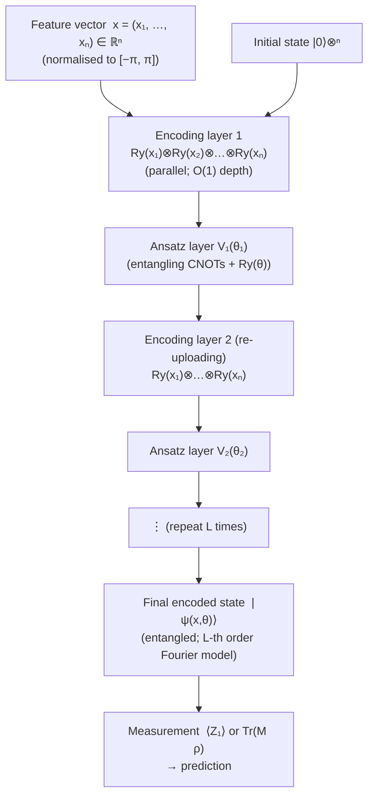

# QCSAA 910–919 · Section 01 · Subsection 911 · Subsubject 006 — Angle Encoding

## 1. Purpose

Defines **angle encoding** (also called rotation encoding or dense encoding) as the mapping of a classical feature vector x = (x₁, x₂, …, xₙ) ∈ ℝⁿ to rotation angles of single-qubit gates applied in parallel, producing the product state |ψ(x)⟩ = ⊗ᵢ₌₁ⁿ R(xᵢ)|0⟩ over n qubits[^schuld2019]. Here R(xᵢ) ∈ {Rx(xᵢ), Ry(xᵢ), Rz(xᵢ)} is a single-qubit rotation gate about the chosen axis with angle proportional to the i-th feature.

Angle encoding is the most widely used encoding strategy for NISQ variational quantum circuits. Its O(1) circuit depth per encoding layer (all rotations applied in parallel), together with its direct compatibility with hardware-native single-qubit gate sets and its natural integration with data re-uploading, make it the default encoding choice for quantum machine learning on current quantum processors. For aerospace applications, angle encoding is the primary candidate for real-time inference of continuous-valued flight parameters due to its shallow circuit depth and low gate-error accumulation.

**Restricted band (N-006[^n006]).** This document inherits `governance_class: restricted`.

## 2. Scope

- Covers the *Angle Encoding* subsubject (`006`) of subsection `911`.
- Inherits Q-Division authority and ORB support from the parent row in [`README.md`](./README.md)[^archtable].
- Concepts in scope:
  - **Product state structure** — the encoded state is a tensor product of n single-qubit states; there is no entanglement introduced by the encoding layer itself; correlations between features must come from subsequent entangling ansatz layers.
  - **Rx/Ry/Rz parameterisation** — the rotation gate R_α(θ) = exp(−i θ/2 σ_α) rotates the qubit state by angle θ around axis α ∈ {x, y, z} of the Bloch sphere; Ry encoding maps real scalars to polar angle θ = xᵢ on the Bloch sphere equatorial plane; Rz encoding maps to azimuthal phase; mixed axis choices are allowed and affect the kernel geometry.
  - **Qubit-per-feature requirement** — exactly n qubits are required to encode n features; this is a 1:1 qubit-to-feature ratio, which is manageable for low-to-moderate dimensional problems but becomes a bottleneck for very high-dimensional feature vectors (compare amplitude encoding's logarithmic qubit overhead).
  - **Circuit depth O(1) per encoding layer** — because all rotation gates are applied in parallel (no qubit dependencies), the encoding layer contributes O(1) depth; on hardware with native single-qubit gates (e.g., Rz, SX), the depth is at most 2 native gates per qubit per encoding layer.
  - **Limited expressibility for a single encoding layer** — the product state |ψ(x)⟩ = ⊗ᵢ Ry(xᵢ)|0⟩ has no entanglement; its feature map kernel is a product kernel κ(x,y) = Πᵢ cos²((xᵢ−yᵢ)/2), which is a relatively simple function; a single layer cannot capture feature interactions or represent complex decision boundaries.
  - **Data re-uploading to boost expressibility** — by repeating the encoding layer L times interleaved with entangling ansatz layers V(θ): U(x,θ) = V_L(θ_L) Ry(x) … V_1(θ_1) Ry(x), the model gains access to higher Fourier frequencies of x[^schuld2019]; with L repetitions the model can approximate any Fourier series of x up to L-th order; this is the primary mechanism for increasing angle-encoding expressibility without switching to a deeper encoding strategy.
  - **Feature pre-processing and angle bounds** — rotation angles are periodic with period 2π; features should be normalised or standardised to a suitable range (e.g., [0, π] or [−π, π]) before encoding; outliers may wrap around the Bloch sphere and degrade model performance; the preprocessing transformation must be documented in the evidence package.
  - **Aerospace application: flight parameter encoding** — angle encoding is the recommended strategy for encoding normalised continuous-valued aerospace features such as airspeed, altitude, roll/pitch/yaw angles, engine N1/N2 RPM, and fuel flow rates; the shallow circuit depth (O(1) per layer) is compatible with near-term NISQ hardware noise budgets and real-time inference latency requirements.
- Out of scope: basis encoding (see `004_`), amplitude encoding (see `005_`), IQP feature maps (see `007_`), trainability and barren plateaus (see `009_`), DO-178C certification boundaries (see `010_`).

## 3. Diagram — Angle Encoding Circuit with Optional Re-uploading

## 4. Footprint

| Metric | Value |
|---|---|
| Architecture | `QCSAA` — Quantum Computing & Sentient Agency Architecture |
| Master range | `900–999` |
| Code range | `910-919` |
| Section | `01` — Quantum Machine Learning e IA Cuántica |
| Subsection | `911` — Quantum Feature Maps and Embeddings |
| Subsubject | `006` — Angle Encoding |
| Primary Q-Division | Q-HPC[^qdiv] |
| Support Q-Divisions | Q-HORIZON, Q-DATAGOV |
| ORB support | ORB-PMO, ORB-LEG |
| Governance class | `restricted`[^gov] |
| Folder path | `Q+ATLANTIDE/900-999_QCSAA/910-919_Quantum-Machine-Learning-e-IA-Cuantica/911_Quantum-Feature-Maps-and-Embeddings/` |
| Document | `006_Angle-Encoding.md` (this file) |
| Parent subsection | [`README.md`](./README.md) · [`000_Overview.md`](./000_Overview.md) |
| Parent architecture | [`../../README.md`](../../README.md) |
| Parent baseline | [`organization/Q+ATLANTIDE.md`](../../../../organization/Q+ATLANTIDE.md) |

## 5. References & Citations

[^baseline]: **Q+ATLANTIDE controlled baseline (v1.0.0)** — [`organization/Q+ATLANTIDE.md`](../../../../organization/Q+ATLANTIDE.md). Defines the controlled `000-999` architecture-band taxonomy and the ATLAS-1000 register subpart.

[^archtable]: **§3 — Subsubject Index (parent README)** — [`README.md` §3](./README.md#3-subsubject-index). Authoritative source for the `911` subsection row (Primary Q-Division Q-HPC).

[^qdiv]: **Q-Division authority** — Q-Divisions provide technical authority over an architecture row (Q+ATLANTIDE Note N-002). See [`organization/Q+ATLANTIDE.md` §4](../../../../organization/Q+ATLANTIDE.md#4-notes).

[^gov]: **Governance class** — `restricted` denotes documents requiring additional governance, evidence packages and access controls (rule N-006[^n006]).

[^n006]: **Note N-006 (Restricted bands)** — Quantum-related (`900-999` QCSAA) bands require additional governance, evidence packages and access controls. Templates must additionally declare `governance_class: restricted`, `evidence_package_id` and `access_control_profile`. See [`organization/Q+ATLANTIDE.md` §5.3](../../../../organization/Q+ATLANTIDE.md#53-restricted-band-templates-n-006).

[^schuld2019]: **Schuld, M. & Killoran, N. (2019)** — "Quantum Machine Learning in Feature Hilbert Spaces." *Physical Review Letters*, 122, 040504. Introduces angle encoding, data re-uploading, and the Fourier series interpretation of quantum models.

[^havlicek]: **Havlíček, V., Córcoles, A. D., Temme, K., et al. (2019)** — "Supervised learning with quantum-enhanced feature spaces." *Nature*, 567, 209–212. Compares angle encoding to IQP feature maps in the context of quantum kernel classification.

[^isoiec4879]: **ISO/IEC 4879:2023** — *Quantum computing — Vocabulary*. Defines rotation gate, product state, and parameterised quantum circuit.

### Applicable standards

The following standards apply to this subsubject in addition to the cross-cutting Q+ATLANTIDE governance:

- Schuld & Killoran (2019) — "Quantum Machine Learning in Feature Hilbert Spaces"[^schuld2019]
- Havlíček et al. (2019) — "Supervised learning with quantum-enhanced feature spaces"[^havlicek]
- ISO/IEC 4879:2023 — *Quantum computing — Vocabulary*[^isoiec4879]
