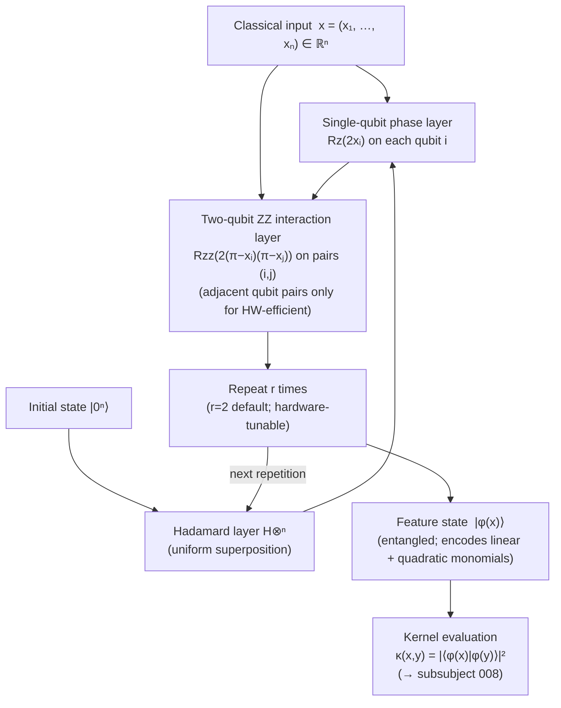

# QCSAA 910–919 · Section 01 · Subsection 911 · Subsubject 007 — IQP and Hardware-Efficient Feature Maps

## 1. Purpose

Defines **IQP (Instantaneous Quantum Polynomial-time) feature maps** and **hardware-efficient feature maps** as structured circuits that interleave product-state encoding layers with entangling layers to increase expressibility beyond single-layer angle encoding[^havlicek]. IQP circuits consist of alternating Hadamard layers and diagonal-unitary layers whose phases are polynomial functions of the classical input x, producing entangled feature states whose classical simulation is believed to be computationally hard — a property that motivates the quantum advantage claim for kernel methods based on these feature maps[^schuld2021].

The Havlíček et al. *ZZFeatureMap* (2019)[^havlicek] is the canonical QCSAA example of a second-order IQP feature map: it applies single-qubit Rz(xᵢ) gates followed by two-qubit ZZ-interaction terms Rzz(xᵢxⱼ) = exp(−i xᵢxⱼ/2 Z⊗Z), encoding both linear and quadratic feature interactions. Hardware-efficient feature maps additionally constrain the entangling gates and qubit connectivity to match the native coupling graph of a specific quantum processor, reducing compilation overhead and SWAP-gate noise.

**Restricted band (N-006[^n006]).** This document inherits `governance_class: restricted`.

## 2. Scope

- Covers the *IQP and Hardware-Efficient Feature Maps* subsubject (`007`) of subsection `911`.
- Inherits Q-Division authority and ORB support from the parent row in [`README.md`](./README.md)[^archtable].
- Concepts in scope:
  - **IQP circuit structure** — an IQP circuit is a quantum circuit of the form H⊗ⁿ · D(x) · H⊗ⁿ where H⊗ⁿ is the tensor product of n Hadamard gates and D(x) is a diagonal unitary in the computational basis; D(x) = exp(i Σ_S φ_S(x) Z^⊗S) where the sum is over subsets S ⊆ {1,…,n} and φ_S(x) is a polynomial function of x; the resulting circuit creates superpositions whose interference pattern encodes the input.
  - **ZZFeatureMap construction** — the Havlíček et al. second-order IQP feature map for n qubits encodes x via: (1) H⊗ⁿ layer; (2) single-qubit phase gates Rz(2xᵢ) on qubit i for all i; (3) two-qubit ZZ interactions Rzz(2(π−xᵢ)(π−xⱼ)) on all adjacent pairs (i,j); steps 2–3 are repeated for r=2 repetitions by default; the resulting kernel captures linear and quadratic feature interactions.
  - **Hardware-efficient ansätze** — hardware-efficient feature maps replace generic CNOT+Rz decompositions with native-gate equivalents (e.g., echoed cross-resonance (ECR) gates on IBM devices, iSWAP on Google, CZ on Rigetti); native-gate circuits have lower depth after compilation, fewer SWAP insertions, and thus lower effective gate error.
  - **Depth vs expressibility tradeoff** — increasing the number of IQP repetitions r increases the expressibility of the feature map (more Fourier components accessible) but also increases circuit depth and accumulated gate error; the optimal r is a hardware-dependent tradeoff quantified via the expressibility metric[^schuld2019].
  - **Connectivity constraints** — the ZZ interaction requires a CNOT or equivalent two-qubit gate between qubits i and j; on processors with limited connectivity (e.g., linear or heavy-hex topology), non-adjacent ZZ interactions require SWAP routing, adding depth; hardware-efficient designs restrict ZZ interactions to connected qubit pairs to avoid SWAP overhead.
  - **Quantum advantage claim for IQP feature maps** — Havlíček et al.[^havlicek] argue that the quantum kernel κ(x,y) computed by an IQP circuit cannot be efficiently estimated classically (under plausible complexity-theoretic assumptions about approximate 2-designs and hardness of simulating IQP circuits); this hardness claim is the basis for asserting quantum advantage in kernel-based classification using IQP feature maps; the claim is conditional and must be stated as such in aerospace evidence packages.
  - **Geometric difference metric** — Huang et al. (2021) define the geometric difference g(K_Q, K_C) between a quantum kernel matrix K_Q and a classical kernel matrix K_C as a measure of how differently they weight the training data; a large geometric difference is a necessary (but not sufficient) condition for quantum kernel advantage over classical methods.
- Out of scope: angle encoding without entanglement (see `006_`), kernel matrix estimation (see `008_`), trainability of IQP-based classifiers (see `009_`), aerospace depth budget allocation (see `010_`).

## 3. Diagram — IQP Feature Map Circuit (ZZFeatureMap)

## 4. Footprint

| Metric | Value |
|---|---|
| Architecture | `QCSAA` — Quantum Computing & Sentient Agency Architecture |
| Master range | `900–999` |
| Code range | `910-919` |
| Section | `01` — Quantum Machine Learning e IA Cuántica |
| Subsection | `911` — Quantum Feature Maps and Embeddings |
| Subsubject | `007` — IQP and Hardware-Efficient Feature Maps |
| Primary Q-Division | Q-HPC[^qdiv] |
| Support Q-Divisions | Q-HORIZON, Q-DATAGOV |
| ORB support | ORB-PMO, ORB-LEG |
| Governance class | `restricted`[^gov] |
| Folder path | `Q+ATLANTIDE/900-999_QCSAA/910-919_Quantum-Machine-Learning-e-IA-Cuantica/911_Quantum-Feature-Maps-and-Embeddings/` |
| Document | `007_IQP-and-Hardware-Efficient-Feature-Maps.md` (this file) |
| Parent subsection | [`README.md`](./README.md) · [`000_Overview.md`](./000_Overview.md) |
| Parent architecture | [`../../README.md`](../../README.md) |
| Parent baseline | [`organization/Q+ATLANTIDE.md`](../../../../organization/Q+ATLANTIDE.md) |

## 5. References & Citations

[^baseline]: **Q+ATLANTIDE controlled baseline (v1.0.0)** — [`organization/Q+ATLANTIDE.md`](../../../../organization/Q+ATLANTIDE.md). Defines the controlled `000-999` architecture-band taxonomy and the ATLAS-1000 register subpart.

[^archtable]: **§3 — Subsubject Index (parent README)** — [`README.md` §3](./README.md#3-subsubject-index). Authoritative source for the `911` subsection row (Primary Q-Division Q-HPC).

[^qdiv]: **Q-Division authority** — Q-Divisions provide technical authority over an architecture row (Q+ATLANTIDE Note N-002). See [`organization/Q+ATLANTIDE.md` §4](../../../../organization/Q+ATLANTIDE.md#4-notes).

[^gov]: **Governance class** — `restricted` denotes documents requiring additional governance, evidence packages and access controls (rule N-006[^n006]).

[^n006]: **Note N-006 (Restricted bands)** — Quantum-related (`900-999` QCSAA) bands require additional governance, evidence packages and access controls. Templates must additionally declare `governance_class: restricted`, `evidence_package_id` and `access_control_profile`. See [`organization/Q+ATLANTIDE.md` §5.3](../../../../organization/Q+ATLANTIDE.md#53-restricted-band-templates-n-006).

[^havlicek]: **Havlíček, V., Córcoles, A. D., Temme, K., et al. (2019)** — "Supervised learning with quantum-enhanced feature spaces." *Nature*, 567, 209–212. Defines the ZZFeatureMap, demonstrates quantum kernel classification, and argues for the classical-simulation hardness of IQP feature map kernels.

[^schuld2019]: **Schuld, M. & Killoran, N. (2019)** — "Quantum Machine Learning in Feature Hilbert Spaces." *Physical Review Letters*, 122, 040504. Provides the expressibility framework used to evaluate IQP and hardware-efficient feature maps.

[^schuld2021]: **Schuld, M. (2021)** — "Supervised quantum machine learning models are kernel methods." arXiv:2101.11020. Formalises the kernel view of IQP feature maps and discusses conditions for quantum kernel advantage.

[^isoiec4879]: **ISO/IEC 4879:2023** — *Quantum computing — Vocabulary*. Defines unitary gate, entanglement, and quantum circuit depth.

### Applicable standards

The following standards apply to this subsubject in addition to the cross-cutting Q+ATLANTIDE governance:

- Havlíček et al. (2019) — "Supervised learning with quantum-enhanced feature spaces"[^havlicek]
- Schuld & Killoran (2019) — "Quantum Machine Learning in Feature Hilbert Spaces"[^schuld2019]
- Schuld (2021) — "Supervised quantum machine learning models are kernel methods"[^schuld2021]
- ISO/IEC 4879:2023 — *Quantum computing — Vocabulary*[^isoiec4879]
